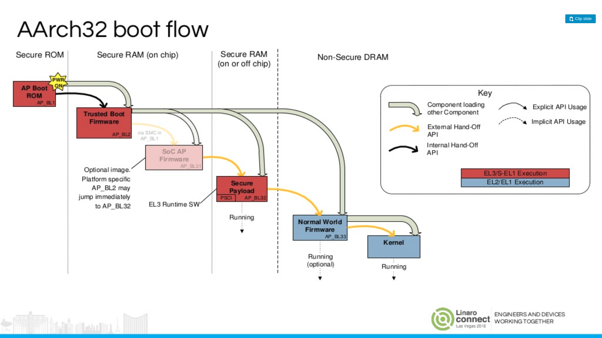
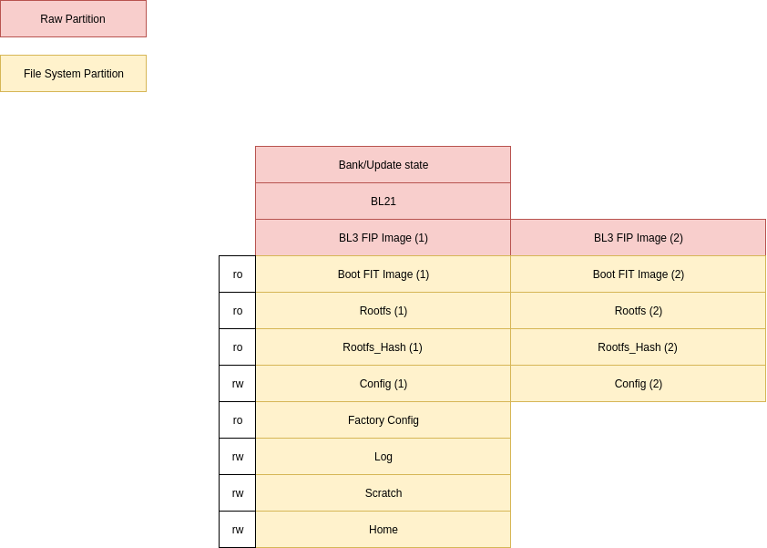
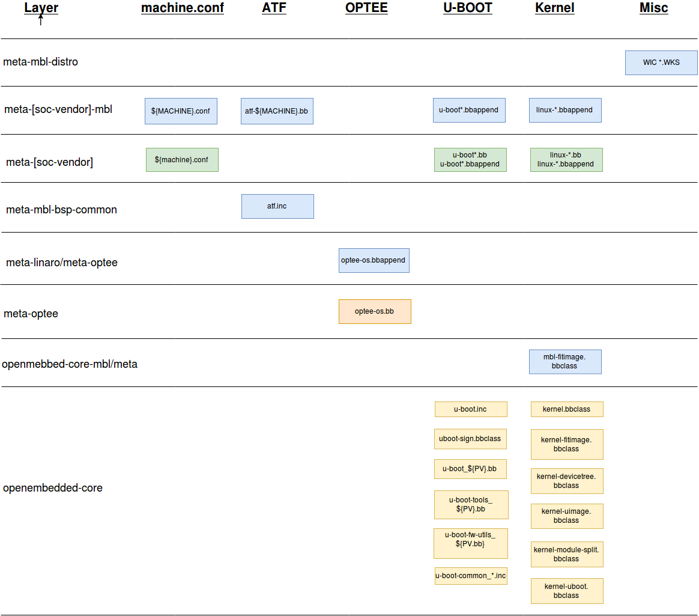
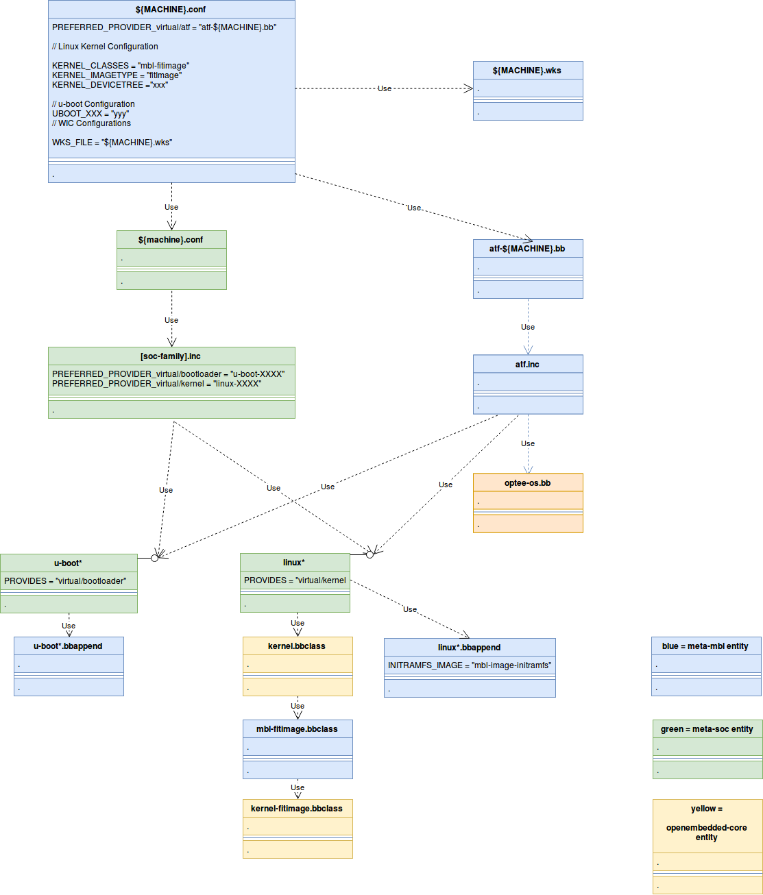
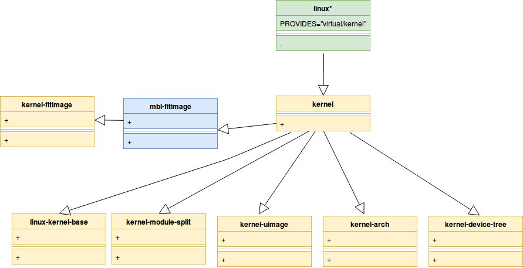
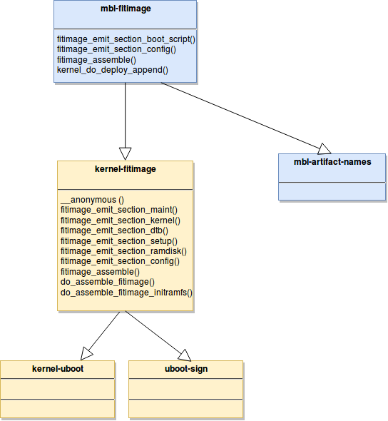
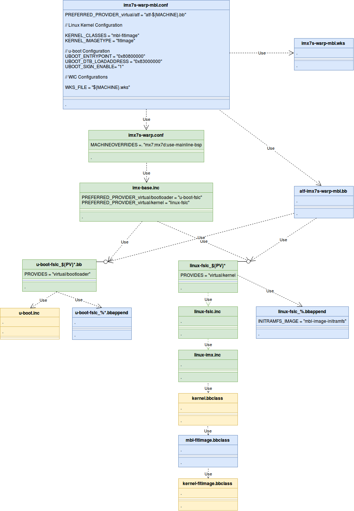

# <a name="section-1-0"></a> 1.0 Mbed Linux OS BSP Porting Guide

Copyright © 2019 Arm Limited.

## <a name="section-1-1"></a> 1.1 Overview

This document is a guide for porting a pre-existing ARM Cortex-A BSP into the Mbed Linux OS (MBL) distribution,
thus enabling our platform software stack for security, connection to the mbed Pelion device management and firmware update.
BSP porting activities are primarily centred on configuring the secure boot software components so
the right artefacts appear on the right flash partitions for update:
- **Trusted Firmware for Cortex A (TF-A)**. Trusted Firmware is used to implement the v7A AArch32 and the v8A AArch64 secure boot flows.
  TF-A artefacts include the second stage bootloader BL2 and the Firmware Image Package (FIP) containing third stage bootloaders
  BL3x and certificates.
- **Open Platform Trusted Execution Environment (OP-TEE)**. This is the OS with trusted applications running in the Trustzone secure world and is packaged as BL32 inside the FIP image.
- **U-Boot**. U-Boot is used as the normal world bootloader for loading the Rich OS. This is packaged as BL33 inside the FIP image.
- **Linux kernel**. The Linux kernel is used as the normal world Rich OS. The kernel image is packaged with the device tree binaries and
  initial RAM file system in a Flattened Image Tree (FIT) image.

[Section 1](#section-1-0) provides an introduction to this document including an overview, the pre-requisites before undertaking the
porting activity and a section defining terminology.

[Section 2](#section-2-0) describes the relevant system architecture relating the [AArch32](#fig2-2-1) and [AArch64](#fig2-2-2) secure boot flows, the partitioning
of build artefacts between BL2, the FIP and FIT images, and the flash partition layout for updating firmware.

[Section 3](#section-3-0) provides a top-down overview of the Yocto meta-layers composed into the MBL development workspaces for BSP development
including a [software stack diagram](#figure-3.7) showing how recipes from different layers collaborate.

[Section 4](#section-4-0) provides an overview of `${MACHINE}.conf`, ATF, OP-TEE, `u-boot` and `linux` recipes inter-relationships
using a [UML diagram](#figure-4-0).

[Section 5](#section-5-0) provides a detailed discussion of the MBL ` ${MACHINE}.conf` and
community ` ${machine}.conf` machine configuration files.

[Section 6](#section-6-0) provides a discussion of the `u-boot*.bb` base recipe and the MBL `u-boot*.bbappend` customisation.

[Section 7](#section-7-0) provides a discussion of the `linux*.bb` base recipe and the MBL `linux*.bbappend` customisation.

[Section 8](#section-8-0) provides a discussion of the `atf-${MACHINE}.bb` recipe for building the ARM Trusted Firmware.

[Section 9](#section-9-0) provides a concrete example for the WaRP7 target of the `${MACHINE}.conf`, ATF, OP-TEE, `u-boot` and `linux` recipe interrelationships
using a [UML diagram](#figure-9-1).

[Section 10](#section-10-0) provides a summary of porting tasks.

[Section 11](#section-11-0) provides a list of supporting references to this document.


## <a name="section-1-2"></a> 1.2 Prerequisites

MBL uses Yocto, BitBake, `openembedded-core` and third-party meta-layers to compose the development and build workspace.
[Embedded Linux Systems with the Yocto Project][strief-2016] is highly recommended for preparatory material before
consulting the [Yocto Mega Manual][yocto-mega-manual-latest], and in particular, reading the
[Yocto Project Board Support Package (BSP) Developer's Guide][yocto-project-board-support-package-bsp-seveloper-guide-latest].
 
For porting ATF to your target platform, please consult the [ATF porting guide][atf-doc-plat-porting-guide].

For porting OP-TEE to your target platform, please consult the [OP-TEE documentation][optee-docs].


## <a name="section-1-3"></a> 1.3 Terminology

This section defines terminology used throughout this document.

<a name="Table-1-3"></a>
    Term                Definition

    AP                  Application Processor
    ATF                 ARM Trusted Firmware
    BL                  Bootloader
    BL1                 1st Stage Boot Loader
    BL2                 2nd Stage Boot Loader. This is based on TF-A running at EL3 when the MMU
                        is switched off. BL2 loads the FIP image and authenitcates FIP content.
    BL31                3rd Stage Boot Loader - Part 1.
                          - e.g. Secure Monitor running in EL1-SW.  This stage enables the MMU.
    BL32                3rd Stage Boot Loader - Part 2.
                          - e.g. OP-TEE, the secure world OS. This typically switches to Normal World.
    BL33                3rd Stage Boot Loader - Part 3.
                          - e.g. u-boot, the Normal World boot loader.
                          - Also referred to as Non-Trusted World Firmware (NT-FW).

    DTB                 Device Tree Binary
    EL                  Execution Level
    FIP                 Firmware Image Package. This is a "simple filesystem" for
                        managing signed bootchain components.
    FIT                 Flattened Image Tree. This is a Linux Kernel image container for
                        holding the kernel, kernel DTB and initramfs.
    Linux               The runtime normal-world kernel.
    MBL                 Mbed Linux OS
    MMU                 Memory Management Unit
    Noraml World        The non-security operating mode as defined in ARM reference documentation.
    NT                  Non-Trusted
    NT-FW               Non-Trusted Firmware Binary (REF1)
                          - e.g. BL33 u-boot. Runs at EL2-NW
    NT-FW-CERT          Non-Trusted Firmware Certificate (REF1)
                          - e.g. u-boot content certificate.
    NT-FW-KEY-CERT      Non-Trusted Firmware Certificate (REF1)
    NW                  Normal World (REF2)
    OP-TEE              Open Platform Trusted Execution Environment
    Secure World        The high security operating mode as defined in ARM reference document.
    SW                  Secure World (REF2)
    SOC-FW              System-On-Chip Firmware Binary (REF1)
    SOC-FW-CERT         System-On-Chip Firmware Certificate (REF1)
    SOC-FW-KEY-CERT     System-On-Chip Firmware Key Certificate (REF1)
    ROT                 Root of Trust
    ROTPK               Root of Trust Public Key
    ROTPrvK             Root of Trust Private Key
    TBBR                Trusted Board Boot Requirements
    TBBR-CLIENT         TBBR Specification document
    TB-FW               Trusted Board Firmware Binary (REF1)
    TB-FW-CERT          Trusted Board Firmware Certificate (REF1)
    TB-FW-KEY-CERT      Trusted Board Firmware Key Certificate (REF1)
    TF-A                Trusted Firmware for Cortex-A
    TOS-FW              Trusted OS Firmware Binary (REF1)
    TOS-FW-CERT         Trusted OS Firmware Certificate (REF1)
    TOS-FW-EXTRA1       Trusted OS Firmware Extra-1 Binary (REF1)
    TOS-FW-EXTRA2       Trusted OS Firmware Extra-2 Binary (REF1)
    TOS-FW-KEY-CERT     Trusted OS Firmware Key Certificate (REF1)
    TRUSTED-KEY-CERT    Trusted Key Certificate.
                          - Contains the trusted world public key.
                          - Contains the non-trusted world public key.
    WIC                 Openembedded Image Creator application.

**Table 1.3: Acronyms.**
* **REF1:** Term is defined in the TF-A fiptool documentation and source code.
* **REF2:** Term is defined in the TrustZone documentation.


## <a name="section-2-0"></a> 2.0 System Architecture

## <a name="section-2-1"></a> 2.1 Introduction

The key BSP system architecture requirements can be summarised as follows:
- **Security**. Trusted firmware for Cortex-A is employed as it provides a generic solution for authenticating software components.
- **Firmware Update**. The Pelion device management update service is used to update device firmware. This leads to a flash
  partition layout where trusted firmware, the kernel, the root file system and applications are independently updatable.
- **Reuse**. We're possible, suitable pre-existing solutions and software are reused to leverage
  know-how and speed up time to market.


## <a name="section-2-2"></a> 2.2 Boot Flow

<a name="fig2-2"></a>


**Figure 2.2: The figure shows a summary form of the secure boot chain flow.**

[Figure 2.2](#fig2-2) shows the main entities in the secure bootchain sequence, which are the
Soc Boot ROM, the Trusted Firmware (TF), OP-TEE, U-Boot and the Linux kernel.
1. After the power is turned on the Soc Boot ROM runs. This is the first stage bootloader (BL1) which is programmed into the chip during manufacture.
1. BL1 authenticates the second stage bootloader, which is Trusted Firmware for Cortex A (TF-A). TF-A supplies
    - the second stage bootloader BL2.
    - part 1 of the third stage boot loader BL31.
1. BL31 runs OP-TEE, also called BL32.
1. BL31 runs the normal world bootloader, U-Boot (referred to as BL33).
1. U-Boot runs the Linux Kernel.


### <a name="section-2-2-1"></a> 2.2.1 AArch32 Boot Flow

<a name="fig2-2-1"></a>

**Figure 2.2.1: Linaro Connect 2016 Presentation LAS16-402 [slide 16][linaro-connect-las16-402-slides] showing the AArch32 secure boot process.**


[Figure 2.2.1](#fig2-2-1) shows the Cortex-v7A AArch32 generic secure boot process which is the starting point for discussing secure boot on the WaRP7.
The diagram is divided into 4 columns indicating the memory type and
physical location from which the boot code will run:
1. The first column shows the software components that execute from secure ROM.
1. The second column shows the software components that execute from secure on-chip RAM.
1. The third column shows the software components that execute from secure RAM, which may be on or off the SoC.
1. The fourth column shows the software components that execute from insecure DRAM, which is off-chip.

The boot sequence consists of the following events:
1. BL1 loads BL2.
1. BL1 runs BL2 (in this step and all subsequent steps, running a component is preceded by successful authentication of the component).
1. BL2 loads BL31 (TF-A secure monitor).
1. BL2 loads BL32 (OP-TEE OS).
1. BL2 loads BL33 (U-Boot, the normal world boot loader).
1. BL2 runs  BL31 (TF-A secure monitor)
1. BL31 runs BL32 (OP-TEE OS). OP-TEE OS modifies the kernel device tree to communicate shared information between OP-TEE OS and the kernel e.g. the address/size of the OP-TEE OS <-> kernel shared memory buffer.
1. BL32 runs U-Boot (change from SW to NW).
1. BL33 (u-boot) runs kernel.
1. The secure boot chain process has now completed.

### <a name="section-2-2-2"></a> 2.2.2 AArch64 Boot Flow

<a name="fig2-2-2"></a>

**Figure 2.2.2: Linaro Connect 2016 Presentation LAS16-402 [slide 15][linaro-connect-las16-402-slides] showing AArch64 secure boot process.**

[Figure 2.2.2](#fig2-2-2) shows the Cortex-v8A AArch64 generic secure boot process which is the starting point for discussing the Raspberry Pi 3 and NXP IMX8 Mini secure boot.

For steps 1-6, the boot flow for AArch64 is the same as the AArch32 boot flow described in the previous section. Thereafter, the boot flow differs slightly:

7. BL31 runs BL32 and then blocks waiting for BL32 to complete initialisation.
8. BL32 (Secure Payload, OP-TEE) runs and initialises.
9. BL31 (SoC AP Firmware, Secure Monitor) resumes and runs BL33 (Normal World Firmware, u-boot). BL31 continues to run in the system.
10. BL33 orchestrates the loading and running of the Rich OS.
11. The secure boot chain process has now completed.

See the [Basic Signing Flow document](basic-signing-flow.md##-a-name-section-2-1-a-2-1-the-generic-tf-a-secure-boot-chain) for a more detailed description of the AArch64 secure boot flow.

## <a name="section-2-3"></a> 2.3 Partitioning software components into FIP/FIT images

<a name="fig2-3"></a>

**Figure 2.3: partitioning of software components.**

[Figure 2.3](#fig2-3) shows the factoring of software components into five binary images:
1. **SoC Compatible Image**. This image contains the TF-A generated BL2 and the ROTPK and is signed.
1. **FIP Image**. This image is the TF-A fiptool generated FIP image and conatins many [TBBR-CLIENT
   defined key and content certificates](#ref-tbbr-client) as well as the BL3x bootchain components.
  The FIP image contains the following components:
    1. TRUSTED-KEY-CERT.
    1. SOC-FW-KEY-CERT1.
    1. TOS-FW-KEY-CERT.
    1. NT-FW-KEY-CERT.
    1. SOC-FW-CERT.
    1. BL31 (TF-A).
    1. TOS-FW-CERT.
    1. BL32 (OP-TEE).
    1. BL33 (u-boot).
    1. u-boot device tree containing the FIT verification public key.
1. **FIT Image**. `u-boot-mkimage` is used to create the FIT image which contains:
    1. Linux kernel.
    1. Linux kernel device tree.
    1. `boot.scr`. This is a compiled version of the U-Boot boot script.
    1. The initramfs image.
    1. [The Verity public key.][android-verified-boot] 
    1. A configuration block.
1. **Rootfs Partition**. This image contains the root filesystem.
1. **Rootfs_hash Partition**. This image contains the Verity hash tree.

For more information please refer to the [Trusted Board Boot Requirements CLIENT document](#ref-tbbr-client).

## <a name="section-2-4"></a> 2.4 Flash partition layout

<a name="fig2-4"></a>

**Figure 2.4: The flash partition layout to support update has 2 banks of images.**

[Figure 2.4](#fig2-4) shows the flash partition layout where the function of each of the partitions is described in the table below.

| Partition | Usage |
| --- | --- |
| Bank/Update state | This is a raw partition that is accessible by all boot loaders and the normal device firmware. It holds the non-volatile state that reflects the active bank and whether an update is in progress. It is important that updates to state are robust to power failure. |
| BL2 | This is a raw partition that holds the TF-A BL2 boot loader. BL2 cannot be updated via the normal firmware update process. |
| BL3 FIP Image 1 & 2 | FIP Image 1 & 2 Two partitions to hold two versions of the BL31 boot loader and associated components contained within a signed FIP image. |
| Boot FIT Image 1 & 2 | Two partitions to hold two versions of the boot partition. Contains the Linux kernel and device tree. |
| Rootfs 1 & 2 | Two partitions for the read-only rootfs plus the associated dm-verity hash tree. |
| Rootfs_Hash 1 & 2 | Partitions for the dm_verity hash trees corresponding to Rootfs 1 & 2. |
| Config 1 & 2 | Non-volatile configuration data is saved to the active config partition. Two partitions are used to allow an update to modify configuration data while allowing a fallback to the old data if an update fails. In most cases, configuration data is just copied between banks during an update. |
| Factory Config | A single partition for configuration data written during the manufacturing process. When manufacturing is complete, the partition is modified to being read-only. |
| Log | A single partition for log files. |
| Scratch | /scratch directory mounted to this partition. Used for saving potentially large temporary files such as downloaded firmware files. Note that /tmp is used in a similar manner but it mapped to RAM file system where there will be greater restrictions on file size. |
| Home | /home directory mounted to this partition. Used for user space application storage. |

**Table 2.4: Flash partition functional description.**

The flash partitions for the following software components are banked i.e. there are 2 instances present in the system:
- BL3 FIP Image.
- Boot FIT Image.
- Rootfs.
- Rootfs_Hash.
- Config.

The reason for these flash partitions being banked is for the update service. One partition is the active (running partition)
while the other is the non-active (non-running) partition. A update will write a new image to the non-active partition and then
change the Bank/Update state so that the new image comes into service (the non-active bank becomes active, and the active bank
becomes non-active.

## <a name="section-3-0"></a> 3.0 Overview of MBL Yocto meta-layers

## <a name="section-3-1"></a> 3.1 Types of Yocto meta-layers

The MBL workspace contains Yocto community and MBL meta-layers needed to build MBL images. The Yocto project classifies layers into one of three types:
- BSP layers. The layer contains the machine configuration file for a target platform, or contains metadata relating to target specific board support packages.
  `meta-raspberrypi` is an example of a BSP layer.
- Distro layers. The layer contains the configuration file (`mbl.conf`) for the distribution (e.g. `meta-mbl-distro`).
- General purpose layers. The layer contains metadata and recipes for applications (e.g. `meta-mbl-apps`).

In addition to the above, MBL introduces the notion of a *staging layer*.
The purpose of a staging layer is to provide a logical place where MBL originated `.bb` and `.bbappend` recipes relating to a community
layer can be stored prior to upstreaming, or in the case where the meta-data cannot be upstreamed, maintained for the MBL distribution.

As a way of introducing and describing the community and MBL meta-layers used in MBL, [Section 3.2](#section-3-2) describes the concrete example of layers used in
the `raspberrypi3-mbl` workspace. The distribution and general purpose layers are briefly mentioned whereas BSP layers are described in more detail.

The subsequent sections describe the BSP meta-layers used in the remaining target platforms.
[Section 3.3](#section-3-3) discusses the BSP layer for `imx7d-pico-mbl`, [Section 3.4](#section-3-4) for `imx7s-warp-mbl`
and [Section 3.5](#section-3-5) for `imx8mmevk-mbl`. For these platforms the distribution and
general purpose layers are the same as `raspberrypi3-mbl`.


## <a name="section-3-2"></a> 3.2 Layers for `raspberrypi3-mbl`

Once an MBL workspace has been created and the environment initialised, the `bblayers*.conf` configured meta-layers can be listed using `bitbake-layers show-layers`.
[Table 3.2.1](#Table-3-2-1) shows the command output for `MACHINE=raspberrypi3-mbl`:

<a name="Table-3-2-1"></a>

    layer                   path                                              priority
    ==================================================================================
    meta-mbl-distro         <ws>/layers/meta-mbl/meta-mbl-distro                    14
    meta-mbl-apps           <ws>/layers/meta-mbl/meta-mbl-apps                      5
    meta-filesystems        <ws>/layers/meta-openembedded/meta-filesystems          6
    meta-networking         <ws>/layers/meta-openembedded/meta-networking           5
    meta-oe                 <ws>/layers/meta-openembedded/meta-oe                   6
    meta-python             <ws>/layers/meta-openembedded/meta-python               7
    meta-virtualization     <ws>/layers/meta-virtualization                         8
    meta-virtualization-mbl <ws>/layers/meta-mbl/meta-virtualization-mbl            5
    meta-mbl-bsp-common     <ws>/layers/meta-mbl/meta-mbl-bsp-common                14
    meta-raspberrypi        <ws>/layers/meta-raspberrypi                            9
    meta-raspberrypi-mbl    <ws>/layers/meta-mbl/meta-raspberrypi-mbl               5
    meta-optee              <ws>/layers/meta-linaro/meta-optee                      8
    meta-optee              <ws>/layers/meta-mbl/meta-linaro-mbl/meta-optee         8
    meta                    <ws>/layers/openembedded-core/meta                      5
    meta                    <ws>/layers/meta-mbl/openembedded-core-mbl/meta         8

**Table 3.2.1: The table shows the output of `bitbake-layers show-layers` for `MACHINE=raspberrypi3-mbl`**.

Note the command output has been slightly modified for presentation purposes (e.g. the full path to the MBL workspace path has been shortened to `<ws>`).
- The first column shows the meta-layer name which is also the name of the workspace directory containing the layer.
- The second column shows the path to the meta-layer. The layout of the layers is more clearly explained by the
  directory hierarchy shown in [Figure 3.2](#Figure-3-2).
- The third column shows the priority of the layer, which controls the BitBake layer processing order. Layers with a higher priority number
  are processed after lower numbers so the settings in the higher priority number layer take precedence.


The MBL workspace directory structure shown in [Figure 3.2](#Figure-3-2) makes a number of points clear:
- The community often makes available multiple meta-layers in a single repository e.g. the `meta-openembedded` repository contains
  multiple layers (`meta-filesystems`, `meta-networking`, `meta-oe` and `meta-python`). In this case, the `meta-openembedded`
  repository name appears as a subdirectory of `layers` and the meta-layers are subdirectories of `meta-openembedded`.
  The point to observe here is that if multiple layers are provided by a repository then both the repository
  name and the layer name are preserved in the workspace. Other examples include `meta-linaro/meta-optee` and `openembedded-core/meta`.
  Otherwise the meta-layer appears directly under `layers` (e.g. `meta-raspberrypi` and `meta-virtualisation`).
- Like the community, MBL stores multiple layers in the `meta-mbl` repository. The workspace `layers/meta-mbl` directory stores multiple layers.
- The `meta-mbl` repository stores new layers e.g. `meta-mbl-apps`, `meta-mbl-bsp-common` and `meta-mbl-distro`. The intention is that new MBL layers
  are reusable components of related meta-data i.e. a third party  distribution might use MBL secure boot by reusing `meta-mbl-bsp-common` for example. New MBL layers
  have `meta-mbl` at the start of the layer name.
- The `meta-mbl` repository stores staging layers for customisations of community recipes (e.g. `.bbappend` recipes).
  Staging layers follow the naming convention of appending "`-mbl`" to the community repository e.g.
  `meta-linaro-mbl/meta-optee`, `openembedded-core-mbl/meta`, `meta-raspberrypi-mbl`, and `meta-virtualization-mbl`.

<a name="Figure-3-2"></a>
- In the staging layers configuration file (layers.conf) the BBFILE_COLLECTIONS variable should append "-mbl" to the upstream layer original value. e.g. for `meta-linaro-mbl/meta-optee/conf/layer.conf`: `BBFILE_COLLECTIONS = "meta-optee-mbl"`, for `openembedded-core-mbl/meta/conf/layer.conf`: `BBFILE_COLLECTIONS = "core-mbl"`, `meta-raspberrypi-mbl/conf/layer.conf`: `BBFILE_COLLECTIONS = "raspberrypi-mbl"` and `meta-virtualization-mbl/conf/layer.conf`: `BBFILE_COLLECTIONS = "virtualization-layer-mbl"`
 
```
    <mbl_workspace_root_path>
    └── layers                                  // Directory containing meta-layers at leaf nodes.
        ├── meta-linaro                         // Community repo name holding multiple meta-layers.
        │   └── meta-optee                      // Community meta-layer for Trusted Exec. Env.
        ├── meta-mbl                            // MBL repo name holding multiple meta-layers.
        │   ├── meta-linaro-mbl                 // MBL staging directory for meta-linaro.
        │   │   └── meta-optee                  // MBL staging layer for meta-optee customisations.
        │   ├── meta-mbl-apps                   // MBL layer for MBL applications.
        │   ├── meta-mbl-bsp-common             // MBL layer for common BSP recipes & meta-data.
        │   ├── meta-mbl-distro                 // MBL distribution layer.
        │   ├── meta-raspberrypi-mbl            // MBL staging layer for meta-raspberrypi `*.bbappend`.
        │   ├── meta-virtualization-mbl         // MBL staging layer for meta-virtualization `*.bbappend`.
        │   └── openembedded-core-mbl           // MBL staging directory for openembedded-core.
        │       └── meta                        // MBL staging layer for openembedded-core/meta
        ├── meta-openembedded                   // Community repo name holding multiple meta-layers.
        │   ├── meta-filesystems                // Community meta-layer for filesystems.
        │   ├── meta-networking                 // Community meta-layer for networking.
        │   ├── meta-oe                         // Community meta-layer for Open Embedded.
        │   └── meta-python                     // Community meta-layer for Python.
        ├── meta-raspberrypi                    // Community meta-layer for RaspberryPi BSP.
        ├── meta-virtualization                 // Community meta-layer for virtualization.
        └── openembedded-core                   // Community repo name holding multiple meta-layers.
            └── meta                            // Community meta-layer for building Linux distributions.
```

**Figure 3.2: Workspace `layer` directory hierarchy representation showing `raspberrypi3-mbl` meta-layers.**


For the community layer `meta-raspberrypi`, the `meta-mbl` repository contains the MBL staging layer `meta-raspberrypi-mbl` for `.bbappend` customisations to
`meta-raspberrypi *.bb` recipes. As `meta-raspberrypi-mbl` contains the `raspberrypi3-mbl.conf` machine configuration file it too is a BSP layer.
`raspberrypi3-mbl.conf` cannot be upstreamed to `meta-raspberrypi` and therefore has to be maintained independently.

<a name="Table-3-2-2"></a>

| Layer | Type | Source | Description |
| --- | --- | --- | --- |
| meta                          | General   | Community | Openembedded core recipe library support for building images. |
| meta-bsp                      | BSP       | Community | BSP layer containing Qualcomm qca9377 kernel module recipe and imx8 firmware blobs used by some NXP targets. |
| meta-filesystems              | General   | Community | Filesystem subsystems meta-layer. |
| meta-freescale                | BSP       | Community | This is the Freescale NXP maintained BSP layer for i.MX8 target containing `imx8mmevk.conf`. |
| meta-freescale-mbl            | BSP       | MBL       | MBL BSP staging layer containing `imx8mmevk-mbl.conf`, `u-boot*.bbappend` and `linux*.bbappend` recipe customisations. |
| meta-freescale-3rdparty       | BSP       | Community | The Freescale NXP community has established this low-friction alternative for upstreaming third party originated recipes. i.MX7 targets including `imx7s-warp.conf` and `imx7d-pico.conf` are hosted in this layer. |
| meta-freescale-3rdparty-mbl   | BSP       | MBL       | MBL BSP staging layer containing `imx7*-mbl.conf`, `u-boot*.bbappend` and `linux*.bbappend` recipe customisations. |
| meta                          | General   | MBL       | MBL staging layer for `openembedded-core/meta` customisations. |
| meta-mbl-apps                 | General   | MBL       | MBL applications e.g. `mbl-cloud-client`. |
| meta-mbl-bsp-common           | BSP       | MBL       | MBL layer for BSP meta-data commonly used by more than one target BSP. |
| meta-mbl-distro               | Distro    | MBL       | MBL distribution layer including image recipes containing `mbl.conf`, `mbl-image*.bb` recipes and `*.wks` files. |
| meta-networking               | General   | Community | Networking subsystems meta-layer. |
| meta-oe                       | General   | Community | Open Embedded layer for distribution tools & applications. |
| meta-linaro/meta-optee        | BSP       | Community | Linaro provided layer for OP-TEE |
| meta-linaro-mbl/meta-optee    | BSP       | MBL       | MBL staging layer for `meta-optee` customisations or related meta-data. |
| meta-python                   | General   | Community | Layer to build the Python runtime for the target. |
| meta-raspberrypi              | BSP       | Community | RaspberryPi provided BSP layer containing `raspberrypi3.conf`. |
| meta-raspberrypi-mbl          | BSP       | MBL       | MBL staging layer for `meta-raspberrypi` customisations. |
| meta-virtualization           | General   | Community | Layer to provide support for constructing OE-based virtualized solutions. |
| meta-virtualization-mbl       | General   | MBL       | MBL staging layer for Docker virtualisation customisations. |

**Table 3.2.2: The table describes each of the meta-layers that appear in the MBL workspace**.

The layers that appear in a workspace are summarised in [Table 3.2.2](#Table-3-2-2).
Note that an MBL workspace contains all of the meta-layers listed in Table 3.2.2, but the `bblayers*.conf` files configure BitBake
to only use the meta-layers needed for the current target and ignore the rest. This is achieved by:
- `bblayers.conf` only specifying the layers common to all targets.
- `bblayers.conf` including a target specific file `bblayers_${MACHINE}.conf`. `bblayers_${MACHINE}.conf` specifies the
  target specific layers.


## <a name="section-3-3"></a> 3.3 BSP meta-layers for `imx7d-pico-mbl`

[Table 3.3.1](#Table-3-3-1) shows the BSP layers for `imx7d-pico-mbl` configured in `bblayers_imx7d-pico-mbl.conf`. The full set of layers used by `imx7d-pico-mbl`
is the set of layers obtained by replacing the `meta-raspberrypi*` BSP layers in [Table 3.2.1](#Table-3-2-1) with the BSP layers in [Table 3.3.1](#Table-3-3-1) below.
Refer to [Section 3.2](#section-3-2) for more details of the layers.

<a name="Table-3-3-1"></a>

    layer                       path                                                priority
    ========================================================================================
    meta-freescale              <ws>/layers/meta-freescale                          5
    meta-freescale-mbl          <ws>/layers/meta-mbl/meta-freescale-mbl             6
    meta-freescale-3rdparty     <ws>/layers/meta-freescale-3rdparty                 4
    meta-freescale-3rdparty-mbl <ws>/layers/meta-mbl/meta-freescale-3rdparty-mbl    6
    meta-bsp                    <ws>/layers/meta-fsl-bsp-release/imx/meta-bsp       8

**Table 3.3.1: The table shows the BSP layers output from `bitbake-layers show-layers` for `MACHINE=imx7d-pico-mbl`**.


## <a name="section-3-4"></a> 3.4 BSP meta-layers for `imx7s-warp-mbl`

[Table 3.4.1](#Table-3-4-1) shows the BSP layers for `imx7s-warp-mbl` configured in `bblayers_imx7s-warp-mbl.conf`. The full set of layers used by `imx7s-warp-mbl`
is the set of layers obtained by replacing the `meta-raspberrypi*` BSP layers in [Table 3.2.1](#Table-3-2-1) with the BSP layers in [Table 3.4.1](#Table-3-4-1) below.
Refer to [Section 3.2](#section-3-2) for more details of the layers.

<a name="Table-3-4-1"></a>

    layer                   path                                                    priority
    ========================================================================================
    meta-freescale              <ws>/layers/meta-freescale                          5
    meta-freescale-mbl          <ws>/layers/meta-mbl/meta-freescale-mbl             6
    meta-freescale-3rdparty     <ws>/layers/meta-freescale-3rdparty                 4
    meta-freescale-3rdparty-mbl <ws>/layers/meta-mbl/meta-freescale-3rdparty-mbl    6

**Table 3.4.1: The table shows the BSP layers output from `bitbake-layers show-layers` for `MACHINE=imx7s-warp-mbl`**.


## <a name="section-3-5"></a> 3.5 BSP meta-layers for `imx8mmevk-mbl`

[Table 3.5.1](#Table-3-5-1) shows the BSP layers for `imx8mmevk-mbl` configured in `bblayers_imx8mmevk-mbl.conf`. The full set of layers used by `imx8mmevk-mbl`
is the set of layers obtained by replacing the `meta-raspberrypi*` BSP layers in [Table 3.2.1](#Table-3-2-1) with the BSP layers in [Table 3.5.1](#Table-3-5-1) below.
Refer to [Section 3.2](#section-3-2) for more details of the layers.

<a name="Table-3-5-1"></a>

    layer                   path                                                        priority
    ============================================================================================
    meta-freescale        <ws>/layers/meta-freescale                                    5
    meta-freescale-mbl    <ws>/layers/meta-mbl/meta-freescale-mbl                       6
    meta-bsp              <ws>/layers/meta-mbl/meta-fsl-bsp-release-mbl/imx/meta-bsp    8

**Table 3.5.1: The table shows the BSP layers output from `bitbake-layers show-layers` for `MACHINE=imx8mmevk-mbl`**.


## <a name="section-3-6"></a> 3.6 Example Machine Configuration Files

`meta-raspberrypi` and `meta-raspberrypi-mbl` are examples of BSP layers for RaspberryPi.
`meta-freescale` and `meta-freescale-mbl` are  BSP layers for the Freescale NXP i.MX8 Mini.
In this document, such BSP layers are often referred to as `meta-[soc-vendor]` and `meta-[soc-vendor]-mbl`
respectively when the discussion is applicable to all targets.

[Table 3.6](#Table-3-6) shows the relationship between the target machine configuration files and the containing meta-layers.
- The first column defines the MACHINE identifier.
- The second column reports the name of the `${MACHINE}.conf` file contained in the `meta-[soc-vendor]-mbl` MBL staging layer.
- The third column reports the name of the `${machine}.conf` file contained in the `meta-[soc-vendor]` community layer.
- The forth column reports the meta-layers used to hold the machine configuration files. `meta-freescale(-3rdparty)(-mbl)` denotes
  four layers:
    - `meta-freescale`, `meta-[soc-vendor]` community layer.
    - `meta-freescale-mbl`, MBL staging layer.
    - `meta-freescale-3rdparty`, `meta-[soc-vendor]` community layer.
    - `meta-freescale-3rdparty-mbl`, MBL staging layer.

<a name="Table-3-6"></a>

| MACHINE | `${MACHINE}.conf` | `${machine}.conf` | meta-layer(s) |
| --- | --- | --- | --- |
| `imx7s-warp-mbl` | `imx7s-warp-mbl.conf` | `imx7s-warp.conf` | `meta-freescale(-3rdparty)(-mbl)` |
| `imx8mmevk-mbl` | `imx8mmevk-mbl.conf` | `imx8mmevk.conf` | `meta-freescale(-mbl)` |
| `raspberrypi3-mbl` | `raspberrypi3-mbl.conf` | `raspberrypi3.conf` | `meta-raspberrypi(-mbl)` |
| `imx7d-pico-mbl` | `imx7d-pico-mbl.conf` | `imx7d-pico.conf` | `meta-freescale(-3rdparty)(-mbl)` |

**Table 3.6: The table shows the correspondence between `${MACHINE}.conf`, `${machine}.conf` and the associated meta-layers**.


## <a name="section-3-7"></a> 3.7 Yocto BSP Recipe Software Architecture

This section gives a top down overview of the MBL Yocto meta-layers and the relationships between recipes and configuration files.

<a name="figure-3.7"></a>

**Figure 3.7: The Yocto meta layers relevant for BSP development. `meta-mbl` repo entities are shown in blue, `meta-[soc-vendor]`
  in green, `meta-optee` in orange and `openembedded-core` in yellow.**

[Figure 3.7](#figure-3.7) shows the Yocto layers composed into the MBL development workspace related to BSP development.
Each layer is shown horizontally across the figure containing a number of recipe packages and configuration files.
Beginning with the top layer and working downwards:
- **`meta-mbl-distro`**. The distribution layer provides the WIC kickstart image layout files `${MACHINE}.wks`.
- **`meta-[soc-vendor]-mbl`**. The MBL staging layer provides:
    - The BSP customisation for specific target platforms i.e. it defines `${MACHINE}.conf` files.
    - The MBL `u-boot*.bbappend` customisation recipes for specifying how u-boot is built.
    - The MBL `linux*.bbappend`  customisation recipes for specifying how Linux is built.
    - The `atf-${MACHINE}.bb` recipe for building ATF. This includes `atf.inc` from the `meta-mbl-bsp-common` layer.
- **`meta-[soc-vendor]`**. The community layer provides:
    - The BSP support for specific target platforms i.e. it defines `${machine}.conf` files.
    - The `u-boot*.bb` base recipes and customisations using `u-boot*.bbappend` recipes.
    - The `linux*.bb` base recipes and customisations using the`linux*.bbappend` recipes.
- **`meta-mbl-bsp-common`**. The MBL layer includes the generic ATF recipe support `atf.inc` included in the target specific `atf-${MACHINE}.bb` recipe.
- **`meta-linaro-mbl/meta-optee`**. This MBL staging layer provides the `optee*.bbappend` customisation recipes.
- **`meta-optee`**. The community layer provides:
    - `optee-os.bb` for building the OP-TEE OS.
    - `optee-client.bb` for building the trusted execution client library for the Linux kernel.
    - `optee-test.bb` for building the OP-TEE test framework and tests.
- **`openembedded-core-mbl/meta`**. This MBL staging layer provides:
    - `mbl-fitimage.bbclass`, the re-useable class used to generate the FIT packaging of the kernel. See [Section 7.4](#section-7-4) for details.
- **`openembedded-core`**. This layer contains a library of recipes and classes supporting the creation of Linux distributions.
    - `u-boot.inc.`, This include file contains the bulk of the symbol definitions and recipe functions for building the u-boot bootloader.
      Its included into the `u-boot_${PV}.bb` recipe.
    - `u-boot-sign.bbclass`. This is the class that orchestrates the verified boot signing of FIT images.
    - `u-boot_${PV}.bb`. This is the top level boilerplate recipe for building the u-boot bootloader. The Package Version variable `${PV}`
      expands to give `u-boot_2018.11.bb`, for example.
    - `u-boot-tools_${PV}.bb`. This is a recipe for building the u-boot `mkimage` tool, for creating and signing FIT images, for example.
      The recipe can be used to build `mkimage` host or target versions.
    - `u-boot-fw_utils_{PV}.bb`. This is a recipe for building the u-boot `fw_printenv/fw_setenv/etc` firmware tools for managing the u-boot
      environment. The recipe can build host or target binaries.
    - `u-boot-common_${PV}.inc`. This contains common symbol definitions used by multiple `u-boot*` recipes.
      It's included into the `u-boot_${PV}.bb` recipe.
    - `kernel-fitimge.bbclass`. See [Section 7.4](#section-7-4) for details.
    - `kernel-devicetree.bbclass`. See [Section 7.3](#section-7-3) for details.
    - `kernel-uimage.bbclass`. See [Section 7.3](#section-7-3) for details.
    - `kernel-module-split.bbclass`. See [Section 7.3](#section-7-3) for details.
    - `kernel-uboot.bbclass`. See [Section 7.4](#section-7-4) for details.

# <a name="section-4-0"></a> 4.0 BSP Recipe Relationships

This section describes the main BSP recipe relationships using a UML diagram. The discussion is applicable to all targets.

<a name="figure-4-0"></a>


**Figure 4.0: The figure shows the important configuration and recipe file relationships. `meta-mbl` repo entities are shown in blue, `meta-[soc-vendor]`
  in green, `meta-optee` in orange and `openembedded-core` in yellow.**


[Figure 4.0](#figure-4-0) illustrates the key relationships between important recipe and configuration packages in a UML diagram.
The model captures an abstract understanding of how the different recipe components fit together to control the MBL build for any target platform.

Note that an entity's colour indicates the layer in which it resides and follows the same colour coding used in [Figure 3.7](#figure-3.7).

The `${MACHINE}.conf` is the top level control file which specifies how the key boot components (ATF, OP-TEE, u-boot and Linux) are built to form
a working bootchain. It includes the `${machine}.conf` supplied by the `meta-[soc-vendor]` BSP layer, which in turn includes `[soc-family].inc`.
For more information on `${MACHINE}.conf`, `${machine}.conf` and `[soc-family].inc` see [Section 5.0](#section-5-0).

The `[soc-family].inc` specifies the u-boot recipe by setting `PREFERRED_PROVIDER_virtual/bootloader = u-boot-XXXX`.
The `u-boot*.bb` base recipe controls the building of `u-boot` as the bootloader subject to the machine configuration file settings.
For more information on `u-boot*` processing see [Section 6.0](#section-6-0).

The `[soc-family].inc` specifies the Linux kernel recipe by setting `PREFERRED_PROVIDER_virtual/kernel = linux-XXXX`.
The `linux*.bb` base recipe controls the building of `linux` as the kernel subject to the machine configuration file settings.
For more information on `linux*` processing see [Section 7.0](#section-7-0).

The `atf-${MACHINE}.bb` is the target specific ATF recipe which controls how the ATF components of the bootchain are built and packaged.
`atf-${MACHINE}.bb` uses `atf.inc` which encapsulates the generic ATF processing common to all targets. `atf.inc` uses `optee-os.bb` which builds
the OP-TEE component. For more information on `atf-${MACHINE}.bb`, `atf.inc`  and `optee-os.bb` processing see [Section 8.0](#section-8-0).


# <a name="section-5-0"></a> 5.0 Machine Configuration Files

This section describes the `${MACHINE}.conf`, `${machine}.conf` and `[soc-family].inc` entities in the BSP recipe relationship UML diagram ([Figure 4.0](#figure-4-0)).
The discussion is applicable to all targets.


## <a name="section-5-1"></a> 5.1 `${MACHINE}.conf`: The top level BSP control file

[Figure 4.0](#figure-4-0) illustrates the `${MACHINE}.conf` machine configuration file using a UML class entity with symbols.
The MBL `meta-[soc-vendor]-mbl ${MACHINE}.conf` file includes the community `meta-[soc-vendor] ${machine}.conf` and customises key symbols to specify
how ATF, OP-TEE, `u-boot` and `linux` will be built and configured. MBL thus uses `${MACHINE}.conf` to override and modify the configuration
 specified configuration in `${machine}.conf`.

The key symbols modified in `${MACHINE}.conf` are as follows:
- `PREFERRED_PROVIDER_virtual/atf = "atf-${MACHINE}"`. This symbol in `${MACHINE}.conf` specifies
  which recipe to use for building ATF. The recipe packages bootchain artefacts into the FIP image as specified in [Section 2.3](#section-2-3).
- `KERNEL_CLASSES = "mbl-fitimage"`. This symbol changes the `kernel.bbclass` processing to inherit the `mbl-fitimage.bbclass`, which
  packages the kernel in a FIT image as specified in [Section 2.3](#section-2-3).
- `KERNEL_IMAGETYPE = "fitImage"`. This symbol customises `kernel.bbclass` processing to generate a FIT image rather than a zImage, for example.
- `KERNEL_DEVICETREE = "XXX"`. This symbol definition is used to specify additional device trees that can be included in the FIT image.
- `UBOOT_ENTRYPOINT = "0xabcdefab"`. This symbol specifies the u-boot entry point called by OP-TEE, for example.
- `UBOOT_DTB_LOADADDRESS = "0xabcdefab"`. This symbol specifies the memory address where the u-boot DTB will be loaded into memory.
- `UBOOT_SIGN_ENABLE = "1"`. This symbol enables FIT image signing of subcomponents by `u-boot-mkimage`.
- `WKS_FILE = "${MACHINE}.wks"`. This symbol specifies which the WIC kickstart file defining the target partition layout.
   See "Creating Partitioned Images Using Wic" in [Yocto Mega Manual][yocto-mega-manual-latest] and [Section 2.4](#section-2-4) for more details.

[Section 2.3 Partitioning software components into FIP/FIT image](#section-2-3) specifies that the Linux kernel image
is packaged into a FIT image so the kernel FIT image can be written to a dedicated partition
([Section 2.4](#section-2-4)) and independently updated. FIT image generation is achieved using
the `linux*`, `kernel.bbclass`, `mbl-fitimage.bbclass` and `kernel-fitimage.bbclass` entities shown in [Figure 4.0](#figure-4-0),
and by setting the symbols `KERNEL_CLASSES` and `KERNEL_IMAGETYPE`. See section [Section 7.3](#section-7-3) and [Section 7.4](#section-7-4) for more details.

See [Section 9.1](#section-9-1) for details of the `${MACHINE}.conf` file for `imx7s-warp-mbl`. 

## <a name="section-5-2"></a> 5.2 `${machine}.conf`: The community BSP control file

The `meta-[soc-vendor]` machine configuration files `${machine}.conf` orchestrate u-boot and kernel creation by using
virtual providers (see the section "Using Virtual Providers" in the [Yocto Mega Manual][yocto-mega-manual-latest]).
Virtual providers allow the selection of a specific package recipe from amongst
several providers. For example, consider the case of two `u-boot*` recipes each providing the same package functionality
by declaring they provide the `virtual/bootloader` symbolic package name:
- `u-boot-fslc.bb` which declares its ability to build a bootloader by specifying the virtual provider directive `PROVIDES="virtual/bootloader"`.
- `u-boot-imx.bb` which also declares the virtual provider directive `PROVIDES="virtual/bootloader"`.

A `${machine}.conf` (by including `[soc-family].inc`) selects a specific bootloader package recipe by setting the `PREFERRED_PROVIDER_virtual/bootloader`
symbol to the actual recipe (package) name:

    PREFERRED_PROVIDER_virtual/bootloader="u-boot-fslc"

[Figure 4.0](#figure-4-0) shows it's actually the `[soc-family].inc` recipe included by `${machine}.conf`
that specifies the virtual providers for the u-boot and kernel components.
`[soc-family].inc` is an include file containing target SoC symbol definitions common to a family of processors, and may be used in
more than one `${machine}.conf`. For example:
- `[soc-family].inc` specifies the u-boot recipe by setting `PREFERRED_PROVIDER_virtual/bootloader = u-boot-XXXX`.
- `[soc-family].inc` specifies the Linux kernel recipe by setting `PREFERRED_PROVIDER_virtual/kernel = linux-XXXX`.

See [`imx-base.inc`](#soc-family-inc-imxbase.inc) for an example of the `[soc-family].inc` recipe.


# <a name="section-6-0"></a> 6.0 `u-boot*`

This section describes `u-boot*.bb` and `u-boot*.bbappend` entities in the UML diagram [Figure 4.0](#figure-4-0).
The discussion is applicable to all targets.


## <a name="section-6-1"></a> 6.1 `u-boot*.bb`: The top level `virtual/bootloader` control recipe

[Figure 4.0](#figure-4-0) shows the `meta-[soc-vendor]` `u-boot*.bb` recipe which is used to
build the bootloader. As discussed in [Section 5.2](#section-5-2), the `[soc-family].inc` defines
`PREFERRED_PROVIDER_virtual/bootloader = u-boot-XXXX` to specify the bootloader recipe.
The nominated bootloader recipe `u-boot-XXXX` (typically present in the `meta-[soc-vendor]` BSP layer)
expresses its capability of being a `virtual/bootloader` provider by including `PROVIDES=virtual/bootloader`
in the recipe. This relationship is expressed in [Figure 4.0](#figure-4-0) by the dotted-line arrow between
`[soc-family].inc` and the interface symbol attached to `u-boot*.bb`


## <a name="section-6-2"></a> 6.2 `u-boot*.bbappend` Customisation Recipe

[Figure 4.0](#figure-4-0) shows the `meta-[soc-vendor]-mbl` `u-boot*.bbappend` recipe, which is used to
customise the `meta-[soc-vendor]` BSP layer `u-boot*.bb` recipe as required for MBL. Customisation
typically includes:
- Setting `SRC_URI` and `SRCREV` to point to a forked and patched version of u-boot used for the target.
- Applying additional patches stored in `meta-[soc-vendor]-mbl`.
- Specifying new values of symbols to customise base recipe behaviour.
- Handling device trees.


# <a name="section-7-0"></a> 7.0 `linux*`

This section describes the `linux*.bb` and `linux*.bbappend` entities in the UML diagram [Figure 4.0](#figure-4-0).
The discussion is applicable to all targets.


## <a name="section-7-1"></a> 7.1 `linux*.bb`: The top level `virtual/kernel` control recipe

[Figure 4.0](#figure-4-0) shows the `meta-[soc-vendor]` `linux*.bb` base recipe, which is used to
build the Linux kernel.
As discussed in [Section 5.2](#section-5-2), the `[soc-family].inc` defines
`PREFERRED_PROVIDER_virtual/kernel = linux-XXX` to specify the kernel recipe.
The nominated linux recipe `linux-XXXX` (typically present in the `meta-[soc-vendor]` BSP layer)
expresses its capability of being a `virtual/kernel` provider by including `PROVIDES=virtual/kernel`
in the recipe. This relationship is expressed in [Figure 4.0](#figure-4-0) by the dotted-line arrow between
`[soc-family].inc` and the interface symbol attached to `linux*.bb`


## <a name="section-7-2"></a> 7.2 `linux*.bbappend` Customisation Recipe

[Figure 4.0](#figure-4-0) shows the `meta-[soc-vendor]-mbl` `linux*.bbappend` recipe, which is used to
customise the `meta-[soc-vendor]` BSP layer `linux*.bb` recipe as required for MBL.  Customisation
typically includes:
- Setting `SRC_URI` and `SRCREV` to point to a forked and patched version of the Linux kernel with the required driver support and fixes.
- Applying additional patches stored in `meta-[soc-vendor]-mbl`.
- Specifying the default kernel configuration file to use using the `KBUILD_DEFCONFIG_<machine>` directive
  e.g. `KBUILD_DEFCONFIG_imx7s-warp-mbl ?= "warp7_mbl_defconfig"`.
- Merging kernel configuration fragments into the Linux configuration file to enable MBL required kernel configuration e.g. to
  enable verified boot.
- Setting `INITRAMFS_IMAGE = "mbl-image-initramfs"`, to define the `meta-mbl` recipe for building the initramfs.
- Setting `KERNEL_EXTRA_ARGS` to specify extra arguments supplied to the kernel.
- Setting other symbol values to customise base recipe behaviour e.g.
  to report the current version of the kernel used by the target.


## <a name="section-7-3"></a> 7.3 `kernel.bbclass` `openembedded-core` Support

This section provides detailed discussion of the `openembedded-core` meta layer which provides support classes and recipes used by
`linux*.bb` and `linux*.bbappend`.

<a name="figure-7-3"></a>

**Figure 7.3: The figure shows the `openembedded-core` `kernel.bbclass` hierarchy including `mbl-fitimage`.**

[Figure 7.3](#figure-7-3) shows the UML diagram for the `kernel.bbclass` used for generating the Linux kernel, and how it relates to
`linux*.bb(append)` and `mbl-fitimage.bbclass`. This is a more detailed representation of the `linux*` hierarchy
shown in [Figure 4.0](#figure-4-0), drawn to include more of the underlying `openembedded-core` support for building the kernel.

- **`linux*`**. This entity represents the `meta-[soc-vendor]` provided recipe for building the kernel. The recipe
  contains the line `inherit kernel` to inherit the `kernel.bblass` functionality.
- **`kernel`**.The `kernel.bbclass` implements the creation of the Linux kernel image (uImage by default).
  As can be seen from the diagram, the class hierarchy is not well composed because `kernel.bbclass` inherits
  from image specific base classes (e.g. `kernel-uimage.bbclass`) rather than image specific classes being specialized from a general purpose base class.
  However, this is a recognized problem and is a result of having to maintain backwards compatibility with an existing code base of working recipes.
  The general principal is that the infrastructure for generating kernel images has been partitioned into several logical parts which are
  co-ordinated through the `kernel.bbclass`.
- **`linux-kernel-base`**. The `linux-kernel-base.class` provides helper functions to `kernel.bbclass` including extracting the Linux kernel version from `linux/version.h`.
- **`kernel-uimage`**. `KERNEL_CLASSES` defaults to `kernel-uimage` if unspecified, which results in `kernel.bbclass` generating a uImage binary.
- **`kernel-arch`**. `kernel.bbclass` inherits from `kernel-arch.bbclass` to set the `ARCH` environment variable from `TARGET_ARCH`for building the Linux kernel.
- **`kernel-devicetree`**. `kernel.bbclass` inherits from `kernel-devicetree.bbclass` to generate the kernel device tree, deploying it to `DEPLOY_DIR_IMAGE`
- **`mbl-fitimage`**.`kernel.bbclass` is made to inherit from `mbl-fitimage.bbclass` by setting `KERNEL_CLASSES="mbl-fitimage"` in `${MACHINE}.conf`
  (see [Figure 4.0](#figure-4-0), [Section 3.7](#section-3-7) and the next section for more details).  Therefore MBL does not use `kernel-uimage.bbclass`.
- **`kernel-fitimage`**. This is the base class for `mbl-fitimage.bbclass`, and is responsible for generating the FIT image according to
  configuration symbol settings.


## <a name="section-7-4"></a> 7.4 `kernel-fitimage.bbclass` and `mbl-fitimage.bbclass`

<a name="figure-7-4"></a>


**Figure 7.4: The figure shows the `mbl-fitimage.bbclass` class hierarchy.**

[Figure 7.4](#figure-7-4) shows a UML class diagram annotated with the processing methods used in generating FIT images.
- **`kernel-fitimage.bbclass`**. The `kernel-fitimage.bbclass` encapsulates the `uboot-mkimage` tool invocation to combine a number of image components
  (e.g. kernel binary and DTB) into a single multi-component image (the FIT image). The class member functions `fitimage_emit_section_xxx()`
  write FIT image specification metadata sections in the fit-image description file (`fit-image.its`). 
  The `fit_image_assemble()` member function is then used to generate the FIT image according to the `fit-image.its` specification.
  If `UBOOT_SIGN_ENABLE` is set (as is the case in MBL `${MACHINE}.conf` files), the "assemble" function signs the newly generated image (again using `uboot-mkimage`). 
  The processing is hooked into the build by the class promoting certain member functions to tasks entry-points.
  
- **`kernel-uboot.bbclass`**. This class is used to post-process the kernel image using the `objcopy` tool.
- **`uboot-sign.bbclass`**. This class is not used for signing because `mbl-fitimage.bbclass` processing is used instead.
- **`mbl-fitimage.bbclass`**. The `mbl-fitimage.bbclass` inherits from `kernel-fitimage.bbclass` and (re-)implements functions to customise
  the behaviour of the base class. See later in this section for more details. 
- **`mbl-artefact-names.bbclass`**. This is a utility class used to define standard names for artefacts e.g. `MBL_UBOOT_CMD_FILENAME = "boot.cmd"`
  defines the `u-boot` boot script file to be `boot.cmd` by default.


The `kernel-fitimage.bbclass` member functions of interest are described briefly below:
- `__anonymous()`. This is an initialisation function for the class that executes after parsing (i.e. the class constructor).
- `fitimage_emit_section_setup()`. Helper function to write the setup section in the FIT image `fit-image.its` file.
- `fitimage_emit_section_ramdisk()`. Helper function to write the initramfs section in the FIT image `fit-image.its` file.
- `fitimage_emit_section_config()`. Helper function to write the config section in the FIT image `fit-image.its` file.
- `fitimage_emit_section_dtb()`. Helper function to write the device tree binary section in the FIT image `fit-image.its` file.
- `fitimage_emit_section_kernel()`. Helper function to write the kernel section in the FIT image `fit-image.its` file.
- `fitimage_emit_section_maint()`. Helper function to write the main section in the FIT image `fit-image.its` file.
- `fitimage_assemble()`. This function orchestrates the n-step procedure for writing the `fit-image.its` file by
  (depending on configuration) invoking the appropriate `fitimage_emit_section_xxx()` helper functions, creating the FIT image, and then signing the image.
- `do_assemble_fitimage()`. The class promotes this function to be a task entrypoint for the build process to create a FIT image (without initramfs).
- `do_assemble_fitimage_initramfs()`. The class promotes this function to be a task entrypoint for the build process to create a FIT image including initramfs.

The key `${MACHINE}.conf` symbols controlling FIT image creation are as follows:

- `KERNEL_CLASSES`. Setting this symbol to `"mbl-fitimage"` results in the inclusion of `mbl-fitimage.bbclass` in the `kernel.bbclass` hierarchy as
  shown in [Figure 7.3](#figure-7-3). The processing is then hooked into the build.
- `UBOOT_SIGN_ENABLE`. Setting this symbol results in the signing headers being added to the FIT image, as per the MBL requirements.

The `mbl-fitimage.bbclass` member functions of interest are described briefly below:
- `fitimage_emit_section_boot_script()`. Helper function to write the boot script `fit-image.its` section, which incorporates the u-boot `boot.cmd` file into the FIT image as the `boot.scr`.
- `fitimage_emit_section_config()`. This writes a modified form of the config to include the new `boot.scr` boot script section.
- `fitimage_assemble()`. This is a modified version of `kernel-fitimage.bbclass::fitimage_assemble()` to invoke the
`fitimage_emit_section_boot_script()` and `fitimage_emit_section_boot_config()` functions to add the `boot.scr`
and boot configuration to the FIT image.


# <a name="section-8-0"></a> 8.0 `atf-${MACHINE}.bb`

This section describes `the atf-${MACHINE}.bb`, `atf.inc` and `optee-os.bb` entities in the UML diagram [Figure 4.0](#figure-4-0).
The discussion is applicable to all targets.


## <a name="section-8-1"></a> 8.1 `meta-[soc-vendor]-mbl` ATF recipes

In [Figure 4.0](#figure-4-0) the `meta-[soc-vendor]-mbl` machine configuration file `${MACHINE}.conf` orchestrates ATF creation by
specifying `PREFERRED_PROVIDER_virtual/atf = "atf-${MACHINE}"`. `atf-${MACHINE}.bb` includes `atf.inc` to create dependencies
on u-boot and the kernel recipes. ATF is dependent on u-boot and the Linux kernel for the following reasons:
- ATF packages `u-boot` into the FIP image with other ATF build artefacts.
- ATF packages the `u-boot` device tree including the FIT verification key into the FIP image.
- ATF may need to co-ordinate the location of shared memory buffers used for
  OP-TEE-Linux kernel inter-communication using overlays. ATF packages OP-TEE in the FIP image, whereas the kernel is packaged
  into the FIT image by `mbl-fitimage`.

The `atf.inc` dependency on the `virtual/bootloader` and `virtual/kernel` providers is created with the
following `atf.inc` line:

    do_compile[depends] += " virtual/kernel:do_deploy virtual/bootloader:do_deploy optee-os:do_deploy"

This means that the `virtual/bootloader` and `virtual/kernel` artefacts should be deployed
before the `atf.inc do_compile()` method runs, so they are available for the ATF recipe to use.
Note that `atf.inc` expects the
`virtual/bootloader`, `virtual/kernel` and `optee*` artefacts on which it depends to be
deployed to the `DEPLOY_DIR_IMAGE-${DEPLOY_DIR}/images/${MACHINE}/` directory. For the
`imx7s-warp-mbl` target this directory is:

    <workspace_root>/build-mbl/tmp-mbl-glibc/deploy/images/imx7s-warp-mbl


If required, ATF generates a ROT key pair used for signing artefacts. The ROT private key
is also stored in the above directory. For more details about ATF root of trust key generation
and signing, see the [Mbed Linux OS Basic Signing Flow][basic-signing-flow.md].


## <a name="section-8-2"></a> 8.2 Details of the `meta-[soc-vendor]-mbl` ATF `atf-${MACHINE}.bb` recipe

<a name="Table-8-2"></a>

| Platform Name | ATF platform guide |
| --- | --- |
| NXP Warp7 | [warp7.rst][atf-doc-plat-warp7-rst] |
| NXP IMX8 Mini | [imx8.rst][atf-doc-plat-imx8-rst] |
| Raspberry Pi 3 | [rpi3.rst][atf-doc-plat-rpi3-rst] |
| Technexion Pico Pi | Not Available |

**Table 8.2: The table shows the available ATF target documents available**.

The main source of information for assisting in the porting ATF to a new platform is the [ATF porting guide][atf-doc-plat-porting-guide]
and the associated ATF documents available in the repo. [Table 8.2](#Table-8-2) shows the ATF repository platform documents available, for example.

As an example, the ATF imx platform support is available here in the repository:

    ./drivers/imx
    ./plat/imx
    ./plat/imx/imx7
    ./plat/imx/imx8m
    ./plat/imx/common
    ./plat/imx/imx8qx
    ./plat/imx/imx8qm

One file of particular interest is `plat/imx/imx7/warp7/warp7_io_storage.c` which defines the `plat_io_policy` descriptor for `imx7s-warp-mbl`:

    static const struct plat_io_policy policies[] = {
    #ifndef WARP7_FIP_MMAP
        [FIP_IMAGE_ID] = {
            &mmc_dev_handle,
            (uintptr_t)&mmc_fip_spec,
            open_mmc
        },
    #else
        [FIP_IMAGE_ID] = {
            &memmap_dev_handle,
            (uintptr_t)&fip_block_spec,
            open_memmap
        },
    #endif
        [BL32_IMAGE_ID] = {
            &fip_dev_handle,
            (uintptr_t)&bl32_uuid_spec,
            open_fip
        },
        [BL32_EXTRA1_IMAGE_ID] = {
            &fip_dev_handle,
            (uintptr_t)&bl32_extra1_uuid_spec,
            open_fip
        },
        [BL32_EXTRA2_IMAGE_ID] = {
            &fip_dev_handle,
            (uintptr_t)&bl32_extra2_uuid_spec,
            open_fip
        },
        [BL33_IMAGE_ID] = {
            &fip_dev_handle,
            (uintptr_t)&bl33_uuid_spec,
            open_fip
        },
    #if TRUSTED_BOARD_BOOT
        [TRUSTED_BOOT_FW_CERT_ID] = {
            &fip_dev_handle,
            (uintptr_t)&tb_fw_cert_uuid_spec,
            open_fip
        },
        [TRUSTED_KEY_CERT_ID] = {
            &fip_dev_handle,
            (uintptr_t)&trusted_key_cert_uuid_spec,
            open_fip
        },
        [TRUSTED_OS_FW_KEY_CERT_ID] = {
            &fip_dev_handle,
            (uintptr_t)&tos_fw_key_cert_uuid_spec,
            open_fip
        },
        [NON_TRUSTED_FW_KEY_CERT_ID] = {
            &fip_dev_handle,
            (uintptr_t)&nt_fw_key_cert_uuid_spec,
            open_fip
        },
        [TRUSTED_OS_FW_CONTENT_CERT_ID] = {
            &fip_dev_handle,
            (uintptr_t)&tos_fw_cert_uuid_spec,
            open_fip
        },
        [NON_TRUSTED_FW_CONTENT_CERT_ID] = {
            &fip_dev_handle,
            (uintptr_t)&nt_fw_cert_uuid_spec,
            open_fip
        },
    #endif /* TRUSTED_BOARD_BOOT */
    };

This is the starting point for porting ATF to a new platform.


# <a name="section-9-0"></a> 9.0 Example: `imx7s-warp-mbl` BSP Recipe/Package Relationships


## <a name="section-9-1"></a> 9.1 Example: `imx7s-warp-mbl` Recipe/Package UML Diagram

This section provides a concrete example of the UML diagram shown in [Figure 4.0](#figure-4-0) for the i.MX7 Warp7 target `MACHINE=imx7s-warp-mbl`.

<a name="figure-9-1"></a>


**Figure 9.1: The UML diagram shows the relationships between the recipes and configuration files for the `imx7s-warp-mbl` target.**

[Figure 9.1](#figure-9-1) shows the `imx7s-warp-mbl` realisation of recipes and configuration files shown in [Figure 4.0](#figure-4-0).
This section will discuss the `meta-freescale` and `meta-freescale-3rdparty` entities shown in green.
- **`imx7s-warp-mbl.conf`**. This is `meta-[soc-vendor]-mbl=meta-freescale-3rdparty-mbl` machine configuration file for the target.
    - `KERNEL_CLASSES  = "mbl-fitimage"`. The `mbl-fitimage.bbclass` is inherited into `kernel.bbclass` processing by defining this symbol to include `mbl-fitimage`.
    - `KERNEL_IMAGETYPE = "fitImage"`. The kernel is packages in a FIT image by specifying `"fitImage"`
    - `# KERNEL_DEVICETREE="imx7s-warp.dtb"`.  It's unnecessary to change this symbol here as the required `"imx7s-warp.dtb"` value is specified in `imx7s-warp.conf`.
    - `UBOOT_CONFIG = ""`
    - `UBOOT_MACHINE = "warp7_bl33_defconfig"`. This is the `u-boot` default configuration file to use.
    - `UBOOT_CONFIG[sd] = ""`
    - `UBOOT_SUFFIX = "bin"`. This is used to enable u-boot verified boot. See uboot-sign.bbclass for more information.
    - `UBOOT_BINARY = "u-boot.${UBOOT_SUFFIX}"`. This is the `u-boot` binary name.
    - `UBOOT_ENTRYPOINT = "0x80800000"`. This is the `u-boot` binary entrypoint.
    - `UBOOT_DTB_LOADADDRESS = "0x83000000"`. This is the location where the `u-boot` DTD is loaded into memory.
    - `UBOOT_IMAGE = "mbl-u-boot.bin"` This is the name of the `u-boot` image.
    - `UBOOT_SIGN_ENABLE = "1"`. This enables verified boot signing.
- **`imx7s-warp.conf`**. This is the `meta-[soc-vendor]=meta-freescale-3rdparty` machine configuration file which provides the base BSP support for the NXP Warp7 target.
- **`imx-base.inc`<a name="soc-family-inc-imxbase.inc"></a>**. This is an example of the `[soc-family].inc` file and gives the virtual provider definitions:
    - `PREFERRED_PROVIDER_virtual/bootloader="u-boot-fslc"`.
    - `PREFERRED_PROVIDER_virtual/kernel="linux-fslc"`.
- **`linux-fslc_${PV}.bb`**. This is the Freescale NXP community maintained mainline Linux kernel BSP recipe with backported features and fixes.
  The package version symbol `${PV}` is periodically updated to the next Linux kernel stable release version e.g. 4.9, 4.14, 4.19.
- **`linux-fslc.inc`**. This is a common include file for `linux-fslc*` recipes which specifies a Linux kernel default config, common dependencies
  and the inclusion of the `imx-base.inc` include file.
- **`linux-imx.inc`**. This  is the common include file for IMX SoCs which encapsulates the interface to the `openembedded-core .bbclasses`, including
  `kernel.bbclass`.
- **`u-boot-fslc_${PV}.bb`**. This is the Freescale NXP community maintained mainline `u-boot` BSP recipe with backported features and fixes.
  The package version symbol `${PV}` is periodically updated to the next u-boot stable release version e.g. 2018.07, 2018.11.


## <a name="section-9.2"></a> 9.2 `imx7s-warp-mbl` recipe dependency graph

This section presents a recipe and machine configuration file dependency graph for the `imx7s-warp-mbl`
target as an alternative way of visualising the information shown in [Figure 9.1](#figure-9-1).

<a name="figure-9-2"></a>
```
MACHINEOVERRIDES="armv7ve:imx:use-mainline-bsp:imx7s-warp:imx7s-warp-mbl:imx7s-warp-mbl"
MACHINE=imx7s-warp-mbl

  imx7s-warp-mbl.conf                                                                                 (1)
      KERNEL_XXX config                                                                               (2)
      KERNEL_CLASSES  = "mbl-fitimage"                                                                (3)
      KERNEL_IMAGETYPE = "fitImage"
      UBOOT_XXX config                                                                                (4)
      WKS_XXX config                                                                                  (5)
      IMAGE_BOOT_FILES config
      PREFERRED_PROVIDER_virtual/atf = "atf-${MACHINE}"                                               (6)
      |   \-> atf-imx7s-warp-mbl.bb
      |           DEPENDS = ""
      |           \-> aft.inc
      |               DEPENDS += " openssl-native coreutils-native optee-os u-boot virtual/kernel"
      |
      |
      \-> imx7s-warp.conf                                                                             (7)
          MACHINEOVERRIDES =. "mx7:mx7d:use-mainline-bsp:"                                            (8)
          KERNEL_DEVICETREE = "imx7s-warp.dtb"
          |
          \-> imx-base.inc                                                                            (9)
                # bootloader recipe config
                PREFERRED_PROVIDER_u-boot ??= "u-boot-fslc"                                           (10)
                PREFERRED_PROVIDER_virtual/bootloader ??= "u-boot-fslc"                               (11)
                    \-> u-boot-fslc_XXXX.YY.bb                                                        (12)
                        \-> u-boot-fslc_%.bbappend                                                    (13)
                        \-> u-boot-fslc_%.bbappend                                                    (14)

                # kernel recipe config
                IMX_DEFAULT_KERNEL_use-mainline-bsp = "linux-fslc"                                    (15)
                PREFERRED_PROVIDER_virtual/kernel ??= "${IMX_DEFAULT_KERNEL}"
                    \-> linux-fslc_X.YY.bb                                                            (16)
                    |   \-> linux-fslc.inc                                                            (17)
                    |       \-> linux-imx.inc                                                         (18)
                    |       |       inherit kernel <others removed to save space>
                    |       |           \-> kernel.bbclass
                    |       |                   inherit ${KERNEL_CLASSES}                             (19)
                    |       |                       \-> mbl-fitimage.bbclass                          (20)
                    |       |                               inherit kernel-fitimage
                    |       |                                   \-> kernel-fitimage.bbclass
                    |       |
                    |       |                               do_compile[depends] += "mbl-boot-scr:do_deploy"
                    |       |                                                                         (21)
                    |       |
                    |       \-> u-boot-sign.bbclass                                                   (22)
                    |
                    \-> linux-fslc_%.bbappend                                                         (23)
                    \-> linux-fslc_%.bbappend                                                         (24)
```

**Figure 9.2: The diagram show the recipes and configuration files dependency graph for the `imx7s-warp-mbl`.**

[Figure 9.2](#figure-9-2) shows the recipes and machine configuration file dependency graph for the `imx7s-warp-mbl`:
- **(1)**. `meta-freescale-3rdparty-mbl/conf/machine/imx7s-warp-mbl.conf` is the `${MACHINE}.conf` configuration file for `imx7s-warp`.
  See [Figure 4.0](#figure-4-0) and [Section 5.1](#section-5-1).
- **(2)**. The KERNEL_XXX symbols control Linux kernel and for FIT image generation.
  See [Section 7.4](#section-7-4) for more information.
- **(3)**. See (19).
- **(4)**. The UBOOT_XXX symbols control u-boot image generation, and the signing of FIT image
    components by the uboot-mkimage tool.
- **(5)**. This specifies the WIC WKS kickstart file for the flash partition geometry.
- **(6)**. This specifies `atf-imx7s-warp-mbl.bb` is to be used as the `virtual/atf` provider.
- **(7)**. `meta-freescale-3rdparty/conf/machine/imx7s-warp.conf` is the `meta-[soc-vendor] ${machine}.conf` configuration file for `imx7s-warp-mbl`.
- **(8)**. `use-mainline-bsp` is used to configure `linux-fslc*`. See (15).
- **(9)**. `require meta-freescale/conf/machine/include/imx-base.inc`
- **(10)**. This makes our atf recipe work because we have DEPENDS += " u-boot "
- **(11)**. This specifies the `uboot-fslc` recipe to be the `virtual/bootloader` provider.
- **(12)**. `meta-freescale/recipes-bsp/u-boot/u-boot-fslc_2018.09.bb`, for example.
- **(13)**. `meta-freescale-3rdparty/recipes-bsp/u-boot/u-boot-fslc_%.bbappend`.
- **(14)**. `meta-freescale-mbl/recipes-bsp/u-boot/u-boot-fslc_%.bbappend`.
- **(15)**. Configured by MACHINEOVERRIDES including "use-mainline-bsp".
- **(16)**. `meta-freescale/recipes-kernel/linux/linux-fslc_4.18.bb`.
- **(17)**. `meta-freescale/recipes-kernel/linux/linux-fslc.inc`.
- **(18)**. `meta-freescale/recipes-kernel/linux/linux-imx.inc`.
- **(19)**. As kernel.bbclass includes the line:
        inherit ${KERNEL_CLASSES}
    and imx7s-warp-mbl.conf includes the line:
        KERNEL_CLASSES  = "mbl-fitimage"
    then the mbl-fitimage.bbclass is inherited by the `kernel.bbclass`.
- **(20)**. This generates the FIT image according to the MBL specification.
- **(21)**. This is how the dependency on `mbl-boot-scr` is introduced for the BSPs.
- **(22)**. This is used for FIT image signing.
- **(23)**. `meta-freescale-3rdparty/recipes-kernel/linux/linux-fslc_%.bbappend`.
- **(24)**. `meta-freescale-3rdparty-mbl/recipes-kernel/linux/linux-fslc_%.bbappend`.


# <a name="section-10-0"></a> 10.0 Summary of BSP Porting Tasks

This section provides a summary of the tasks required to integrate a pre-existing BSP for the new target `foo-bar` into MBL.

- Add the pre-existing `meta-[soc-vendor]` layer to `bblayers.conf` if required.
  This layer should contain the `${machine}.conf` file called `foo-bar.conf` for the new target.
- Create the `u-boot*.bbappend` file.
    - Resolve licensing issues.
    - Upstream the u-boot `foo-bar` port to `git://git.linaro.org/landing-teams/working/mbl/u-boot.git`.
    - Set `SRCREV` and `SRC_URI` for ported u-boot.
    - Apply patches.
    - Fix DTB issues.
    - Upstream the `u-boot*.bbappend` recipe and associated files to `https://github.com/ARMmbed/meta-mbl`.
- Create the `linux*.bbappend` file.
    - Resolve licensing issues.
    - Upstream the Linux kernel `foo-bar` port to `git://git.linaro.org/landing-teams/working/mbl/linux.git`.
    - Set `SRCREV` and `SRC_URI` for ported Linux kernel.
    - Define default kernel configuration.
    - Merge required config to build with all required options.
    - Set `INITRAMFS_IMAGE = "mbl-image-initramfs"`.
- Manage Linux firmware files.
    - Resolve licensing issues.
    - Upstream the linux-firmware binary files to `git://git.linaro.org/landing-teams/working/mbl/linux-firmware.git`.
    - Modify `meta-mbl/openembedded-core-mbl/meta/recipes-kernel/linux-firmware/linux-firmware_%.bbappend` as required.
    - Upstream modified `linux-firmware_%.bbappend` recipe to `https://github.com/ARMmbed/meta-mbl`.
- Create the `optee-os.bbappend` recipe for building OP-TEE for the new target.
    - Resolve licensing issues.
    - Upstream the OP-TEE `foo-bar` port to `git://git.linaro.org/landing-teams/working/mbl/optee_os.git`.
    - Upstream the `optee-os.bbappend` recipe and associated files to `https://github.com/ARMmbed/meta-mbl`.
- Create the `atf-foo-bar-mbl.bb` recipe for building ATF for the new target.
    - Resolve licensing issues.
    - Upstream the ATF `foo-bar` port to `git://git.linaro.org/landing-teams/working/mbl/arm-trusted-firmware.git` or to
      `https://github.com/ARM-software/arm-trusted-firmware`.
    - Upstream modified `atf-foo-bar-mbl.bb` recipe to `https://github.com/ARMmbed/meta-mbl`.
- Create the ${MACHINE}.conf` file called `foo-bar-mbl.conf`:
    - Resolve licensing issues.
    - Define `PREFERRED_PROVIDER_virtual/atf = "atf-${MACHINE}`
    - Define `KERNEL_CLASSES  = "mbl-fitimage"`
    - Define `KERNEL_IMAGETYPE = "fitImage"`
    - Define `KERNEL_DEVICETREE = "XXX"` as required.
    - Define `UBOOT_ENTRYPOINT = "0xabcdefab"` as required.
    - Define `UBOOT_DTB_LOADADDRESS = "0xabcdefab"` as required.
    - Define `UBOOT_SIGN_ENABLE = "1"`
    - Define `WKS_FILE=${MACHINE}.wks`.
    - Upstream the `foo-bar-mbl.conf` machine configuration file to `https://github.com/ARMmbed/meta-mbl`.
    - Upstream the `foo-bar-mbl.wks` to `https://github.com/ARMmbed/meta-mbl`.


## <a name="section-11-0"></a> 11.0 References

* [ARM Trusted Firmware Platform Porting Guide][atf-doc-plat-porting-guide].
* [mbed Linux OS Basic Signing Flow][basic-signing-flow.md].
* [OP-TEE Documentation][optee-docs]
* [Embedded Linux Systems with the Yocto Project (Pearson Open Source Software Development Series) 1st Edition, Rudolf J. Streif,  ISBN-13: 978-0133443240 ISBN-10: 0133443248][strief-2016].
* [Linaro Connect 2016 Presentation LAS16-402 showing boot flow diagrams][linaro-connect-las16-402-slides].
* <a name="ref-tbbr-client"></a> Trusted Board Boot Requirements CLIENT (TBBR-CLIENT), Document number: ARM DEN0006C-1, Copyright ARM Limited 2011-2015.
* [u-boot documentation][u-boot].
* [Yocto Project Board Support Package (BSP) Developer's Guide][yocto-project-board-support-package-bsp-seveloper-guide-latest]
* [Yocto Mega Manual][yocto-mega-manual-latest].


[android-verified-boot]:https://source.android.com/security/verifiedboot
[atf-doc-plat-warp7-rst]:https://github.com/ARM-software/arm-trusted-firmware/blob/master/docs/plat/warp7.rst
[atf-doc-plat-imx8-rst]:https://github.com/ARM-software/arm-trusted-firmware/blob/master/docs/plat/imx8.rst
[atf-doc-plat-rpi3-rst]:https://github.com/ARM-software/arm-trusted-firmware/blob/master/docs/plat/rpi3.rst
[atf-doc-plat-porting-guide]:https://github.com/ARM-software/arm-trusted-firmware/blob/master/docs/getting_started/porting-guide.rst
[basic-signing-flow.md]:./basic-signing-flow.md
[linaro-connect-las16-402-slides]:https://connect.linaro.org/resources/las16/las16-402/
[meta-linaro]:https://git.linaro.org/openembedded/meta-linaro.git/tree/
[meta-mbl]:https://github.com/armmbed/meta-mbl
[meta-openembedded]:https://github.com/openembedded/meta-openembedded
[meta-raspberrypi]:http://git.yoctoproject.org/cgit/cgit.cgi/meta-raspberrypi/
[meta-virtualization]:http://git.yoctoproject.org/cgit/cgit.cgi/meta-virtualization/
[openembedded-core]:https://github.com/openembedded/openembedded-core
[optee-docs]:https://optee.readthedocs.io/
[strief-2016]:http://book.yoctoprojectbook.com/
[u-boot]:https://www.denx.de/wiki/view/DULG/UBootCmdGroupExec#Section_5.9.4.2.
[yocto-mega-manual-latest]:https://www.yoctoproject.org/docs/latest/mega-manual/mega-manual.html
[yocto-project-board-support-package-bsp-seveloper-guide-latest]:https://www.yoctoproject.org/docs/latest/bsp-guide/bsp-guide.html
