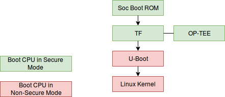

## Secure boot and firmware verification requirements

Copyright © 2018 Arm Limited.

### Introduction

The purpose of this document is to describe the requirements for the secure boot and firmware integrity verification of an Mbed Linux platform.  The goal of secure boot and any subsequent integrity verification is to ensure that a device will only run firmware from legitimate sources.  To protect high value data, the secure boot procedure aims to guarantee the integrity of the trusted execution environment by isolating it from possible vulnerabilities in other firmware components.  To reflect the different levels of trust confidence in the sources of different firmware components, signed components are grouped as follows:

The grouping by trust confidence is reflected in the chain-of-trust formed between boot components and their corresponding code signing authorities.

During the boot process, the following components should be verified:

*    Trusted world firmware and boot loaders used beyond the SoC ROM boot loader.
*    The trusted execution environment (TEE) and associated secure applications.
*    Normal world boot loaders.
*    The Linux kernel.

Other software components shall also be verified, but not necessarily during the boot process.  To avoid significantly impacting boot time, software components held in the root file system or other mounted read-only file systems may be verified on-demand, as and when files are accessed.  The verification of application container bundles is beyond the scope of this document.

The secure boot process must accommodate the field update of all firmware components, including trusted firmware, boot loaders and TEE.  The policy for what gets updated will be defined by device operators.  To support different update policies, the update solution should accommodate updating of individual components in a secure manner. 

Where possible, the boot process should use existing components such as Trusted Firmware, OP-TEE and U-Boot, configured in a way that requirements for security and reuse are met.  For a Linux distribution, it is highly desirable to use unmodified existing components wherever possible to exploit code maturity and familiarity by adopters.  This will require appropriate build configuration options to be selected to adapt the functionality of components such as U-Boot to meet requirements. 

#### Terminology

This section outlines the terminology used throughout the document:

*    TF-A: Trusted Firmware - secure world software for Arm A class devices (REF7)
*    DEK: Data Encryption Key
*    FIT: Flattened Image Tree
*    OTP: One Time Programmable
*    PSA: Platform Security Architecture (REF8)
*    SoC: System on Chip
*    SPL: Secondary Program Loader (U-Boot)
*    TEE: Trusted Execution Environment
*    TPM: Trusted Platform Module

#### References

* REF1: DM Verity project: https://gitlab.com/cryptsetup/cryptsetup/wikis/DMVerity
* REF2: Trusted Base System Architecture CLIENT2 (TBSA-CLIENT2), Document number: ARM DEN 0021A-6, Copyright ARM Limited 2011-2013
* REF3: Trusted Board Boot Requirements CLIENT (TBBR-CLIENT), Document number: ARM DEN0006C-1, Copyright ARM Limited 2011-2015
* REF4: mkimage tool source code: https://github.com/lentinj/u-boot/blob/master/tools/mkimage.c
* REF5: Verified Boot documents: https://www.chromium.org/chromium-os/chromiumos-design-docs/verified-boot
* REF6: Integrity Measurement Architecture: https://sourceforge.net/p/linux-ima/wiki/Home/
* REF7: Trusted Firmware for Arm A class devices: https://www.trustedfirmware.org/index.html
* REF8: Platform Security Architecture: https://developer.arm.com/products/architecture/security-architectures/platform-security-architecture

### Summary

This is a summary of the secure boot requirements for MBL:

*    All booted images must be signed and verified using a chain of trust where an OTP programmed key forms the root of trust for the verification chain.
*    Reuse of an existing solution is highly desirable.
*    As much of the secure verification logic as possible should be common across supported platforms.
*    Trusted Firmware provides a generic solution for booting and verifying trusted world firmware and the first normal world boot stage (U-Boot).
*    U-Boot to verify the Linux kernel, device tree and normal world boot script using Verified Boot, as used in Chrome OS.
*    The TEE must be initialized early on in the boot sequence to reduce the probability of its integrity being compromised.
*    Boot time verification can be limited to verifying all steps up to and including the Linux Kernel.
*    dm-verity (REF1) should be used to check the integrity of the read-only root FS.
*    A flow for device firmware development must be provided.
*    Development images should only be allowed to run on development devices.
*    It must not be possible to run a development image on a production device.

### Trusted Firmware

Trusted Firmware provides a reference implementation for the secure boot of trusted world components, up to loading and verifying the first normal world boot loader.  Although developed for ARMv8-A architecture, build configuration options are supported for ARMv7-A.  Trusted Firmware meets the requirements specified in the Arm Trusted Boot Requirements specification (REF3) but with restrictions for ARMv7-A devices.

### PSA Requirements

All design choices that are made for A class devices will be aligned to the goals of PSA.  Currently the following documents have been used:

*    Trusted Base System Architecture CLIENT2 (TBSA-CLIENT2) (REF2)
*    Trusted Board Boot Requirements CLIENT (TBBR-CLIENT) (REF3)

These documents give guidance in the following areas for secure boot:

#### Scope of SoC Root of Trust Key

The root of trust key, used by the SoC boot ROM, should only be used for verifying the firmware loaded and run by the boot ROM.  The type and size of the key will be constrained by the SoC boot ROM capabilities.  For example, NXP support RSA key pairs of sizes (1K, 2K or 4K).  The signing authority is responsible for using an appropriate key size to meet longevity requirements.

Subsequent boot images should be verified using keys embedded in the image of a previously loaded stage or in certificates held in secure storage.  The scope of the SoC root of trust key should be restricted to verifying the first booted image.

It is also recommended that the first loaded image is encrypted.  This requirement will depend on SoC capabilities.

By limiting the scope of the SoC root of trust key to the verification performed by the ROM boot loader, no other component used during the boot flow is dependent on any SoC specific root of trust key.  Other boot components may depend on SoC specifc NV counters, stored in OTP, for rollback protection.

#### Trusted World Components Should be Booted Before Normal World Components

To avoid the possibility of a normal world component, in some way, compromising a trusted world component, all trusted world components shall be booted before normal world components.  Also, to reduce the risk of unknown software running in secure mode, the size of any boot loader that runs in the secure state should be minimized.  A boot flow that uses Trusted Firmware, OP-TEE and U-Boot would follow the illustrated sequence:

### Platform Independent Boot Stage Verification

Beyond the loading and verification of the initial image, loaded by the SoC boot ROM, the boot logic and verification of subsequent steps in the boot process should be common across supported platforms.  This requirement is intended to achieve the following:

*    Minimize porting effort to new platforms.
*    Use a single image format that includes signature and key blocks for all supported platforms.
*    Use a common toolchain for image creation and signing (apart from the initial image loaded by the SoC boot ROM).
*    Achieve uniform security across platforms (within hardware constraints).

Ideally, the boot stage verification code should be free of SoC dependencies.  This will allow the same verification code to be used on different platforms.  There may be cases where hardware assistance is available to support cryptographic operations.  A choice may be made to exploit hardware features on certain platforms, if significant benefits can be achieved.  However, a software only implementation should be available to provide a default solution. 

### A Generic Flow using Trusted Firmware and U-Boot

The boot sequence will chain the following boot mechanisms:

1.    SoC boot ROM loads, verifies and runs the first trusted world image (TF-A BL2)
2.    TF-A loads, verifies and runs trusted world components, including OP-TEE.
3.    TF-A verifies and loads U-Boot which loads, verifies and runs normal world components.

The following diagram illustrates the chaining of the secure boot steps:

#### Trusted World Boot

Booting of trusted world components will be performed by Trusted Firmware.  Beyond the initial boot performed by the ROM boot loader, TF-A performs boot steps BL2, BL31, BL32 and BL33.  Prior to entering BL33, the switch from secure to non-secure execution mode is made.  All trusted components (e.g. OP-TEE) will have been initialised, prior to the mode switch.  BL33 will be U-Boot for MBL.

#### Normal World Boot

Booting of normal world components will be performed by U-Boot.  U-Boot is a bootloader intended for embedded devices and is most commonly used to boot the Linux kernel.  It includes many configuration options to support different boot requirements.  MBL will use the Verified Boot option to provide a common boot solution for normal world firmware.

##### Verified Boot

One secure boot option supported by U-Boot is called Verified Boot.  Verified Boot is a term used in Chrome OS.  It covers the secure boot and user-space integrity checking features used in Chrome OS.  Verified Boot features have been mainlined into U-Boot and can be optionally enabled using a suitable build configuration.  Verified Boot is a generic secure boot mechanism that can be used for embedded devices.

Signing key pairs can be created using openSSL.

Features of Verified Boot are:

* Uses FIT format.
* FIT files can contain signed image hash.
* FIT files can contain public keys used for verifying later boot stages.
* Images are signed using generic mkimage tool (REF4)
* The Verified Boot build configuration depends on the Vboot library.  Vboot library provides (REF5)
  * Hashing
  * RSA signature checking
  * Verified boot flow logic
  * TPM (Trusted Platform Module) library - used for roll-back protection

An IoT device is unlikely to include TPM hardware.  Instead, any TPM services used during secure boot will need to be provided by a trusted application running in the TEE.  A trusted application could provide roll-back protection, equivalent to the TPM service, using one of the following platform specific options:

*    On-chip counters based on OTP fuses
*    If the storage is based on eMMC then use the Replay Protected Memory Block (RPMB) whereby the access key used is a key only accessible by the secure side (e.g. based on an SoC secret) 
*    Emulated within secure on-chip embedded NVM (securely managed by the Trusted OS) 
*    Secure flash (accessible to secure only) protected by a derived key from the DEK (authenticated encryption).
*    In future SoCs ARM's CryptoCell/Island products will also provide a facility for roll-back protection. 

These will require the Trusted OS to have an application interface for providing the counter values and increasing them.

### Integrity Checking

The boot flow described above provides secure verification of all components in the boot chain, up to and including the Linux kernel.  It does not verify the read-only root file system or any other mounted file system that may hold executables or configuration data.  An additional solution will be required to check the integrity of read-only files.  The chosen solution will be:

#### dm-verity

Verified Boot, used in Chrome OS, relies on integrity checking of read-only block devices, performed before blocks are read.  This relies on the dm-verity kernel feature (REF1), which provides transparent checking of block devices.  The dm-verity feature scans block devices on demand and checks that block hashes match the expected hash, generated when the image file was created.  Access will be blocked if a mismatch is detected.   Use of block level intergrity checking will require block oriented firmware updates of a read-only device.  This is needed to ensure that block content hashes over the whole block device match the expected hashes.

### Image Signing

The following diagram illustrates how image signing tools are used to sign different boot components:

### Operation on Open and Closed Devices

A SoC will provide OTP hardware that determines the 'open' or 'closed' state of a device where:

*    Open: boot_mode=open means that if authentication of a boot chain component fails, an authentication failure event is logged but the boot process continues.
*    Closed: boot_mode=closed means that if authentication of a boot chain component fails, the boot process is halted (or perhaps put into a recovery mode).

After completing manufacturing steps, a production device should be in the closed state.  A production device should also have the following functionality disabled:

*    Serial console
*    Debug access via network e.g. via ssh
*    Debug and trace functions
*    JTAG

Mbed Linux should only support signed boot images for all boot steps beyond the initial step performed by the Soc ROM bootloader, independent of whether the device is open or closed. Unsigned images are not supported which:

*    reduces implementation effort.
*    reduces the test burden, while supporting easy developer project on-boarding.
*    reduces the software attack surface, increasing security of the software.

To support firmware development on an open device, the build process should automatically sign images using one or more developer keys.  The image containing SPL can also be signed using the SoC signing tool but this is not necessary.  When producing a release build, images will need to be signed by a trusted firmware supplier.

