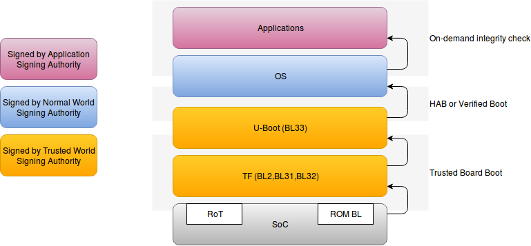
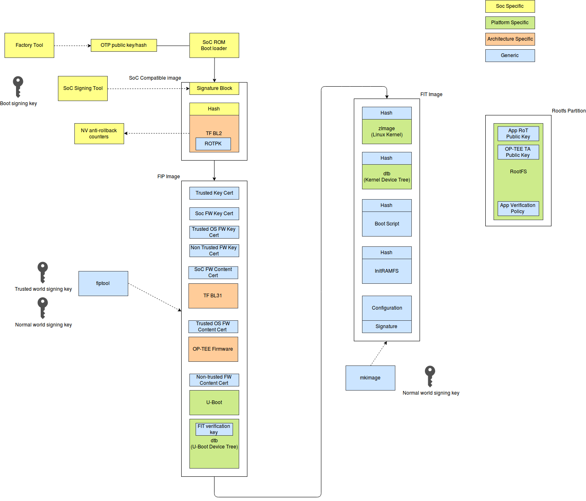

# Secure boot and firmware verification requirements

Copyright © 2018-2019 Arm Limited.

This article provides information about the methodology Mbed Linux OS (MBL) uses to support secure boot and firmware updates, and assumes you are an experienced Linux developer. You may find it interesting if you are porting MBL to new hardware or contributing to its code base.

## Introduction

This document describes the requirements for the secure boot and firmware integrity verification of an Mbed Linux OS platform. To protect high value data, the secure boot procedure and subsequent integrity verification ensure a device will only run firmware from legitimate sources. The secure boot procedure also guarantees the integrity of the trusted execution environment by isolating it from possible vulnerabilities in other firmware components. The verification of application container bundles is beyond the scope of this document.

Boot components and their corresponding code signing authorities form a chain of trust, which reflects their grouping by levels of trust confidence. The boot process needs to verify the following components:

1. Trusted world firmware and boot loaders used beyond the SoC ROM boot loader.
1. The trusted execution environment (TEE) and associated secure applications.
1. Normal world boot loaders.
1. The Linux kernel.

The secure boot process must accommodate field updates for all firmware components, including trusted firmware, boot loaders and TEE, as individuals. Device operators will then define their own policy for what can and cannot be updated.

### Terminology

This document uses the following terminology:

* **TF-A**: Trusted Firmware - secure world software for Arm Cortex-A devices (REF7).
* **DEK**: Data Encryption Key.
* **FIT**: Flattened Image Tree.
* **OTP**: One Time Programmable.
* **PSA**: Platform Security Architecture (REF8).
* **SoC**: System on Chip.
* **SPL**: Secondary Program Loader (U-Boot).
* **TEE**: Trusted Execution Environment.
* **TPM**: Trusted Platform Module.

### References

* REF2: Trusted Base System Architecture CLIENT2 (TBSA-CLIENT2), Document number: ARM DEN 0021A-6, Copyright ARM Limited 2011-2013
* REF3: Trusted Board Boot Requirements CLIENT (TBBR-CLIENT), Document number: ARM DEN0006C-1, Copyright ARM Limited 2011-2015
* REF4: mkimage tool source code: [https://github.com/lentinj/u-boot/blob/master/tools/mkimage.c](https://github.com/lentinj/u-boot/blob/master/tools/mkimage.c)
* REF5: Verified Boot documents: [https://www.chromium.org/chromium-os/chromiumos-design-docs/verified-boot](https://www.chromium.org/chromium-os/chromiumos-design-docs/verified-boot)
* REF6: Integrity Measurement Architecture: [https://sourceforge.net/p/linux-ima/wiki/Home/](https://sourceforge.net/p/linux-ima/wiki/Home/)
* REF7: Trusted Firmware for Arm Cortex-A class devices: [https://www.trustedfirmware.org/index.html](https://www.trustedfirmware.org/index.html)
* REF8: Platform Security Architecture: [https://developer.arm.com/products/architecture/security-architectures/platform-security-architecture](https://developer.arm.com/products/architecture/security-architectures/platform-security-architecture)

## Summary of requirements and recommendations

This is a summary of the MBL secure boot's requirements and recommendations:

* For the boot process, we recommend using unmodified existing components (such as Trusted Firmware, OP-TEE and U-Boot) wherever possible, to exploit code maturity and familiarity by adopters. The boot process should use these components with build options that meet requirements for security and reuse.
* All booted images must be signed and verified using a chain of trust. The root of trust key for the chain must be in OTP storage.
* As much of the secure verification logic as possible should be common across supported platforms. This is explained in greater detail [later in this document](#platform-independent-boot-stage-verification).
* Use Trusted Firmware to provide a generic solution for booting and verifying trusted world firmware and the first normal world boot stage (U-Boot).
* Use U-Boot to verify the Linux kernel, device tree and normal world boot script using Verified Boot, as used in Chrome OS.
* The TEE must be initialized early on in the boot sequence to reduce the probability of its integrity being compromised.
* Boot time verification can be limited to verifying all steps up to and including the Linux Kernel. Other software components must also be verified, but not necessarily during the boot process; to avoid significantly impacting boot time, software components held in the root file system or other mounted read-only file systems may be verified on-demand (as and when files are accessed).
* Only allow development images to run on development devices; it must not be possible to run a development image on a production device.

## Trusted Firmware

[Trusted Firmware](https://www.trustedfirmware.org/index.html) provides a reference implementation for the secure boot of trusted world components, up to loading and verifying the first normal world boot loader. Trusted Firmware meets the requirements specified in the Arm Trusted Boot Requirements specification (REF3) but with restrictions for ARMv7-A devices (because it was developed for [the ARMv8-A architecture](https://www.trustedfirmware.org/about/)).

## Aligning MBL with PSA requirements

All MBL design choices will be aligned to the goals of PSA, based on:

* Trusted Base System Architecture CLIENT2 (TBSA-CLIENT2), Document number: ARM DEN 0021A-6, Copyright ARM Limited 2011-2013 (REF2)
* Trusted Board Boot Requirements CLIENT (TBBR-CLIENT), Document number: ARM DEN0006C-1, Copyright ARM Limited 2011-2015 (REF3)

These documents give guidance on the scope of the SoC Root of Trust key, and the boot sequence for trusted and normal world components.

### Scope of SoC Root of Trust key

The Root of Trust (RoT) key, used by the SoC boot ROM, should only be used for verifying the firmware loaded and run by the boot ROM. Subsequent boot images should be verified using keys embedded either in the image of a previously loaded stage or in certificates held in secure storage. The scope of the SoC root of trust key should be restricted to verifying the first booted image, so that no other component used during the boot flow is dependent on any SoC-specific RoT key. Instead, for rollback protection, they must depend on SoC-specific NV counters stored in OTP.

The type and size of the key are constrained by the SoC boot ROM capabilities. For example, NXP support RSA key pairs of sizes 1K, 2K and 4K. The signing authority is responsible for using an appropriate key size to meet longevity requirements. We also recommend encrypting the first loaded image if the SoC can support that.

### Trusted world components must be booted before Normal world components

To avoid the possibility of a Normal world component compromising a Trusted (or Secure) world component in some way, all Trusted world components must be booted before Normal world components. Also, to reduce the risk of unknown software running in secure mode, the size of any boot loader that runs in the secure state should be minimized. A boot flow that uses Trusted Firmware, OP-TEE and U-Boot will follow the illustrated sequence:

## Platform-independent boot stage verification

After loading and verifying the initial image, loaded by the SoC boot ROM, the boot logic and verification of subsequent steps in the boot process should be common across supported platforms. This achieves:

* Minimal porting effort to new platforms.
* A single image format that includes signature and key blocks for all supported platforms.
* A common toolchain for image creation and signing (apart from the initial image loaded by the SoC boot ROM).
* Uniform security across platforms (within hardware constraints).

Ideally, the boot stage verification code should be free of SoC dependencies to allow a default software-only implementation, which can then be used on different platforms. Different platforms can exploit hardware features only available on those platforms if they bring significant benefits - such as hardware crypto.

## A generic flow using Trusted Firmware and U-Boot

The boot sequence chains the following boot mechanisms:

1. **SoC boot ROM** loads, verifies and runs the first trusted world image (TF-A BL2).
1. **TF-A** loads, verifies and runs trusted world components, including OP-TEE.
1. **TF-A** verifies and loads U-Boot.
1. **U-Boot** loads, verifies and runs normal world components.

The following diagram illustrates the chaining of the secure boot steps:

### Secure world boot

Booting of trusted boot components is performed by Trusted Firmware. After the ROM boot loader performs the initial boot, TF-A performs boot steps BL2, BL31, BL32 and BL33 (in the above diagram). The switch from secure to non-secure execution mode on the CPU is done *before* entering BL33, when all trusted components (like OP-TEE) have already been initialised. For MBL, BL33 is U-Boot.

### Normal world boot

Booting of normal world components is performed by U-Boot, a boot loader for embedded devices most commonly used to boot the Linux kernel. Its many configuration options support different boot requirements, and MBL uses the **Verified Boot** option to provide a common boot solution for normal world firmware.

#### Verified Boot

U-Boot supports **Verified Boot**, a generic secure boot mechanism that can be used for embedded devices. The term is used in Chrome OS to refer to its secure boot and user-space integrity checking features. Verified Boot features have been mainlined into U-Boot, and you can enable them with a build configuration.

Verified Boot features:

* Uses the FIT format. FIT files can contain:
    * A signed image hash.
    * Public keys used for verifying subsequent boot stages.

    You can use OpenSSL to create keys for use in verified boot..
* Images are signed using the generic mkimage tool (REF4).
* The Verified Boot build configuration depends on the Vboot library (REF5), which provides:
  * Hashing.
  * RSA signature checking.
  * The code to validate the verified boot components.
  * The Trusted Platform Module (TPM) library used for roll-back protection.

An IoT device is unlikely to include TPM hardware; it will instead rely on a trusted application running in the TEE for any TPM services used during secure boot. A trusted application can provide roll-back protection, equivalent to the TPM service, using one of the following platform-specific options:

* On-chip counters based on OTP fuses.
* If the storage is based on eMMC: use the Replay Protected Memory Block (RPMB), where the access key is only accessible to the secure side (for example, based on an SoC secret).
* Emulated within secure on-chip embedded NVM (securely managed by the Trusted OS).
* Secure flash (accessible through Secure world only), protected by a derived key from the DEK (authenticated encryption).
* In future SoCs, ARM's CryptoCell/Island products will also provide a facility for roll-back protection.

For all of these, the trusted application must have an application interface through which it can provide and increase counter values.

## Image signing

<!--to do: crosslink to image signing when it's published-->

The following diagram illustrates how image signing tools sign different boot components:

1. A factory tool writes the Root of Trust key into OTP storage.
1. The trusted boot flow's RoT key is added to the second stage boot - TF-A BL2.
1. An SoC signing tool signs the RoT key.
1. The fiptool that is provided by Trusted Firmware populates the keys into the FIP image for the trusted boot components.
1. The image is signed using the trusted boot flow RoT key.
1. mkimage adds the keys for the normal world components to the FIP image, and the components are signed using the keys from the FIP image.
1. The root file system (rootfs) contains the keys for the IoT applications and TEE applications.

## Operation on open and closed devices

An SoC provides OTP hardware that determines the 'open' or 'closed' state of a device:

* Open: `boot_mode=open` means that if authentication of a boot chain component fails, an authentication failure event is logged but the boot process continues.
* Closed: `boot_mode=closed` means that if authentication of a boot chain component fails, the boot process is halted (or put into a recovery mode, at the hardware vendor's choosing).

At the end of the manufacturing process, a production device should be in the close state. It should also have have the following functionality disabled:

* Serial console.
* Debug access over network, for example using SSH.
* Debug and trace functions.
* JTAG.

Beyond the initial step performed by the Soc ROM boot loader, Mbed Linux OS only supports signed boot images, independent of whether the device is open or closed. Not supporting unsigned images means:

* Reduced implementation effort.
* Reduced test burden, while supporting easy developer project on-boarding.
* Reduced software attack surface, and therefore increased software security.

To support firmware development on an open device, the build process will automatically sign images using one or more developer keys. You can use the SoC signing tools to sign the image containing secondary boot - TF-A BL2. When producing a release build, images must be signed by a trusted firmware supplier.
