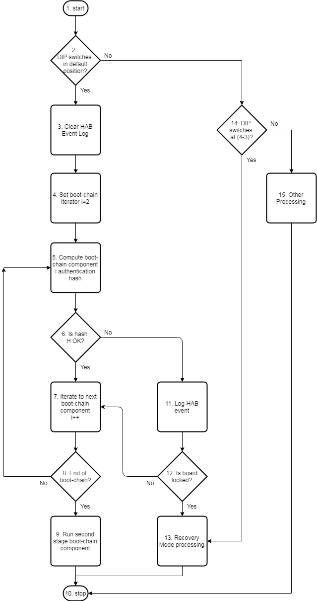
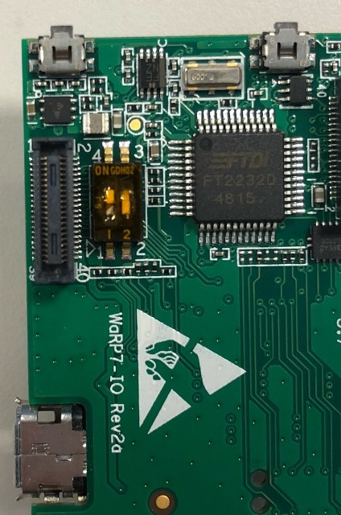

# <a name="section-1"></a> 1. WaRP7: How to sign images and recover unbootable boards

## 1.1 Overview

This document describes how to sign WaRP7 images, program One-Time Programmable fuses and check whether
the secure boot authentication has been completed successfully. Optionally, the board can then be locked.

The document is divided into six main sections: 
1. The first part provides a document overview including summary descriptions of the main sections, [outstanding issues](#section-1-4) and 
   a definition of the [terminology](#section-1-5) used throughout the document.
1. The second part provides an overview of the [secure boot processing logic](#section-2).
1. The third part describes the developer work flow for generating keying material, signing images, 
   programming WaRP7 images/OTP fuses and checking a secure boot is successful before locking the board.
   See [section 1.2](#section-1-2) for more details.
1. The forth part describes the recovery procedure for fixing an unbootable board. 
   See [section 1.3](#section-1-3) for more details.
1. The fifth part is an [Appendix](#section-5) with complete listing because only abridged version are 
   often shown in the main sections. This saves duplication and reduces the overall size of the document. 
1. The sixth part lists the references of supporting documentation.


## <a name="section-1-2"></a> 1.2 Overview of section 3 (developer workflow)

The developer workflow is described in [Section 3](#developer-workflow) which begins with an overview of the 
procedural steps necessary to boot a signed image.

[Section 3.1](#section-3-1) describes the prerequisites for generating signed images, including 
installing the required packages and tools (e.g. the NXP CST and `imx_usb` tools).

[Section 3.2](#section-3-2) describes generating the keying material including the 2048 bit CA private key, Super Root Keys (SRK), 
CSF keys, IMG keys and associated certificates. This is done by running the NXP CST `hab4_pki_tree.sh` tool. 

[Section 3.3](#section-3-3) describes using the NXP CST `srktool` for generating the `SRK_1_2_3_4_fuse.bin` and `SRK_1_2_3_4_table.bin` binaries. 
These binaries encode hashes of the four Super Root Keys for programming the OTP fuses. Hashes are used because the number of 
OTP fuse bits available is much smaller than the total number of key bits (4 x 2048). 
These bin files are used by `imx7-efuse-util.py`, the OTP programming tool for setting the OTP fuses.

[Section 3.4](#section-3-4) describes how to generate the mbl-console-image-test, which is the unsigned image precursor. The test
image is used rather than the production image because only the test image contains the `imx7-efuse-util.py` script for programming the OTP fuses. 
[Section 3.7](#section-3-7) describes how to use `imx7-efuse-util.py`.

[Section 3.5](#section-3-5) describes how to sign an image using the Makefile signing tool. In addition to signing the image, 
the Makefile also generates the u-boot recovery image which is needed for the Recovery Procedure described in [Section 4](#section-4).

[Section 3.6](#section-3-6) describes how to flash the signed image onto the WaRP7 board. This involves exposing the WaRP7
flash as a USB mass storage device (flash disk) and using bash commands on the dev host to write to the flash disk.

[Section 3.7](#section-3-7) describes how to program the WaRP7 board OTP fuses using `imx7-efuse-util.py` and the binaries 
`SRK_1_2_3_4_fuse.bin` and `SRK_1_2_3_4_table.bin` generated by the `srktool`. 
The binaries are specified as command line arguments to the `imx7-efuse-util.py` 
script which performs the programming operation.  

[Section 3.8](#section-3-8) describes how to verify the secure boot processing has successfully authenticated 
each of the components in the boot-chain (u-boot, kernel, kernel device tree and OPTEE).

[Section 3.9](#section-3-9) describes how to verify the u-boot recovery image works _before_ the board is locked. The 
verification procedure checks the recovery image itself
passes authentication (no HAB events), verifying the recovery image has been signed correctly by the same
keys (hashes) programmed into the OTP fuses.

[Section 3.10](#section-3-10) describes how to lock the board. Once the board is locked then any boot-chain
component failing authentication will trigger the Recovery Mode, which is covered extensively in section 4. 


## <a name="section-1-3"></a> 1.3 Overview of section 4 (recovery procedure)

[Section 4](#section-4) describes how to recover a locked board that fails to boot, which is usually caused by
a secure boot-chain component failing authentication. The step-by-step procedure
involves loading the u-boot recovery image into memory and using the UMS flash disk to 
reprogram the board flash with a valid image. 

[Section 4.1](#section-4-1) provides an overview of the Recovery Mode and the procedure needed to restore
unbootable boards to working order. Two common scenarios are described: Scenario 1 where the Recovery Mode
must be force triggered using WaRP-IO board DIP switches, and Scenario 2 where the Recovery Mode is 
triggered automatically.   

[Section 4.2](#section-4-2) summarises the Recovery Procedure steps in a list form with a brief description of each 
step. Each step is the subject of the following sections. 

[Section 4.3](#section-4-3) describes the prerequisites before starting the Recovery Procedure including 
a definition of the starting state of the board, acquiring the `imx_usb` tool (see also [section 3.1](#section-3-1) ) and 
verifying the u-boot recovery image (see also [section 3.9](#section-3-9)). 

[Section 4.4](#section-4-4) describes how to set the DIP switches on the [WaRP7-IO board](#warp7-io-board) to 
force the WaRP7-CPU board into Recovery Mode. This is required when Recovery Mode is not automatically triggered.

[Section 4.5](#section-4-5) describes how to check that the board has entered Recovery Mode by checking for a syslog 
event indicating the WaRP7 USB mass storages device (flash disk) is visible to the development machine.

[Section 4.6](#section-4-6) describes how to use the `imx_usb` tool to load the u-boot recovery image into memory, 
and then run it. The u-boot command prompt is then used to invoke the UMS command `ums 0 mmc 0` 
([Section 4.7](#section-4-7)) so the UMS flash disk is presented to the development machine. 
[Section 4.8](#section-4-8) then describes writing a working image to the flash disk, 
restoring the board to working order.

[Section 4.9](#section-4-9) describes setting the DIP switches on the [WaRP7-IO board](#warp7-io-board) back 
to the default position so that when the board powers up again the board does not automatically enter Recovery Mode.

[Section 4.10](#section-4-10) presents the trace for a board that successfully boots.


## <a name="section-1-4"></a> 1.4 Known issues

The known issues with this document or with WaRP7 image signing include the following:

- The output of the `hab_status` u-boot command for a signed image booted on a board with factory settings for OTP fuses (all 0x00000000)
  is currently not understood. The NXP documentation doesn't clarify this point.
- The output of the `hab_status` u-boot command for a u-boot recovery image u-boot-recovery.imx-signed on an unlocked 
  board with OTP fuses programmed should report no HAB events, but events are observed in the log. This issue has been raised with NXP.
- Figure 1 could be updated to clarify the differences between locked and unlocked behaviour of the board.

## <a name="section-1-5"></a> 1.5 Terminology

This section defines the terminology used throughout the document:

    BSP  : Board Support Package
    CA   : Certificate Authority
    CSF  : Command Sequence File
    CST  : Code-Signing Tool
    DCD  : Device Configuration Data
    DEK  : Data Encryption Key
    DER  : File extension for binary DER encoded certificates
    HAB  : High Assurance Boot
    HID  : Human Interface Device
    IVT  : Image Vector Table
    NC   : No Comment
    OPTEE: Open Platform Trusted Execution Environment
    OTP  : One-Time Programmable
    PEM  : File extension for X509 base64 encoded certificates
    RoT  : Root of Trust
    RP   : Recovery Procedure
    SiP  : Silicon Partner
    SRK  : Super Root Key (PKI public/private signing keys)
    TSP  : Target (Family) Support Package e.g. the feature support common to the IMx7 family
    TPM  : Trusted Platform Module
    VP   : Verification Procedure
    UMS  : USB Mass Storage Mode


# <a name="section-2"></a> 2 Secure Boot Processing Logic  

## <a name="section-2-1"></a> 2.1 Overview 

<a name="fig_force_recovery_mode_with_dip_switches"></a>


**Figure 1: The picture shows a flowchart describing the WaRP7 boot process.**

### 2.1.1 Introduction 


The system architecture of the WaRP7 secure boot process has 2 main primitives:
1. **Root of Trust (RoT).** 
    - The board root of trust is the WaRP7's OTP fuse containing a hash of the board's SRK public key.  
2. **Component Signing.** 
    - Each system component to be trusted is signed. This means header/tail information is pre/post-pended 
      to a trusted system component binary with (essentially) a certificate containing:
        - The full SRK public key corresponding to the RoT key hash.
        - The signature (i.e. a hash) of the component binary generated using the SRK private key. 
    - The trusted system components include u-boot, the Linux Kernel, the Linux Device Tree and OPTEE. 

The job of the secure boot process is to iterate over the list of trusted system components
checking that:
- The signing certificate appended to the component binary is valid (e.g. has not expired or been revoked, and is from the authority 
  whom says they signed it). 
- The hash of the SRK public key found in the certificate matches the key hash programmed into the OTP fuses
  for that component. Potentially there can be 1 OTP key hash per component.
- The signature of the component binary matches the signature found in the signing certificate.
    
The flowchart in Figure 1 illustrates this process in more detail:
1. Start. After power on reset, the on-chip bootROM runs. This is the first stage bootloader.   
1. DIP Switches in Default (4-2) Position. If the WaRP7-IO board DIP switches are in the default position (4-2) then continue with the normal
   boot flow (Yes branch). Otherwise take the No branch to perform other checks.
1. Clear HAB Event Log. The bootROM clears the HAB log of events. If a boot-chain component fails authentication then a HAB event will be logged.  
1. Boot Chain component i=2. Conceptually, the bootROM loops over the list of boot-chain components authenticating each component. 
   The beginning of the loop is at the second stage (i=2) bootloader.
1. Compute Authentication Hash H. The authentication hash H is computed of the i-th component in the boot-chain. 
1. Is Hash OK? If the computed hash H agrees with that supplied in the signing headers attached to the boot-chain component
   then the authentication continues to the next boot-chain component (Yes branch). Otherwise, an event is logged and the Recovery Mode
   is entered (No branch). 
1. Next Bootchain Component i++. The boot-chain component counter 'i' is incremented to iterate over the list of components in the boot-chain.
1. End of Bootchain? If there is another components in the boot-chain to authenticate then this decision branches back to perform authentication. 
   Otherwise the bootROM process will proceed to the Stop state.
1. Run Second Stage Bootloader. The boot-chain has been successfully authenticated so the second stage bootloader is run. 
1. Stop. The bootROM has performed the task of authenticating the components in the boot-chain and can now stop.
1. Log HAB Event. The authentication failure of boot-chain component 'i' is logged in the HAB event log. 
1. Is board locked? Board configuration is checked and if the system is found to be in the locked state then the Yes branch is taken 
   (to trigger Recovery Mode). Otherwise the No branch is taken to proceed onto the next bootchain component.
1. Recovery Mode Processing. The system performs Recovery Mode processing.
1. DIP Switches in (4-3) Position.  If the WaRP7-IO board DIP switches are in the (4-3) position then trigger the Recovery Mode.
   Otherwise take the No branch to perform other processing (which is not considered in this document).
1. Other Processing (not relevant to this procedure). When the DIP switches are not in the (4-3) position to force the triggering of the recovery mode
   then the processing is not relevant to this discussion.  


# <a name="developer-workflow"></a> 3. The developer workflow for booting a signed image

The developer work-flow steps for booting a Signed Image (SI) includes the following steps:

- **[SI Step 1](#section-3-1): Prerequisites.**
    - Acquire the tools (NXP CST, `imx-usb`) and install required packages.
- **[SI Step 2](#section-3-2): Generate signing keys.**
    - Use the CST tool `hab4_pki_tree.sh` to generate signing keys and certificates.
- **[SI Step 3](#section-3-3): Generate the Fuse and Table Binaries.**
    - Use the CST srktool to generate the fuse and table binary files for programming OTP fuses.
- **[SI Step 4](#section-3-4): Build an unsigned mbl-console-image-test image.**
    - The test image is used first as it contains `imx7-efuse-util.py` which is required to program the OTP fuses.
- **[SI Step 5](#section-3-5): Sign the image.**
    - Sign the mbl-console-image-test image using the signing Makefile tool.
- **[SI Step 6](#section-3-6): Flash/boot the signed image.**
    - Flash the signed image, boot the board and check the `hab_status` report for HAB events.
- **[SI Step 7](#section-3-7): Program the OTP fuses.**
    - Use the imx7-efuse-util.py tool to program the OTP fuses.
- **[SI Step 8](#section-3-8): Reboot and verify a successful secure boot.**
    - Reboot and check the `hab_status` reports secure boot successful authentication.
- **[SI Step 9](#section-3-9): Verifying the u-boot recovery image.**
    - Before locking the board it's prudent to check the recovery image works.
- **[SI Step 10](#section-3-10): OPTIONAL: Close and lock WaRP7.**

Each step is described in more detail below.

## <a name="section-3-1"></a> 2.1 SI Step 1: Prerequisites

This section describes the preparatory steps necessary for creating a signed image.


### <a name="section-3-1-1"></a> 3.1.1 SI Step 1.1: Install required packages for signing

Please consult the [Prerequisites](https://github.com/ARMmbed/meta-mbl/blob/master/docs/walkthrough.md#-1-prepare-your-development-environment) section of the
MBL [Instructions for Building Images](https://github.com/ARMmbed/meta-mbl/blob/master/docs/walkthrough.md) to ensure these packages are installed
on your development host.

In addition, the following packages should be installed for signing:
```
    computer:$ sudo apt-get install make bash kpartx mktemp
```

### 3.1.2 SI Step 1.2: Create a workspace for building images

Create an Mbed Linux workspace by following the instructions in the
[Instructions for Building Images](https://github.com/ARMmbed/meta-mbl/blob/master/docs/walkthrough.md) document.

Throughout this document the `mbl-alpha` directory created in the 
[Instructions for Building Images](https://github.com/ARMmbed/meta-mbl/blob/master/docs/walkthrough.md) guide 
is referred to as TOP_DIR.


### 3.1.3 Step 1.3: Acquire the NXP Code Signing Tool (CST)

In order to sign WaRP7 images, the NXP Code Signing Tool (CST) must be obtained from the NXP website under license. 
This requires acceptance of the NXP Software License Agreement (See the [NXP License Page][NXP-Webpage-for-accepting-CST-Licence-agreement-and-downloading-the-tool] for details).

These instructions refer to the use of version 2.3.3 of the CST (cst-2.3.3.tar.gz).

Having downloaded the CST (e.g. cst-2.3.3.tar.gz), copy the tarball to the following location in the workspace:
```
    TOP_DIR/layers/meta-mbl/pki/nxp/boards
```

### <a name="section-3-1-4"></a> 3.1.4 Step 1.4: Downloading & building the `imx_usb` tool

When the u-boot recovery images is tested prior to locking the board, 
a tool is needed for loading the u-boot recovery image into memory. The tool used in this
procedure is the BoundaryDevices `imx_usb` tool available at the [imx usb loader github project][imx-usb-loader].
(See the project imx usb loader README.md for more details).

To build the tool follow the project instructions, which are summarised below:
- Clone the project.
- Make sure the libusb package is installed on your system.
- Change into the top level directory of the imx usb-loader project and type `make`.
- If successful, the imx_usb binary will be created in the top level directory.   

The `imx-usb` tool is also used when the WaRP7 enters recovery mode so u-boot commands line can be used 
to reprogram the flash with a good image (see step 4 in the recovery procedure later in this document). 


## <a name="section-3-2"></a> 3.2 SI Step 2: Generate signing keys

This section describes how to create the public/private keys and certificates used to sign boot chain component(s).
The secure boot process checks that each boot chain component(s) has been signed by the party trusted to issue valid software images (the signing authority). The secure boot process does not currently implement confidentiality (encryption of images).  

When generating the keying material, the development machine used to create the keys and certificates is acting as a Certificate Authority.

The keying material is composed of the following:

- **A top level private key called the CA private key**. This is used to sign certificates in the next layer down from the CA root in the PKI key hierarchy (tree).
- **Super Root Keys (SRK)**. These private keys are used to sign certificates (containing a public key) at the next level down (second level) in the PKI tree hierarchy.
  The private keys are stored in key files and the public keys are stored in certificates signed by the private key. A hash of 1-4 SRK public keys will be programmed into the OTP fuses. The certificates are embedded in signed images so the secure boot process can:
    - Recover the public key,
    - Check the signature on the certificate,
    - Hash the key and
    - Check the hash agrees with the hash in the relevant OTP fuse.
- **CSF keys and certificates (at the third level of the PKI tree hierarchy)**.
    - These keys are subordinate to the corresponding SRKx key at the next level up in the PKI tree hierarchy.
    - These are used to sign binary components in the boot chain e.g. u-boot, Linux kernel and OPTEE.
    - These keys are used to verify signatures across CSF commands. See [4] for more information on CSF commands.
- **IMG keys and certificates (at the third level of the PKI tree hierarchy)**.
    - These keys are subordinate to the corresponding SRKx key at the next level up in the PKI tree hierarchy.
    - These keys are used to verify signatures across product software.


The `hab4_pki_tree.sh` CST tool can generate a PKI hierarchy with per-board keys where the CA private key is the RoT. 
However, the procedure for creating and managing per-board keys is considered beyond the scope of this document. 
Instead, the document explains how to generate a single set of keying material used for all 
(development) boards. This simplification has the advantage that an 
image signed with the keys can be flashed and booted on all boards. 

The procedure, however, is structured to gracefully evolve from a single set of keys for all boards to a set of keys per board.


**Storing your development keys**

The process described here is for use by a developer generating keying material to sign images and perform development tasks. These keys need to be stored securely and privately so they cannot leave the organization, as they could be used in the future to compromise production devices. Developer private keys may need to be kept on a Trusted Platform Module (TPM) for example, as for production keys, but this depends on the security policy of your organization. It is recommended that one person in the development organization is responsible for generating and securely storing the developer private keys.

**Generating keying material**

To generate the keying material, perform the following steps:

1. Make the board's directory the current working directory.
```
    computer:TOP_DIR/$ cd TOP_DIR/layers/meta-mbl/pki/nxp/boards
```
2. Create a sub-directory with a meaningful name reflecting the purpose of managing the keying material. 
   A suggested scheme is to use a board ID (which can be determined from the 
   QR code sticker attached to the board), as this has the potential to evolve gracefully to manage multiple 
   (sets of) boards and keys/certs. In this example the board ID 000000-0000-000000-0000 is used to suggest
   'all boards':
```
    computer:TOP_DIR/layers/meta-mbl/pki/nxp/boards/$ mkdir 000000-0000-000000-0000
```
3. Unroll the CST tarball into the board sub-directory stripping off the top level directory from the tarball paths.
```
    computer:TOP_DIR/layers/meta-mbl/pki/nxp/boards/$ tar -C 000000-0000-000000-0000 -xvzf cst-2.3.3.tar.gz --strip 1
```
4. Copy the serial file into the 000000-0000-000000-0000/keys directory. This file contains the base serial index number to enumerate (some) HAB tool generated files.
```
    computer:TOP_DIR/layers/meta-mbl/pki/nxp/boards/$ cp serial 000000-0000-000000-0000/keys
```
5. Create the (private) key pass phrase file key_pass.txt in the 000000-0000-000000-0000/keys directory. The private key files are protected using the pass phrase (repeated twice) in this file.
```
    computer:TOP_DIR/layers/meta-mbl/pki/nxp/boards$ cat key_pass.txt
    Replace-this-text-with-your-private-pass-phrase
    Replace-this-text-with-your-private-pass-phrase
    computer:TOP_DIR/layers/meta-mbl/pki/nxp/boards$
```
This file should be stored securely with the other private keying material.

6. Make the current working directory the 000000-0000-000000-0000/keys directory.
```
    computer:TOP_DIR/layers/meta-mbl/pki/nxp/boards/$ cd 000000-0000-000000-0000/keys
```
7. Run the HAB4 tool to generate the keying material:
```
    computer:TOP_DIR/layers/meta-mbl/pki/nxp/boards/000000-0000-000000-0000/keys/$ ./hab4_pki_tree.sh
```
When the `hab4_pki_tree.sh` tool is run, the tool asks a series of questions. The questions and responses are shown
in the following sample of the console log (with line numbers inserted for reference):
```
    1. Do you want to use an existing CA key (y/n)?: n
    2. Do you want to use Elliptic Curve Cryptography (y/n)?: n
    3. Enter key length in bits for PKI tree: 2048
    4. Enter PKI tree duration (years): 10
    5. How many Super Root Keys should be generated? 4
    6. Do you want the SRK certificates to have the CA flag set? (y/n)?: y
```

where:
1. No specifies this development machine will be a CA and have a top level root key.
2. No specifies RSA cryptography will be used to generate the keying material.
3. 2048 specifies the key length (other alternatives are 1024 (shortest/weakest) and 4096 (longest/strongest).
4. 10 specifies that the generated certificates will expire in 10 years time.
5. 4 specifies that 4 SRKs will be generated. The WaRP7 has sufficient space for 4 SRK hashes, so 4 keys are generated. All 4 SRK key hashes will be programmed into the OTP fuses in one operation, rather than 4 separate operations.
6. Yes specifies that the CA flag will be included in certificates.

The following shows what happens when all the questions have been answered and the `hab4_pki_tree.sh` script generates the keying
material (see [Listing A.1.1](#listing-A-1-1) for a full listing):
```
     +++++++++++++++++++++++++++++++++++++++++++++++++++++++++++++++
     This script is a part of the Code signing tools for Freescale's
     High Assurance Boot. It generates a basic PKI tree. The PKI
     tree consists of one or more Super Root Keys (SRK), with each
     SRK having two subordinate keys:
     
     ... further output deleted.
```
**Listing 3.2.1: Output from the `hab4_pki_tree.sh` tool.**


Please ensure the script output does not contain any errors. On success, the following files will have been
generated in the keys sub-directory (see [Listing A.1.2](#listing-A-1-2) for a full listing):
```
    computer:TOP_DIR/layers/meta-mbl/pki/nxp/boards/000000-0000-000000-0000/keys/$ ls -la
    -rw-rw-r-- 1 simhug01 simhug01  7133 Feb 21 14:24 10000000.pem
    ... line removed 
    -rw-rw-r-- 1 simhug01 simhug01  7004 Feb 21 14:24 1000000B.pem
    -rw-rw-r-- 1 simhug01 simhug01  2450 Feb 21 14:24 CA1_sha256_2048_65537_v3_ca_key.der
    -rw-rw-r-- 1 simhug01 simhug01  3394 Feb 21 14:24 CA1_sha256_2048_65537_v3_ca_key.pem
    -rw-rw-r-- 1 simhug01 simhug01  2450 Feb 21 14:24 CSFi_1_sha256_2048_65537_v3_usr_key.yyy
    -rw-rw-r-- 1 simhug01 simhug01  2450 Feb 21 14:24 IMGi_1_sha256_2048_65537_v3_usr_key.yyy
    ... line removed 
    -rw-rw-r-- 1 simhug01 simhug01  2450 Feb 21 14:24 SRKi_sha256_2048_65537_v3_ca_key.yyy
```
**Listing 3.2.2: Summary of `hab4_pki_tree.sh` generated keying files in keys subdirectory (i={1, 2, 3, 4}, yyy={"der", "pem"}).**


The following provides information as to the purpose of these files:

- The `CA1_sha256_2048_65537_v3_ca_key.{pem, der}` are the CA root level 2048 bit private keys in plain text and binary encodings. These are the first level keys in the PKI tree hierarchy.
- The `SRKx_sha256_2048_65537_v3_ca_key.{pem, der} (x={1,2, 3,4})` are the SRK (second level) 2048 bit private keys in plain text and binary encodings:
    - The private keys are used to sign the certificates (containing a public key) at the next level down in the PKI tree hierarchy i.e. at the third level.
- The `CSFx_1_sha256_2048_65537_v3_usr_key.{pem, der} (x={1,2, 3,4})` are the (third level) 2048 bit private keys in plain text and binary encodings:
- The `IMGx_1_sha256_2048_65537_v3_usr_key.{pem, der} (x={1,2, 3,4})` are the (third level) 2048 bit private keys in plain text and binary encodings:
- The `10000000.pem` to 1`000000B.pem` are public keys for the SRK, CSF and IMG private keys mentioned above.
    - There are 12 files in total, 4 public keys each for the SRK, CSF and IMG private keys.  
    - The hashes of the 4 SRKx public keys are stored in the WaRP7 OTP fuses to form the Root of Trust.

On success, the following files will have been generated in the `crts` sub-directory (see [Listing A.1.3](#listing-A-1-3) for a full listing):
```
    computer:TOP_DIR/layers/meta-mbl/pki/nxp/boards/000000-0000-000000-0000/keys/$ ls -la ../crts/
    total 160
    -rw-rw-r-- 1 simhug01 simhug01 1388 Feb 21 14:24 CA1_sha256_2048_65537_v3_ca_crt.der
    -rw-rw-r-- 1 simhug01 simhug01 1935 Feb 21 14:24 CA1_sha256_2048_65537_v3_ca_crt.pem
    -rw-rw-r-- 1 simhug01 simhug01 1358 Feb 21 14:24 CSFi_1_sha256_2048_65537_v3_usr_crt.yyy
    -rw-rw-r-- 1 simhug01 simhug01 1358 Feb 21 14:24 IMGi_1_sha256_2048_65537_v3_usr_crt.yyy
    -rw-rw-r-- 1 simhug01 simhug01 1384 Feb 21 14:24 SRKi_sha256_2048_65537_v3_ca_crt.yyy
    computer:TOP_DIR/layers/meta-mbl/pki/nxp/boards/000000-0000-000000-0000/keys/$
```
**Listing 3.2.3: Summary of `hab4_pki_tree.sh` generated keying files in certs subdirectory (i={1, 2, 3, 4}, yyy={"der", "pem"}).**


The following provides information as to the purpose of these files:

- The `CA1_sha256_2048_65537_v3_ca_crt.{pem, der}` are the CA root level certificate in plain text and binary encodings.
- The `SRKx_sha256_2048_65537_v3_ca_crt.{pem, der} (x={1,2, 3,4})` are the SRK (second level) public key certificates in plain text and binary encodings:
    - The certificate contains the public key of the associated S`RKx_sha256_2048_65537_v3_ca_key.{pem, der}` private key.
- The `CSFx_1_sha256_2048_65537_v3_usr_crt.{pem, der} (x={1,2, 3,4})` are the (third level) public key certificates in plain text and binary encodings:
    - The certificate contains the public key of the associated `CSFx_sha256_2048_65537_v3_ca_key.{pem, der}` private key.
- The `IMGx_1_sha256_2048_65537_v3_usr_crt.{pem, der} (x={1,2, 3,4})` are the (third level) public key certificates in plain text and binary encodings:
    - The certificate contains the public key of the associated `IMGx_sha256_2048_65537_v3_ca_key.{pem, der}` private key.
- All the certificates are in X509 format.


## <a name="section-3-3"></a> 3.3 SI Step 3: Generate the fuse and table binaries

To programme the WaRP7 OTP fuses, use the CST srktool to generate 2 files:

- `SRK_1_2_3_4_table.bin`. This file contains a table of the SRK public keys found in the specified input SRKx_sha256_2048_65537_v3_ca_crt.pem files.
- `SRK_1_2_3_4_fuse.bin`. This file contains a hash of the SRK public keys found in the specified input SRKx_sha256_2048_65537_v3_ca_crt.pem files.
  SRK_1_2_3_4_fuse.bin is used to program the OTP fuses.

For example, the following line shows how these files are generated:
```
    computer:TOP_DIR/layers/meta-mbl/pki/nxp/boards/000000-0000-000000-0000/keys/$ cd ../crts
    computer:TOP_DIR/layers/meta-mbl/pki/nxp/boards/000000-0000-000000-0000/crts/$ ../linux64/bin/srktool -h 4 -t SRK_1_2_3_4_table.bin -e SRK_1_2_3_4_fuse.bin -d sha256 -c ./SRK1_sha256_2048_65537_v3_ca_crt.pem,./SRK2_sha256_2048_65537_v3_ca_crt.pem,./SRK3_sha256_2048_65537_v3_ca_crt.pem,./SRK4_sha256_2048_65537_v3_ca_crt.pem -f 1
```
where:

    `-h` (--hab-ver) <version> specifies the version of the HAB, which we set to 4 for HAB4.
    `-t` (--table) <table_file_name> specifies the name of the output table file, which is set to SRK_1_2_3_4_table.bin because it's generated from 4 certificate files containing the SRK public keys.
    `-e` (–efuses) <fuse_file_name> specifies the name of the output fuse file, which we set to SRK_1_2_3_4_fuse.bin because it's generated from 4 certificate files containing the SRK public keys.
    `-c` (--certs) <cert1,cert2,...,certN> specifies a comma separated list of certificate file names which contain the SRK public keys.
    `-d`, --digest <digestalg>: Message Digest algorithm. Either sha1 or sha256    
    `-f` (--fuse-format) <format> specifies the data format of the SRK efuse binary file.
       We specify 1 for the default format of 32 fuses (bits) per word.

The full use of srktool is documented in [4].


## <a name="section-3-4"></a> 3.4 SI Step 4: Build an unsigned mbl-console-image-test image

To build an image, use the MBL [Instructions for Building Images](https://github.com/ARMmbed/meta-mbl/blob/master/docs/walkthrough.md). The test image is created by using the mbl-console-image-test bitbake target, as shown in the following command:
```
    computer:TOP_DIR/build-mbl/$ bitbake mbl-console-image-test
```

## <a name="section-3-5"></a> 3.5 SI Step 5. Manually sign the image

After a build, use the following command to sign the image:
```
    computer:TOP_DIR/layers/meta-mbl/pki/nxp/sign/$ make IMAGE_NAME=<image-name> CST_BOARD_ID=<board-id>
```
where:

* `image-name` is the name of the image in the TOP_DIR/build-mbl/tmp-mbl-glibc/deploy/images/imx7s-warp-mbl directory to sign. This can be:
    - mbl-console-image-imx7s-warp-mbl.wic.gz
    - mbl-console-image-test-imx7s-warp-mbl.wic.gz
    - `image-name` defaults to mbl-console-image-imx7s-warp-mbl.wic.gz.
* `board-id` is the subdirectory in the TOP_DIR/layers/meta-mbl/pki/nxp/boards containing the keying material for the board. The `board-id` defaults to 000000-0000-000000-0000.

For example, to sign the test image with the keying material stored in boards/000000-0000-000000-0000 use the following command:
```
    computer:TOP_DIR/$ cd TOP_DIR/layers/meta-mbl/pki/nxp/sign
    computer:TOP_DIR/layers/meta-mbl/pki/nxp/sign/$ make IMAGE_NAME=mbl-console-image-test-imx7s-warp-mbl.wic.gz CST_BOARD_ID=000000-0000-000000-0000
```
Excerpts from the generated sample output are shown in the following console output listing:
```
    mkdir -p `pwd`/temp
    mkdir -p `pwd`/signed-binaries
    cp `pwd`/../../../../build-mbl/tmp-mbl-glibc/deploy/images/imx7s-warp-mbl/mbl-console-image-imx7s-warp-mbl.wic.gz .
    cp `pwd`/../boards/000000-0000-000000-0000/keys/* `pwd`/temp
    <<<... much output deleted >>>
    CSF Processed successfully and signed data available in 2048-u-boot_sign.csf-csf-header
    <<<... much output deleted >>>
    CSF Processed successfully and signed data available in 2048-u-boot-recover_sign.csf-csf-header
    <<<... much output deleted >>>
    CSF Processed successfully and signed data available in 2048-boot_scr_sign.csf-csf-header
    <<<... much output deleted >>>
    CSF Processed successfully and signed data available in 2048-zimage_sign.csf-csf-header
    <<<... much output deleted >>>
    CSF Processed successfully and signed data available in 2048-dtb_sign.csf-csf-header
    <<<... much output deleted >>>
    CSF Processed successfully and signed data available in 2048-optee_sign.csf-csf-header
    <<<... much output deleted >>>
    CSF Processed successfully and signed data available in 2048-optee_sign.csf-csf-header
    <<<... much output deleted >>>
    sudo /data/2284/test/to_delete/20180313/layers/meta-mbl/pki/sign/./scripts/add-signed-images.sh -i mbl-console-image-imx7s-warp-mbl.wic.gz
    make[1]: Leaving directory '/data/2284/test/to_delete/20180313/layers/meta-mbl/pki/sign'
```
Part of the make file operations need to run with sudo privileges (in order to mount the loop back device used for
creating the signed image). Enter your account password when prompted.

On success, a signed image (`signed-mbl-console-image-imx7s-warp-mbl.wic.gz`) file will have been created in the current directory:
```
    drwxrwxr-x 2 simhug01 simhug01      4096 Mar 13 16:07 csf-templates
    -rw-rw-r-- 1 simhug01 simhug01      8041 Mar 13 17:21 Makefile
    -rw-r--r-- 1 simhug01 simhug01 135265804 Mar 13 17:24 mbl-console-image-test-imx7s-warp-mbl.wic.gz
    drwxrwxr-x 2 simhug01 simhug01      4096 Mar 13 17:23 scripts
    drwxrwxr-x 4 simhug01 simhug01      4096 Mar 13 17:24 signed-binaries
    -rw-r--r-- 1 simhug01 simhug01 144713770 Mar 13 17:25 signed-mbl-console-image-test-imx7s-warp-mbl.wic.gz
    drwxrwxr-x 5 simhug01 simhug01     12288 Mar 13 17:24 temp
```

You can clean the working directory after you have flashed the board with the following command:
```
    computer:TOP_DIR/layers/meta-mbl/pki/nxp/sign/$ make clean
```

## <a name="section-3-6"></a> 3.6 SI Step 6: Flash/boot the signed image

Follow the instructions in the [Write the disk image to your device and boot Mbed Linux](https://github.com/ARMmbed/meta-mbl/blob/master/docs/walkthrough.md#-8-write-the-disk-image-to-your-device-and-boot-mbed-linux)
section of the MBL [Instructions for Building Images](https://github.com/ARMmbed/meta-mbl/blob/master/docs/walkthrough.md).

When the board is booted press a key at the u-boot prompt.
Type `hab_status` to see if any events have been generated, as illustrated in the console output below (see [listing A.1.4](#Listing-A-1-4) for a full u-boot header listing):

```
    U-Boot 2018.03-rc2+fslc+g224318f (Feb 26 2018 - 18:04:12 +0000)
    ... see listing A.1.5 for full u-boot header trace

    Hit any key to stop autoboot:  0
    => hab_status
    Secure boot disabled
    HAB Configuration: 0xf0, HAB State: 0x66
    --------- HAB Event 1 -----------------
    event data:
            0xdb 0x00 0x08 0x42 0x33 0x11 0xcf 0x00

    STS = HAB_FAILURE (0x33)
    RSN = HAB_INV_CSF (0x11)
    CTX = HAB_CTX_CSF (0xCF)
    ENG = HAB_ENG_ANY (0x00)

    --------- HAB Event 2 -----------------
    event data:
            0xdb 0x00 0x14 0x42 0x33 0x0c 0xa0 0x00
            0x00 0x00 0x00 0x00 0x87 0x7f 0xf4 0x00
            0x00 0x00 0x00 0x20

    STS = HAB_FAILURE (0x33)
    RSN = HAB_INV_ASSERTION (0x0C)
    CTX = HAB_CTX_ASSERT (0xA0)
    ENG = HAB_ENG_ANY (0x00)

    --------- HAB Event 3 -----------------
    event data:
            0xdb 0x00 0x14 0x42 0x33 0x0c 0xa0 0x00
            0x00 0x00 0x00 0x00 0x87 0x7f 0xf4 0x2c
            0x00 0x00 0x01 0xd4

    STS = HAB_FAILURE (0x33)
    RSN = HAB_INV_ASSERTION (0x0C)
    CTX = HAB_CTX_ASSERT (0xA0)
    ENG = HAB_ENG_ANY (0x00)

    --------- HAB Event 4 -----------------
    event data:
            0xdb 0x00 0x14 0x42 0x33 0x0c 0xa0 0x00
            0x00 0x00 0x00 0x00 0x87 0x7f 0xf4 0x20
            0x00 0x00 0x00 0x01

    STS = HAB_FAILURE (0x33)
    RSN = HAB_INV_ASSERTION (0x0C)
    CTX = HAB_CTX_ASSERT (0xA0)
    ENG = HAB_ENG_ANY (0x00)

    --------- HAB Event 5 -----------------
    event data:
            0xdb 0x00 0x14 0x42 0x33 0x0c 0xa0 0x00
            0x00 0x00 0x00 0x00 0x87 0x80 0x00 0x00
            0x00 0x00 0x00 0x04

    STS = HAB_FAILURE (0x33)
    RSN = HAB_INV_ASSERTION (0x0C)
    CTX = HAB_CTX_ASSERT (0xA0)
    ENG = HAB_ENG_ANY (0x00)
    =>
```
As the board currently has the OTP fuse settings that were programmed in the factory (0x00000000 for each fuse), the HAB events are indeterminate (the NXP documentation is silent on the system behaviour in this case).

## <a name="section-3-7"></a> 3.7 SI Step 7: Program the OTP fuses

At the present time, the OTP fuse programming tool imx7-efuse-util.py is not included in the mbl-console-image-test distribution
and therefore has to be copied to the board. The imx7-efuse-util.py script is available at the following location:
```
    computer:TOP_DIR/layers/meta-mbl/pki/nxp/sign/scripts/$ ls -al

    total 72
    drwxrwxr-x 2 simhug01 simhug01  4096 Mar 15 11:54 ./
    drwxrwxr-x 6 simhug01 simhug01  4096 Mar 15 12:01 ../
    -rwxrwxr-x 1 simhug01 simhug01  8836 Mar 13 16:07 add-signed-images.sh*
    -rwxrwxr-x 1 simhug01 simhug01   322 Mar 13 16:07 build_uboot_tools.sh*
    -rwxrwxr-x 1 simhug01 simhug01  8217 Mar 13 16:07 extract-unsigned-images.sh*
    -rwxrwxr-x 1 simhug01 simhug01   396 Mar 13 16:07 fetch_uboot.sh*
    -rwxrwxr-x 1 simhug01 simhug01  8746 Mar 13 17:23 image_sign.sh*
    -rwxrwxr-x 1 simhug01 simhug01 14626 Mar 15 11:54 imx7-efuse-util.py*
    -rwxrwxr-x 1 simhug01 simhug01   448 Mar 13 16:07 mkimage_ver_check.sh*
```

Follow the [instructions for configuring wifi]( https://github.com/ARMmbed/meta-mbl/blob/master/docs/wifi.md) and then
scp the imx7-efuse-util.py script onto your board, for example, into `/home/root`.

Move to the `/boot` directory on the target board and check that the `SRK_1_2_3_4_fuse.bin` file is present:
```
    root@imx7s-warp-mbl:~# cd /boot
    root@imx7s-warp-mbl:/boot# ls -al
    total 17985
    drwxr-xr-x    2 root     root         16384 Jan  1  1970 .
    drwxr-xr-x   19 root     root          1024 Mar 13 03:57 ..
    -rwxr-xr-x    1 root     root            32 Mar  6 17:13 SRK_1_2_3_4_fuse.bin
    -rwxr-xr-x    1 root     root          1452 Feb 26 18:22 boot.scr
    -rwxr-xr-x    1 root     root         11072 Mar  6 17:13 boot.scr.imx-signed
    -rwxr-xr-x    1 root     root         27470 Feb 26 18:22 imx7s-warp.dtb
    -rwxr-xr-x    1 root     root         35648 Mar  6 17:13 imx7s-warp.dtb.imx-signed
    -rwxr-xr-x    1 root     root       9153752 Feb 26 18:22 zImage
    -rwxr-xr-x    1 root     root       9161536 Mar  6 17:13 zImage.imx-signed
    root@imx7s-warp-mbl:/boot#
```
The `SRK_1_2_3_4_fuse.bin` contains the hashes of the public keys that will be programmed into the OTP fuses. The boot chain components have been
signed with the corresponding private keys.   

To get the usage message, on the board, run the script as follows:
```
    root@imx7s-warp-mbl:~# python3 ~/imx7-efuse-util.py -h

    usage: imx7-efuse-util.py [-h] [-k KEYFILE] [-p KEYFILE_PATH] [-l] [-y] [-s]
                              [-d]

    optional arguments:
      -h, --help       show this help message and exit
      -k KEYFILE       keyfile containing data to write to fuses
      -p KEYFILE_PATH  path to write keyfile to
      -l               Lock part to secure mode - irrevocable
      -y               Yes to all prompts
      -s               Print fuse status
      -d               Dump entire fuse contents
    root@imx7s-warp-mbl:/boot#
```

Before programming the OTP fuses, use the imx7-efuse-util.py -s option to inspect the status of the fuses. The output of the script should look similar to the output below:
```
    root@imx7s-warp:~# python3 imx7-efuse-util.py -s
    Path : /sys/bus/nvmem/devices/imx-ocotp0/nvmem
    Boot Fuse settings
    OCOTP_BOOT_CFG0 = 0x10002820
            FORCE_COLD_BOOT = 0
            BT_FUSE_SEL = 1
            DIR_BT_DIS = 0
            SEC_CONFIG = 0
            Boot Mode = MMC/eMMC
    Secure fuse keys
    Bank 6
            0x00000000
            0x00000000
            0x00000000
            0x00000000
    Bank 7
            0x00000000
            0x00000000
            0x00000000
            0x00000000
```

Observe the following details about the output:
- The `FORCE_COLD_BOOT` setting is 0.
- The `BT_FUSE_SEL` setting is 1.
- The `DIR_BT_DIS` setting is 0.
- The `SEC_CONFIG` setting is 0.
- The Boot Mode setting is MMC/eMMC.
- See [2] Chapter 6 for the definition of the above settings.
- The WaRP7 has 2 banks of 4 x 32bit OTP fuses, denoted Bank 6 and Bank 7 in the output. Hence there are 8 x 32 bit OTP fuse bits in total. This suggests the SRK public key hashes are each 64bits in size.
- Notice that all the OTP fuses are reported as 0x00000000 as this board has been received from the factory and not programmed before.

You can program the OTP fuses in the following way:
```
    root@imx7s-warp-mbl:/boot# python3 ~/imx7-efuse-util.py -k SRK_1_2_3_4_fuse.bin
    Write key values in SRK_1_2_3_4_fuse.bin to SRK fuses => /sys/bus/nvmem/devices/imx-ocotp0/nvmem y/n y
    Key 0 0xbfeddd04
    Key 1 0xbb0a8ec7
    Key 2 0xd4d51226
    Key 3 0xba3980c2
    Key 4 0x9e99ae87
    Key 5 0x0eb3b21c
    Key 6 0x475c08e3
    Key 7 0xa55adc2c
    root@imx7s-warp-mbl:/boot#
```

After the OTP fuses have been programmed, this is the sample output of the imx7-efuse-util.py script:
```
    root@imx7s-warp-mbl:/boot# python3 ~/imx7-efuse-util.py -s
    Path: /sys/bus/nvmem/devices/imx-ocotp0/nvmem
    Boot Fuse settings
    OCOTP_BOOT_CFG0 = 0x10002820
            FORCE_COLD_BOOT = 0
            BT_FUSE_SEL     = 1
            DIR_BT_DIS      = 0
            SEC_CONFIG      = 0
            Boot Mode       = MMC/eMMC
    Secure fuse keys
    Bank 6
            0xbfeddd04
            0xbb0a8ec7
            0xd4d51226
            0xba3980c2
    Bank 7
            0x9e99ae87
            0x0eb3b21c
            0x475c08e3
            0xa55adc2c
```
Observe the following details about the output:
- The Bank 6 and 7 OTP fuses now have non-zero settings as they've been programmed with the hashes of SRKs.        


## <a name="section-3-8"></a> 3.8 SI Step 8: Reboot and verify the successful secure boot

Having programmed the OTP fuses with the correct hashes, the board can be rebooted and the `hab_status` event log inspected. The following is the console log of the u-boot initialisation and the output of the `hab_status` command:

```
    U-Boot 2018.03-rc2+fslc+g224318f (Feb 26 2018 - 18:04:12 +0000)
    ... <Normal u-boot start-up trace lines removed to save space>

    Hit any key to stop autoboot:  0
    => hab_status

    Secure boot disabled

    HAB Configuration: 0xf0, HAB State: 0x66
    No HAB Events Found!

    =>
```
**Listing 2-8-1. The listing shows there are no authentication failures (no HAB events) (see [standard u-boot header](#Listing-A-1-4)).**


Observe the following from the above output:
- The `hab_status` command reports `No HAB Events Found!` which indicates u-boot has successfully authenticated all of the components in the boot chain. If  you do not see this message then something has gone wrong with the signing and/or authentication process. Ensure that this message is reported before locking the device.


## <a name="verifying-u-boot-recovery-image"></a> <a name="section-3-9"></a> 3.9 Step 9: Verifying the u-boot recovery image

### <a name="section-3-9-1"></a> 3.9.1 Overview

The goal of this section is to describe how to check the u-boot recovery image (u-boot-recovery.imx-signed) works before 
locking the board, which is the next step in the procedure. It's important to check the image works otherwise
it's possible to get into a situation where it's very difficult to recover the board. For example, if: 
- a board is initially in the unlocked state, and 
- the board is programmed with a boot component that fails authentication, and
- the board is then locked, and 
- the u-boot recovery image fails when the recovery procedure tries to fix the board, 

then the board is unrecoverable (unless a working u-boot recovery image can be created). 

As the u-boot-recovery.imx-signed is generated as part of the image signing, it's prudent to check the recovery image
works before needing to use it. The process for verifying the image is described in this section.

Once the image has been verified, keep the u-boot-recovery.imx-signed in safe storage so it can be easily located when needed.


### <a name="section-3-9-2"></a> 3.9.2 Summary of verification procedure

The following Verification Procedure (VP) describes how to check the u-boot-recovery image works:
- **[VP Step 9.1.](#section-3-9-3) Boot board to the u-boot prompt.**
    - This step is performed on an unlocked board that boots correctly.
- **[VP Step 9.2.](#section-3-9-4) Perform `hab_failsafe` command.**
    - This step invokes the USB Mass Storage device (memory disk) ready for loading the u-boot recovery image into memory.
- **[VP Step 9.3.](#section-3-9-5) Load/Run u-boot-recovery.imx-signed.**
    - This step uses the `imx_usb` tool to load the recovery image into memory using the memory disk, and then run it.  
- **[VP Step 9.4.](#section-3-9-6) Perform `hab_status` at u-boot prompt.** 
    - This step check that the u-boot-recovery.imx-signed is signed correctly i.e. that no authentication failures (HAB events)
    have been generated.


### <a name="section-3-9-3"></a> 3.9.3 VP Step 9.1. Boot board to the u-boot prompt

Boot the board in the normal way (from flash), pressing a key to gain access to the u-boot command prompt:
```
    U-Boot 2018.03-rc2+fslc+g224318f (Feb 26 2018 - 18:04:12 +0000)
    ... <Normal u-boot start-up trace lines removed to save space>

    Hit any key to stop autoboot:  0 
    =>  
```
**Listing 9-1. The listing shows the normal board boot from flash to the u-boot command prompt (see [standard u-boot header](#Listing-A-1-4)).**
 

### <a name="section-3-9-4"></a> 3.9.4 VP Step 9.2. Perform `hab_failsafe` command

Once at the u-boot prompt, the creation of the USB Mass Storage device (memory disk) can be initiated by using the `hab_failsafe` command.
```
    Hit any key to stop autoboot:  0 
    => hab_failsafe 

```

Tailing the dev host syslog then shows log events reporting the appearance of the UMS memory disk:
```
    Mar 28 17:20:19 e113506-lin kernel: [436082.353758] hid-generic 0003:15A2:0076.0018: hiddev0,hidraw2: USB HID v1.10 Device [Freescale SemiConductor Inc  SP Blank ULT1] on usb-0000:00:14.0-5.4.4/input0
    Mar 28 17:20:19 e113506-lin mtp-probe: checking bus 3, device 66: "/sys/devices/pci0000:00/0000:00:14.0/usb3/3-5/3-5.4/3-5.4.4"
    Mar 28 17:20:19 e113506-lin mtp-probe: bus: 3, device: 66 was not an MTP device
```
**Listing 9-2. The excerpt from the development host syslog shows the Recovery Mode UMS memory disk appearing.**


Note the Vendor ID:Product ID 15A2:0076 in the above listing identifies the WaRP7 recovery device is present on the dev host.

Alternatively, the `ls /dev/disk/by-id/` command can be used to inspect the USB disk device description (see [section 4.5](#section-4-5) for more information).


### <a name="section-3-9-5"></a> 3.9.5 VP Step 9.3. Load/Run u-boot-recovery.imx-signed
 

The u-boot-recovery.imx-signed is loaded into memory and run using the following `imx_usb` command at a bash terminal prompt on the development host.
Note the u-boot-recovery.imx-signed has to be signed with the same keys as programmed into the OTP fuses.
```
    sudo ./imx_usb ../mbl-tools/warp7-tools/imx7-code-signing/signed-binaries/u-boot-recover.imx-signed 
```

On the development host, the following trace will be seen if the `imx_usb` command runs successfully (see [listing A.1.5](#Listing-A-1-5) for full listing):
```
    simhug01@e113506-lin:/data/2284/test/to_delete/20180320/imx_usb_loader$ sudo ./imx_usb ../../20180313/layers/meta-mbl/pki/nxp/sign/signed-binaries/u-boot-recover.imx-signed 
    config file <.//imx_usb.conf>
    vid=0x066f pid=0x3780 file_name=mx23_usb_work.conf
    ... lines removed
    vid=0x0525 pid=0xb4a4 file_name=mx6_usb_sdp_spl.conf
    config file <.//mx7_usb_work.conf>
    parse .//mx7_usb_work.conf
    Trying to open device vid=0x15a2 pid=0x0076
    Interface 0 claimed
    HAB security state: production mode (0x12343412)
    == work item
    filename ../../20180313/layers/meta-mbl/pki/nxp/sign/signed-binaries/u-boot-recover.imx-signed
    load_size 0 bytes
    ... lines removed
    succeeded (status 0x128a8a12)
    
    loading binary file(../../20180313/layers/meta-mbl/pki/nxp/sign/signed-binaries/u-boot-recover.imx-signed) to 877ff400, skip=0, fsize=62d58 type=aa
    
    <<<404824, 405504 bytes>>>
    succeeded (status 0x88888888)
    jumping to 0x877ff400
    simhug01@e113506-lin:/data/2284/test/to_delete/20180320/imx_usb_loader$ 
```
**Listing 9-3. Development host trace generated by running the `imx_usb` tool loading/running the recovery image.**  


Check that the `imx_usb` tool reports the successful loading of the recovery image (`succeeded (status 0x88888888)`) 
and the running of the image (`jumping to 0x877ff400`). Note that the `imx_usb` command can only be run once without
power cycling the board.

On the WaRP7 serial console the following output will be seen. 
```
    Hit any key to stop autoboot:  0 
    => hab_failsafe
    
    U-Boot 2018.03-rc2+fslc+g224318f (Feb 26 2018 - 18:04:12 +0000)
    ... <Normal u-boot start-up trace lines removed to save space>

    
    Hit any key to stop autoboot:  0 
    =>  
```
**Listing 9-4. WaRP7 console trace for the running u-boot-recover.imx-signed image (see [standard u-boot header](#Listing-A-1-4)).**  

Note that a key should be pressed to get the u-boot command prompt again.


### <a name="section-3-9-6"></a> 3.9.6 VP Step 9.4. Perform `hab_status` at u-boot prompt
 
To inspect the HAB events generated by the u-boot-recover.imx-signed image, 
type the `hab_status` command at the u-boot prompt. The expectation is that 
there will be no HAB events for a correctly signed u boot recovery image.
However, as the following trace shows, the HAB event log shows events even for
a correctly signed u-boot-recover.imx-signed image.
```
    => hab_status 
    
    Secure boot disabled
    
    HAB Configuration: 0xf0, HAB State: 0x66
    
    --------- HAB Event 1 -----------------
    event data:
            0xdb 0x00 0x08 0x42 0x33 0x28 0xee 0x00
    
    STS = HAB_FAILURE (0x33)
    RSN = HAB_INV_CALL (0x28)
    CTX = HAB_CTX_EXIT (0xEE)
    ENG = HAB_ENG_ANY (0x00)
    
    
    --------- HAB Event 2 -----------------
    event data:
            0xdb 0x00 0x2c 0x42 0x33 0x30 0xee 0x1e
            0x00 0x00 0x00 0x00 0x80 0x00 0x9b 0x00
            0x00 0x00 0x20 0x00 0x00 0x00 0x00 0x21
            0x00 0x00 0x00 0x00 0x00 0x00 0x00 0x00
            0x40 0x00 0x00 0x00 0x00 0x00 0x2d 0x4c
            0x16 0x7a 0x28 0x35
    
    STS = HAB_FAILURE (0x33)
    RSN = HAB_ENG_FAIL (0x30)
    CTX = HAB_CTX_EXIT (0xEE)
    ENG = HAB_ENG_SNVS (0x1E)
    
    => 
```
**Listing 9-5: HAB events for correctly signed u-boot-recover.imx-signed image (board in unlocked state).**

The fact that HAB events are shown in the above case is not understood, and the issue has been raised with NXP. The 
expectation is that for a correctly signed recovery image there would be no HAB events.

To demonstrate that the HAB events in Listing 9-5 are bogus, the board was locked and the verification procedure
repeated. The `hab_status` command now gives the expected output (`No HAB Events Found!`) on the board:

```
    Hit any key to stop autoboot:  0 
    => hab_status
    
    Secure boot enabled
    
    HAB Configuration: 0xcc, HAB State: 0x99
    No HAB Events Found!
```
**Listing 9-6: The `hab_status` command shows no HAB events for the u-boot-recover.imx-signed image once the board is locked.** 


## <a name="section-3-10"></a> 3.10 SI Step 10: OPTIONAL: Close and lock WaRP7

<span class="warning"> **WARNING**: Before locking the device, make sure the `hab_status` command reports successful authentication, 
otherwise, once it is locked, you will not be able to access this device again without using the recovery procedure.</span>

Use the following command to lock the device:
```
    root@imx7s-warp:~# python3 imx7-efuse-util.py -l
```
 An example of the output from imx7-efuse-util.py when locking the board into secure boot mode is shown below:
```
    root@imx7s-warp:~# python3 imx7-efuse-util.py -l
    Secure fuse keys
    Bank 6
            0xbfeddd04
            0xbb0a8ec7
            0xd4d51226
            0xba3980c2
    Bank 7
            0x9e99ae87
            0x0eb3b21c
            0x475c08e3
            0xa55adc2c
    Lock part into secure-boot mode with above keys ?  y/n y
    Are you REALLY sure ? y/n y
    Key 0 0xbfeddd04
    Key 1 0xbb0a8ec7
    Key 2 0xd4d51226
    Key 3 0xba3980c2
    Key 4 0x9e99ae87
    Key 5 0x0eb3b21c
    Key 6 0x475c08e3
    Key 7 0xa55adc2c
    Boot Fuse settings
    OCOTP_BOOT_CFG0 = 0x12002820
            FORCE_COLD_BOOT = 0
            BT_FUSE_SEL     = 1
            DIR_BT_DIS      = 0
            SEC_CONFIG      = 1
            Boot Mode       = MMC/eMMC
```
**Listing 10-1: The `imx7-efuse-util.py` output when locking the board.** 


# <a name="section-4"></a> 4. Recovery Procedure: recovering an unbootable board

## <a name="section-4-1"></a> 4.1 Overview 

### 4.1.1 Introduction 

At some point during development it's possible a locked board will stop booting because for example: 
- A trusted system component that fails authentication has been programmed into flash.
- The 2nd stage boot loader crashes. 

The WaRP7 bootROM implements the Recovery Mode feature enabling the locked board to be reprogrammed with a bootable image.
The flowchart in [Figure 1](#fig_force_recovery_mode_with_dip_switches) shows the WaRP7 bootROM logic that leads to a triggering of the Recovery Mode:

- (7) Is Hash OK? If the computed hash H agrees with that supplied in the signing headers attached to the boot-chain component
   then the authentication continues to the next boot-chain component (Yes branch). Otherwise, an event is logged and the Recovery Mode
   is entered (No branch). 
- (12) Trigger Recovery Mode. The system enters the Recovery Mode.
- (13) DIP Switches in (4-3) Position. If the WaRP7-IO board DIP switches are in the (4-3) position then trigger the Recovery Mode.
   Otherwise take the No branch to perform other processing (which is not considered in this document).


### 4.1.2 Recovery Mode

It's possible to recover an unbootable board using the Recovery Mode in the following way:
- When Recovery Mode is triggered, the first stage bootloader (bootROM) runs a USB driver creating in a USB storage device (memory disk) on the development
  host (over the 2nd USB connection, the other being for the serial console).
- The `imx_usb` tool is then used to write the u-boot recovery image into memory (using the USB memory disk), and to run the image. This image contains a known-good recovery
  version of u-boot.
- At the command prompt of the recovery version of u-boot, the developer invokes the USB Mass Storage (USB) Mode command (`ums 0 mmc 0`) to create a USB storage
  device (flash disk) on the development host. The developer can then program a known-good image into WaRP7 flash via the USB flash disk.
- When the board is rebooted the known-good image runs so the board is now bootable again.    

A developer can check a board has entered Recovery Mode by checking the development machine syslog for the creation of the USB device endpoint (see [section 4.5](#rp-step-3) for details).

  
### 4.1.3 Common Causes of an Unbootable Board

The following highlights two common situations resulting in a locked board being unbootable:
- **Scenario 1: BootROM Doesn't Trigger Recovery Mode (Failure Undetected). **
    - This scenario results from flashing an image where the u-boot/kernel contains a bug, 
      or is malformed or contains a problem leading to a crash early in the boot process. In this situation 
      the Recovery Mode is not triggered because the image passes authentication (no HAB failure events are reported).
      In this scenario, the board has to be forced into Recover Mode using DIP switches on the WaRP7-IO board.
- **Scenario 2: BootROM Triggers Recovery Mode (Failure Detected). **
    - This scenario results from flashing an image that fails authentication e.g. an image signed with keys other than the ones programmed into the OTP fuses.
      In this case, the bootROM will detect the authentication failure, and automatically triggers Recover Mode.


## <a name="section-4-2"></a> 4.2 Step-By-Step Recovery Procedure 

The step-by-step Recovery Procedure (RP) is almost the same for both scenarios 1 and 2, the difference being Scenario 1 forces the board into Recovery Mode using the DIP switches. 
As the procedures for both scenarios are so similar, a single sequence of 
step-by-step instructions is described for both cases, with the note that Steps 2 and 9 apply only to Scenario 1. 

The procedure is summarised below:

- **[RP Step 1](#rp-step-1): Prerequisites.** 
    - The prerequisites includes building the `imx_usb` tool used in Step 4, and verifying the u-boot recovery image works (i.e. successfully boots on the board). 
- **[RP Step 2](#rp-step-2): (Scenario 1 Only) Set DIP switches to trigger Recovery Mode.** 
    - The WaRP7-IO board DIP switches are changed from the default settings (4-2) to the "Enter Recovery Mode" setting (4-3).
- **[RP Step 3](#rp-step-3): Check board has entered recovery mode.**
    - The appearance of the USB device endpoint event for Vendor ID:Product ID 15A2:0076 in the dev host syslog means the board has entered Recovery Mode.
- **[RP Step 4](#rp-step-4): Load/Run u-boot-recovery.imx-signed with `imx_usb`.**
    - Use the imx_usb tool to program u-boot-recovery.imx-signed directly into WaRP7 memory, and run the image.
- **[RP Step 5](#rp-step-5): Initiate USB Mass Storage mode (flash disk).** 
    - Invoke `ums 0 mmc 0` at the u-boot prompt so a USB storage device (flash disk) is instantiated on the development machine.
- **[RP Step 6](#rp-step-6): Reprogram flash with working image.**
    - Program the known-good image into the WaRP7 flash by writing to the UMS flash disk.
    - This is the step that actually fixes the board so that it runs a working image.
- **[RP Step 7](#rp-step-7): (Scenario 1 Only) Set DIP switches to default (4-2) setting.**
    - The WaRP7-IO board DIP switches are changed back to the default settings (4-2) (reversal of Step 2).
- **[RP Step 8](#rp-step-8): See the board boot successfully.**
    - Check that the board boots correctly. 

The steps are described in more detail in the subsequent sections.

## <a name="rp-step-1"></a> <a name="section-4-3"></a> 4.3 RP Step 1: Prerequisites


### 4.3.1 RP Step 1.1: Board starting state

The starting state of the board is assumed to be as follows:
- The board OTP fuses have been programmed with hashes of the SRK public keys as [described earlier in this document](#section-3-7). 
- The board has been locked so that if a trusted boot component fails authentication then 
  the boot process is terminated. 
- The board fails to boot. The board may or may not enter the Recovery Mode. It can appear that the board has 
  crashed because no trace may appear on the serial console, for example. 
- A u-boot [recovery image has previously been generated, verified and available for use](#verifying-u-boot-recovery-image).


### 4.3.2 RP Step 1.2: Downloading & building the `imx_usb` tool

When the WaRP7 enters recovery mode, a tool is needed for loading a (working) u-boot recovery image into memory 
so the u-boot command line can be used to reprogram the flash with a good image (see [step 4 in the recovery procedure](#rp-step-4)). 
The downloading and building of the tool is described in [section 3.1.4](#section-3-1-4).


### 4.3.3 RP Step 1.3: Verifying the u-boot recovery image working on a booting board

A prerequisite of the recovery procedure is a working u-boot image (u-boot-recovery.imx-signed) to recover the board, which is used at [step 4](#rp-step-4). 
Before having to recover a board, it's prudent to check the u-boot-recovery.imx-signed image works as intended i.e. a version of the 
u-boot-recovery.imx-signed has been generated with the same keys that have programmed into the OTP fuses. Once verified, the 
u-boot-recovery.imx-signed image should be kept in a "safe place" so it's available when required. This verification process
is described in [section 3.9](#section-3-9).  


## <a name="rp-step-2"></a> <a name="section-4-4"></a> 4.4 RP Step 2: (Scenario 1 Only) set DIP switches to trigger Recovery Mode.

The WaRP7 development kit sold by Element14 consists of 2 boards: 
- The WaRP7-CPU board hosting the ARM Cortex-A CPU.
- The WaRP7-IO board with breakout headers, sensors and DIP switches.

Consult the development kit user documentation in the [WaRP7 User Guide][WaRP7-User-Guide] for more information. 

To set the DIP switches, detach the WaRP7-CPU board from the WaRP7-IO board and orientate the IO board as shown in the figure below.

<a name="warp7-io-board"></a>


**Figure 2: The picture shows the WaRP7-IO board DIP switches set at in the default positions (4-2).**
  
The above figure shows the top left hand corner of the WaRP7-IO board where the following features can be seen:
- In the bottom left hand corner of the image is the USB connector and the silk-screen lettering "WaRP7-IO Rev2a".
- In the top right hand corner of the image is the square FTDI FT2232 chip.
- To the left of the FTDI chip is a square DIP switch package with the lettering "ON GDH02" on the top edge of the part and "1 2" along the bottom edge
- The board PCB silkscreen has the following numbers in white at the four corners of the DIP switch package:
    - "1" at the bottom left.
    - "2" at the bottom right.
    - "3" at the top right.
    - "4" at the top left.
- The PCB silkscreen numbers are used to refer to the positions of the DIP switches. For example, the setting
  shown in the figure is (4-2) because the first switch is at position 4 and the second switch is 
  at position 2. This is the default setting.
  
In order to force the board to boot into Recovery Mode, move the second switch to position 3, reassemble the WaRP7-CPU and WaRP7-IO boards and power up. 

 
## <a name="rp-step-3"></a> <a name="section-4-5"></a> 4.5 RP Step 3: Check board has entered recovery mode 

When the board enters Recovery Mode, a USB HID device is created on the development host and an associated event is reported in the syslog.
The following listing shows an excerpt from the `tail -f /var/log/syslog` command: 
```
    simhug01@e113506-lin:/data/2284/test/to_delete/20180313/layers/meta-mbl/pki/nxp/sign$ tail -f /var/log/syslog
    Mar 28 17:20:19 e113506-lin kernel: [436082.353758] hid-generic 0003:15A2:0076.0018: hiddev0,hidraw2: USB HID v1.10 Device [Freescale SemiConductor Inc  SP Blank ULT1] on usb-0000:00:14.0-5.4.4/input0
    Mar 28 17:20:19 e113506-lin mtp-probe: checking bus 3, device 66: "/sys/devices/pci0000:00/0000:00:14.0/usb3/3-5/3-5.4/3-5.4.4"
    Mar 28 17:20:19 e113506-lin mtp-probe: bus: 3, device: 66 was not an MTP device

```
**Listing RP.3.1: The USB HID event in the syslog for VendorID:ProductID = 15A2:0076 confirms the WaRP7 has entered Recovery Mode.**

Alternatively, the `ls /dev/disk/by-id/` command can be used to inspect the USB disk device:
```
    simhug01@e113506-lin:/data/2284/test/to_delete/20180313/layers/meta-mbl/pki/nxp/sign$ ls /dev/disk/by-id/
    ... <lines deleted to save space>
    usb-Linux_UMS_disk_0_WaRP7-0xb42400d300000257-0:0
    usb-Linux_UMS_disk_0_WaRP7-0xb42400d300000257-0:0-part1
    usb-Linux_UMS_disk_0_WaRP7-0xb42400d300000257-0:0-part2
    usb-Linux_UMS_disk_0_WaRP7-0xb42400d300000257-0:0-part3
    usb-Linux_UMS_disk_0_WaRP7-0xb42400d300000257-0:0-part4
    usb-Linux_UMS_disk_0_WaRP7-0xb42400d300000257-0:0-part5
    usb-Linux_UMS_disk_0_WaRP7-0xb42400d300000257-0:0-part6
    usb-Linux_UMS_disk_0_WaRP7-0xb42400d300000257-0:0-part7
    ... <lines deleted to save space>
```
**Listing RP.3.2: Development host `ls /dev/disk/by-id/` output showing the WaRP7 UMS disk partitions.**

The above listing shows the WaRP7 UMS flash disk device partitions.
 

## <a name="rp-step-4"></a> <a name="section-4-6"></a> 4.6 RP Step 4: Load/Run u-boot-recovery.imx-signed with `imx_usb` 

The u-boot recovery image u-boot-recovery.imx-signed is now injected into device memory and run using the `imx_usb` command as shown below:
```
    sudo ./imx_usb ../mbl-tools/warp7-tools/imx7-code-signing/signed-binaries/u-boot-recover.imx-signed 
```

The output from the tool is shown in the following listing (see [listing A.1.5](#Listing-A-1-5) for full listing).
```
    simhug01@e113506-lin:/data/2284/test/to_delete/20180320/imx_usb_loader$ sudo ./imx_usb ../../20180313/layers/meta-mbl/pki/nxp/sign/signed-binaries/u-boot-recover.imx-signed 
    config file <.//imx_usb.conf>
    vid=0x066f pid=0x3780 file_name=mx23_usb_work.conf
    ... lines removed
    vid=0x0525 pid=0xb4a4 file_name=mx6_usb_sdp_spl.conf
    config file <.//mx7_usb_work.conf>
    parse .//mx7_usb_work.conf
    Trying to open device vid=0x15a2 pid=0x0076
    Interface 0 claimed
    HAB security state: production mode (0x12343412)
    == work item
    filename ../../20180313/layers/meta-mbl/pki/nxp/sign/signed-binaries/u-boot-recover.imx-signed
    ... lines removed
    succeeded (status 0x128a8a12)
    
    loading binary file(../../20180313/layers/meta-mbl/pki/nxp/sign/signed-binaries/u-boot-recover.imx-signed) to 877ff400, skip=0, fsize=62d58 type=aa
    
    <<<404824, 405504 bytes>>>
    succeeded (status 0x88888888)
    jumping to 0x877ff400
    simhug01@e113506-lin:/data/2284/test/to_delete/20180320/imx_usb_loader$ 
```
**Listing RP.4.1: The trace shows the `imx_usb` tool successfully loads the recovery u-boot-recovery.imx-signed to 0x877ff400 and then runs it.**


When the u-boot-recovery.imx-signed runs, the following trace will be seen on the serial console:
```
    U-Boot 2018.03-rc2+fslc+g224318f (Feb 26 2018 - 18:04:12 +0000)
    ... <Normal u-boot start-up trace lines removed to save space>
    
    Hit any key to stop autoboot:  0 
    =>  
```
**Listing RP.4.2: The serial console trace shows u-boot-recovery.imx-signed running (see [standard u-boot header](#Listing-A-1-4)).**


Touch a key to get the u-boot command prompt as shown at the end of the above trace.
 

## <a name="rp-step-5"></a> <a name="section-4-7"></a> 4.7 RP Step 5: Initiate USB Mass Storage (UMS) mode (flash disk) 

In preparation for reprogramming the WaRP7 flash, the USB Mass Storage command `ums 0 mmc 0` is given at the u-boot prompt.
This results in the creation of a UMS flash disk on the development host: 
```
    => ums 0  mmc 0 
    UMS: LUN 0, dev 0, hwpart 0, sector 0x0, count 0xe40000
    (spinning bar)
```

## <a name="rp-step-6"></a> <a name="section-4-8"></a> 4.8 RP Step 6: Reprogram flash with working image

Once the UMS flash disk has been detected by the development host, the flash can be re-written.  For example:

```
    sudo bmaptool copy --bmap mbl-console-image-imx7s-warp-mbl.wic.bmap mbl-console-image-imx7s-warp-mbl.wic.gz /dev/<device-name>
```
The `<device-name>` should be replaced with the correct device file for the WaRP7's flash device. The spinning bar 
on the serial console will stop spinning while the flash is being programmed.
Note that writing of the image may take some time. 

For more information, please consult the [MBL walkthrough document][mbl-doc-walkthrough-write-full-image].

After the `bmaptool` command has completed, the bar in the serial console will resume spinning again. Then CTRL-C and reset as shown below:
```
    => ums 0  mmc 0 
    UMS: LUN 0, dev 0, hwpart 0, sector 0x0, count 0xe40000
    CTRL+C - Operation aborted
    => reset
    resetting ...
```

## <a name="rp-step-7"></a> <a name="section-4-9"></a> 4.9 RP Step 7: (Scenario 1 Only) set DIP switches to default (4-2) setting 

Power down the board, reset the DIP switches to the default (4-2) settings and then power up the board again.

 
## <a name="rp-step-8"></a> <a name="section-4-10"></a> 4.10 RP Step 8: See the board boot successfully. 

The board should now boot successfully, as shown in the following trace:

```
    U-Boot 2018.03-rc2+fslc+g224318f (Feb 26 2018 - 18:04:12 +0000)
    ... <Normal u-boot start-up trace lines removed to save space>
    
    Hit any key to stop autoboot:  0 
    switch to partitions #0, OK
    mmc0(part 0) is current device
    switch to partitions #0, OK
    mmc0(part 0) is current device
    11072 bytes read in 9 ms (1.2 MiB/s)
    
    Authenticate image from DDR location 0x807ff400...
    
    Secure boot enabled
    
    HAB Configuration: 0xcc, HAB State: 0x99
    No HAB Events Found!
    
    Running bootscript from mmc ...
    ## Executing script at 80800000
    9161536 bytes read in 123 ms (71 MiB/s)
    
    Authenticate image from DDR location 0x807ff400...
    
    Secure boot enabled
    
    HAB Configuration: 0xcc, HAB State: 0x99
    No HAB Events Found!
    
    35648 bytes read in 9 ms (3.8 MiB/s)
    
    Authenticate image from DDR location 0x82fff400...
    
    Secure boot enabled
    
    HAB Configuration: 0xcc, HAB State: 0x99
    No HAB Events Found!
    
    260928 bytes read in 148 ms (1.7 MiB/s)
    
    Authenticate image from DDR location 0x83fff400...
    
    Secure boot enabled
    
    HAB Configuration: 0xcc, HAB State: 0x99
    No HAB Events Found!
    
    Booting secure Linux/OPTEE OS from mmc ...
    ## Booting kernel from Legacy Image at 84000000 ...
       Image Name:   
       Image Type:   ARM Linux OPTEE Boot Image (uncompressed)
       Data Size:    249844 Bytes = 244 KiB
       Load Address: 9dffffe4
       Entry Point:  9e000000
       Verifying Checksum ... OK
    ## Flattened Device Tree blob at 83000000
       Booting using the fdt blob at 0x83000000
       Loading OPTEE Boot Image ... OK
    CACHE: Misaligned operation at range [9dffffe4, 9e03cfe4]
       Using Device Tree in place at 83000000, end 83009b4d
    
    Starting kernel ...
    
    [    0.000000] Booting Linux on physical CPU 0x0
    ... many lines removed to save space 
    [    8.106564] imx7_mipi_csis 30750000.mipi-csi: lanes: 1, hs_settle: 3, clk_settle: 0, wclk: 1, freq: 166000000
    [    9.607254] EXT4-fs (mmcblk1p5): re-mounted. Opts: (null)
    ... many lines removed to save space
    Mbed Linux IoT Distribution 0.1 imx7s-warp-mbl /dev/ttymxc0
    
    imx7s-warp-mbl login: 
```
**Listing RP.8.1: The serial console showing a successful boot in secure mode (see [standard u-boot header](#Listing-A-1-4)).**
 

# <a name="section-5"></a> 5. Appendix 1

## <a name="listing-A-1-1"></a> Listing A.1.1: Output from the `hab4_pki_tree.sh` tool 
```
     +++++++++++++++++++++++++++++++++++++++++++++++++++++++++++++++
     This script is a part of the Code signing tools for Freescale's
     High Assurance Boot. It generates a basic PKI tree. The PKI
     tree consists of one or more Super Root Keys (SRK), with each
     SRK having two subordinate keys:
     + a Command Sequence File (CSF) key
     + Image key.
     script is available for this. This this script assumes openssl
     is installed on your system and is included in your search
     path. Finally, the private keys generated are password
     protectedwith the password provided by the file key_pass.txt.
     The format of the file is the password repeated twice:
     my_password
     my_password
     All private keys in the PKI tree are in PKCS #8 format will be
     protected by the same password.

    +++++++++++++++++++++++++++++++++++++++++++++++++++++++++++++++
    Do you want to use an existing CA key (y/n)?: n
    Do you want to use Elliptic Curve Cryptography (y/n)?: n
    Enter key length in bIt's for PKI tree: 4096
    Enter PKI tree duration (years): 10
    How many Super Root Keys should be generated? 4
    Do you want the SRK certificates to have the CA flag set? (y/n)?: y

    +++++++++++++++++++++++++++++++++++++
    + Generating CA key and certificate +

    +++++++++++++++++++++++++++++++++++++

    ... much output deleted.
```
**Listing A.1.1: WaRP7 Standard U-boot Trace.**


## <a name="listing-A-1-2"></a> Listing A.1.2: `hab4_pki_tree.sh` generated keying files in keys subdirectory.  
```
    computer:TOP_DIR/layers/meta-mbl/pki/nxp/boards/000000-0000-000000-0000/keys/$ ls -la
    -rw-rw-r-- 1 simhug01 simhug01  7133 Feb 21 14:24 10000000.pem
    -rw-rw-r-- 1 simhug01 simhug01  7004 Feb 21 14:24 10000001.pem
    -rw-rw-r-- 1 simhug01 simhug01  7004 Feb 21 14:24 10000002.pem
    -rw-rw-r-- 1 simhug01 simhug01  7133 Feb 21 14:24 10000003.pem
    -rw-rw-r-- 1 simhug01 simhug01  7004 Feb 21 14:24 10000004.pem
    -rw-rw-r-- 1 simhug01 simhug01  7004 Feb 21 14:24 10000005.pem
    -rw-rw-r-- 1 simhug01 simhug01  7133 Feb 21 14:24 10000006.pem
    -rw-rw-r-- 1 simhug01 simhug01  7004 Feb 21 14:24 10000007.pem
    -rw-rw-r-- 1 simhug01 simhug01  7004 Feb 21 14:24 10000008.pem
    -rw-rw-r-- 1 simhug01 simhug01  7133 Feb 21 14:24 10000009.pem
    -rw-rw-r-- 1 simhug01 simhug01  7004 Feb 21 14:24 1000000A.pem
    -rw-rw-r-- 1 simhug01 simhug01  7004 Feb 21 14:24 1000000B.pem
    -rw-rw-r-- 1 simhug01 simhug01  2450 Feb 21 14:24 CA1_sha256_2048_65537_v3_ca_key.der
    -rw-rw-r-- 1 simhug01 simhug01  3394 Feb 21 14:24 CA1_sha256_2048_65537_v3_ca_key.pem
    -rw-rw-r-- 1 simhug01 simhug01  2450 Feb 21 14:24 CSF1_1_sha256_2048_65537_v3_usr_key.der
    -rw-rw-r-- 1 simhug01 simhug01  3394 Feb 21 14:24 CSF1_1_sha256_2048_65537_v3_usr_key.pem
    -rw-rw-r-- 1 simhug01 simhug01  2450 Feb 21 14:24 CSF2_1_sha256_2048_65537_v3_usr_key.der
    -rw-rw-r-- 1 simhug01 simhug01  3394 Feb 21 14:24 CSF2_1_sha256_2048_65537_v3_usr_key.pem
    -rw-rw-r-- 1 simhug01 simhug01  2450 Feb 21 14:24 CSF3_1_sha256_2048_65537_v3_usr_key.der
    -rw-rw-r-- 1 simhug01 simhug01  3394 Feb 21 14:24 CSF3_1_sha256_2048_65537_v3_usr_key.pem
    -rw-rw-r-- 1 simhug01 simhug01  2450 Feb 21 14:24 CSF4_1_sha256_2048_65537_v3_usr_key.der
    -rw-rw-r-- 1 simhug01 simhug01  3394 Feb 21 14:24 CSF4_1_sha256_2048_65537_v3_usr_key.pem
    -rw-rw-r-- 1 simhug01 simhug01  2450 Feb 21 14:24 IMG1_1_sha256_2048_65537_v3_usr_key.der
    -rw-rw-r-- 1 simhug01 simhug01  3394 Feb 21 14:24 IMG1_1_sha256_2048_65537_v3_usr_key.pem
    -rw-rw-r-- 1 simhug01 simhug01  2450 Feb 21 14:24 IMG2_1_sha256_2048_65537_v3_usr_key.der
    -rw-rw-r-- 1 simhug01 simhug01  3394 Feb 21 14:24 IMG2_1_sha256_2048_65537_v3_usr_key.pem
    -rw-rw-r-- 1 simhug01 simhug01  2450 Feb 21 14:24 IMG3_1_sha256_2048_65537_v3_usr_key.der
    -rw-rw-r-- 1 simhug01 simhug01  3394 Feb 21 14:24 IMG3_1_sha256_2048_65537_v3_usr_key.pem
    -rw-rw-r-- 1 simhug01 simhug01  2450 Feb 21 14:24 IMG4_1_sha256_2048_65537_v3_usr_key.der
    -rw-rw-r-- 1 simhug01 simhug01  3394 Feb 21 14:24 IMG4_1_sha256_2048_65537_v3_usr_key.pem
    -rw-rw-r-- 1 simhug01 simhug01   828 Feb 21 14:24 index.txt
    -rw-rw-r-- 1 simhug01 simhug01    20 Feb 21 14:24 index.txt.attr
    -rw-rw-r-- 1 simhug01 simhug01    20 Feb 21 14:24 index.txt.attr.old
    -rw-rw-r-- 1 simhug01 simhug01   758 Feb 21 14:24 index.txt.old
    -rw-rw-r-- 1 simhug01 simhug01     9 Feb 21 14:24 serial
    -rw-rw-r-- 1 simhug01 simhug01     9 Feb 21 14:24 serial.old
    -rw-rw-r-- 1 simhug01 simhug01  2450 Feb 21 14:24 SRK1_sha256_2048_65537_v3_ca_key.der
    -rw-rw-r-- 1 simhug01 simhug01  3394 Feb 21 14:24 SRK1_sha256_2048_65537_v3_ca_key.pem
    -rw-rw-r-- 1 simhug01 simhug01  2450 Feb 21 14:24 SRK2_sha256_2048_65537_v3_ca_key.der
    -rw-rw-r-- 1 simhug01 simhug01  3394 Feb 21 14:24 SRK2_sha256_2048_65537_v3_ca_key.pem
    -rw-rw-r-- 1 simhug01 simhug01  2450 Feb 21 14:24 SRK3_sha256_2048_65537_v3_ca_key.der
    -rw-rw-r-- 1 simhug01 simhug01  3394 Feb 21 14:24 SRK3_sha256_2048_65537_v3_ca_key.pem
    -rw-rw-r-- 1 simhug01 simhug01  2450 Feb 21 14:24 SRK4_sha256_2048_65537_v3_ca_key.der
    -rw-rw-r-- 1 simhug01 simhug01  3394 Feb 21 14:24 SRK4_sha256_2048_65537_v3_ca_key.pem
```
**Listing A.1.2: `hab4_pki_tree.sh` generated keying files in keys subdirectory (i={1, 2, 3, 4}, yyy={"der", "pem"}).**


## <a name="listing-A-1-3"></a> Listing A.1.3: `hab4_pki_tree.sh` generated keying files in certs subdirectory.
```
    computer:TOP_DIR/layers/meta-mbl/pki/nxp/boards/000000-0000-000000-0000/keys/$ ls -la ../crts/
    total 160
    -rw-rw-r-- 1 simhug01 simhug01 1388 Feb 21 14:24 CA1_sha256_2048_65537_v3_ca_crt.der
    -rw-rw-r-- 1 simhug01 simhug01 1935 Feb 21 14:24 CA1_sha256_2048_65537_v3_ca_crt.pem
    -rw-rw-r-- 1 simhug01 simhug01 1358 Feb 21 14:24 CSF1_1_sha256_2048_65537_v3_usr_crt.der
    -rw-rw-r-- 1 simhug01 simhug01 7004 Feb 21 14:24 CSF1_1_sha256_2048_65537_v3_usr_crt.pem
    -rw-rw-r-- 1 simhug01 simhug01 1358 Feb 21 14:24 CSF2_1_sha256_2048_65537_v3_usr_crt.der
    -rw-rw-r-- 1 simhug01 simhug01 7004 Feb 21 14:24 CSF2_1_sha256_2048_65537_v3_usr_crt.pem
    -rw-rw-r-- 1 simhug01 simhug01 1358 Feb 21 14:24 CSF3_1_sha256_2048_65537_v3_usr_crt.der
    -rw-rw-r-- 1 simhug01 simhug01 7004 Feb 21 14:24 CSF3_1_sha256_2048_65537_v3_usr_crt.pem
    -rw-rw-r-- 1 simhug01 simhug01 1358 Feb 21 14:24 CSF4_1_sha256_2048_65537_v3_usr_crt.der
    -rw-rw-r-- 1 simhug01 simhug01 7004 Feb 21 14:24 CSF4_1_sha256_2048_65537_v3_usr_crt.pem
    -rw-rw-r-- 1 simhug01 simhug01 1358 Feb 21 14:24 IMG1_1_sha256_2048_65537_v3_usr_crt.der
    -rw-rw-r-- 1 simhug01 simhug01 7004 Feb 21 14:24 IMG1_1_sha256_2048_65537_v3_usr_crt.pem
    -rw-rw-r-- 1 simhug01 simhug01 1358 Feb 21 14:24 IMG2_1_sha256_2048_65537_v3_usr_crt.der
    -rw-rw-r-- 1 simhug01 simhug01 7004 Feb 21 14:24 IMG2_1_sha256_2048_65537_v3_usr_crt.pem
    -rw-rw-r-- 1 simhug01 simhug01 1358 Feb 21 14:24 IMG3_1_sha256_2048_65537_v3_usr_crt.der
    -rw-rw-r-- 1 simhug01 simhug01 7004 Feb 21 14:24 IMG3_1_sha256_2048_65537_v3_usr_crt.pem
    -rw-rw-r-- 1 simhug01 simhug01 1358 Feb 21 14:24 IMG4_1_sha256_2048_65537_v3_usr_crt.der
    -rw-rw-r-- 1 simhug01 simhug01 7004 Feb 21 14:24 IMG4_1_sha256_2048_65537_v3_usr_crt.pem
    -rw-rw-r-- 1 simhug01 simhug01 1384 Feb 21 14:24 SRK1_sha256_2048_65537_v3_ca_crt.der
    -rw-rw-r-- 1 simhug01 simhug01 7133 Feb 21 14:24 SRK1_sha256_2048_65537_v3_ca_crt.pem
    -rw-rw-r-- 1 simhug01 simhug01 1384 Feb 21 14:24 SRK2_sha256_2048_65537_v3_ca_crt.der
    -rw-rw-r-- 1 simhug01 simhug01 7133 Feb 21 14:24 SRK2_sha256_2048_65537_v3_ca_crt.pem
    -rw-rw-r-- 1 simhug01 simhug01 1384 Feb 21 14:24 SRK3_sha256_2048_65537_v3_ca_crt.der
    -rw-rw-r-- 1 simhug01 simhug01 7133 Feb 21 14:24 SRK3_sha256_2048_65537_v3_ca_crt.pem
    -rw-rw-r-- 1 simhug01 simhug01 1384 Feb 21 14:24 SRK4_sha256_2048_65537_v3_ca_crt.der
    -rw-rw-r-- 1 simhug01 simhug01 7133 Feb 21 14:24 SRK4_sha256_2048_65537_v3_ca_crt.pem
    computer:TOP_DIR/layers/meta-mbl/pki/nxp/boards/000000-0000-000000-0000/keys/$
```
**Listing A.1.3: `hab4_pki_tree.sh` generated keying files in certs subdirectory (i={1, 2, 3, 4}, yyy={"der", "pem"}).**


## <a name="Listing-A-1-4"></a> Listing A.1.4: WaRP7 Standard U-boot Trace
```
    U-Boot 2018.03-rc2+fslc+g224318f (Feb 26 2018 - 18:04:12 +0000)

    CPU:   Freescale i.MX7S rev1.2 800 MHz (running at 792 MHz)
    CPU:   Extended Commercial temperature grade (-20C to 105C) at 41C
    Reset cause: POR
    Board: WARP7 in secure mode OPTEE DRAM 0x9d000000-0xa0000000
    I2C:   ready
    DRAM:  464 MiB
    PMIC: PFUZE3000 DEV_ID=0x30 REV_ID=0x11
    MMC:   FSL_SDHC: 0
    Loading Environment from MMC... *** Warning - bad CRC, using default environment

    Failed (-5)
    In:    serial
    Out:   serial
    Err:   serial
    SEC0: RNG instantiated
    Net:   usb_ether
    Error: usb_ether address not set.
```
**Listing A.1.4: WaRP7 Standard U-boot Trace.**


## <a name="Listing-A-1-5"></a> Listing A.1.5: sudo ./imx_usb u-boot-recover.imx-signed listing 
```
    simhug01@e113506-lin:/data/2284/test/to_delete/20180320/imx_usb_loader$ sudo ./imx_usb ../../20180313/layers/meta-mbl/pki/nxp/sign/signed-binaries/u-boot-recover.imx-signed 
    config file <.//imx_usb.conf>
    vid=0x066f pid=0x3780 file_name=mx23_usb_work.conf
    vid=0x15a2 pid=0x004f file_name=mx28_usb_work.conf
    vid=0x15a2 pid=0x0052 file_name=mx50_usb_work.conf
    vid=0x15a2 pid=0x0054 file_name=mx6_usb_work.conf
    vid=0x15a2 pid=0x0061 file_name=mx6_usb_work.conf
    vid=0x15a2 pid=0x0063 file_name=mx6_usb_work.conf
    vid=0x15a2 pid=0x0071 file_name=mx6_usb_work.conf
    vid=0x15a2 pid=0x007d file_name=mx6_usb_work.conf
    vid=0x15a2 pid=0x0080 file_name=mx6_usb_work.conf
    vid=0x1fc9 pid=0x0128 file_name=mx6_usb_work.conf
    vid=0x15a2 pid=0x0076 file_name=mx7_usb_work.conf
    vid=0x1fc9 pid=0x0126 file_name=mx7ulp_usb_work.conf
    vid=0x15a2 pid=0x0041 file_name=mx51_usb_work.conf
    vid=0x15a2 pid=0x004e file_name=mx53_usb_work.conf
    vid=0x15a2 pid=0x006a file_name=vybrid_usb_work.conf
    vid=0x066f pid=0x37ff file_name=linux_gadget.conf
    vid=0x1b67 pid=0x4fff file_name=mx6_usb_sdp_spl.conf
    vid=0x0525 pid=0xb4a4 file_name=mx6_usb_sdp_spl.conf
    config file <.//mx7_usb_work.conf>
    parse .//mx7_usb_work.conf
    Trying to open device vid=0x15a2 pid=0x0076
    Interface 0 claimed
    HAB security state: production mode (0x12343412)
    == work item
    filename ../../20180313/layers/meta-mbl/pki/nxp/sign/signed-binaries/u-boot-recover.imx-signed
    load_size 0 bytes
    load_addr 0x00000000
    dcd 1
    clear_dcd 0
    plug 1
    jump_mode 2
    jump_addr 0x00000000
    == end work item
    loading DCD table @0x910000
    
    <<<-556, 1024 bytes>>>
    succeeded (status 0x128a8a12)
    
    loading binary file(../../20180313/layers/meta-mbl/pki/nxp/sign/signed-binaries/u-boot-recover.imx-signed) to 877ff400, skip=0, fsize=62d58 type=aa
    
    <<<404824, 405504 bytes>>>
    succeeded (status 0x88888888)
    jumping to 0x877ff400
    simhug01@e113506-lin:/data/2284/test/to_delete/20180320/imx_usb_loader$ 
```
**Listing A.1.5. Development host trace generated by running the `imx_usb` tool loading/running the recovery image.**  


# <a name="section-6"></a> 6. References

1. [Boundary Devices NXP HAB for Dummies ][hab-for-dummies]

2. Security Reference Manual for i.MX, 7Dual and 7Solo Applications Processors, IMX7DSSRM-security.pdf.

3. Secure Boot on i.MX50, i.MX53, and i.MX 6 Series using HABv4, AN4581_HAB_USB_appnote.pdf.

4. HAB Code-Signing Tool, User’s Guide, HABCST_UG.pdf.

5. [mbed Linux storage partition specification][mbed-Linux-storage-partition-specification]

6. Trusted Board Boot Requirements Client (TBBR-Client), ARM Confidential document.

7. Trusted Base System Architecture Client (TBSA-Client), ARM Confidential document.

8. [How to setup your own CA with OpenSSL][How-to-setup-your-own-CA-with-OpenSSL]

9. [NXP Webpage for accepting CST Licence agreement and downloading the tool][NXP-Webpage-for-accepting-CST-Licence-agreement-and-downloading-the-tool]

10. [Variwiki Page on NXP High Assurance Boot](http://www.variwiki.com/index.php?title=High_Assurance_Boot)

11. [WaRP7 User Guide][WaRP7-User-Guide]

12. [Boundary Devices imx-usb-loader project][imx-usb-loader]

13. [MBL Walkthrough Documentation Section on Writing Full Image][mbl-doc-walkthrough-write-full-image]


[hab-for-dummies]: https://boundarydevices.com/high-assurance-boot-hab-dummies/ (see attachment  https___boundarydevices.pdf to this page)
[mbed-Linux-storage-partition-specification]: https://github.com/ARMmbed/meta-mbl/blob/master/docs/partitions.md
[How-to-setup-your-own-CA-with-OpenSSL]: https://gist.github.com/Soarez/9688998
[NXP-Webpage-for-accepting-CST-Licence-agreement-and-downloading-the-tool]: https://www.nxp.com/webapp/sps/download/license.jsp?colCode=IMX_CST_TOOL
[WaRP7-User-Guide]: https://github.com/WaRP7/WaRP7-User-Guide/releases
[imx-usb-loader]: https://github.com/boundarydevices/imx_usb_loader 
[mbl-doc-walkthrough-write-full-image]: https://github.com/ARMmbed/meta-mbl/blob/master/docs/walkthrough.md#81-write-the-full-disk-image-to-a-warp-7-device 


