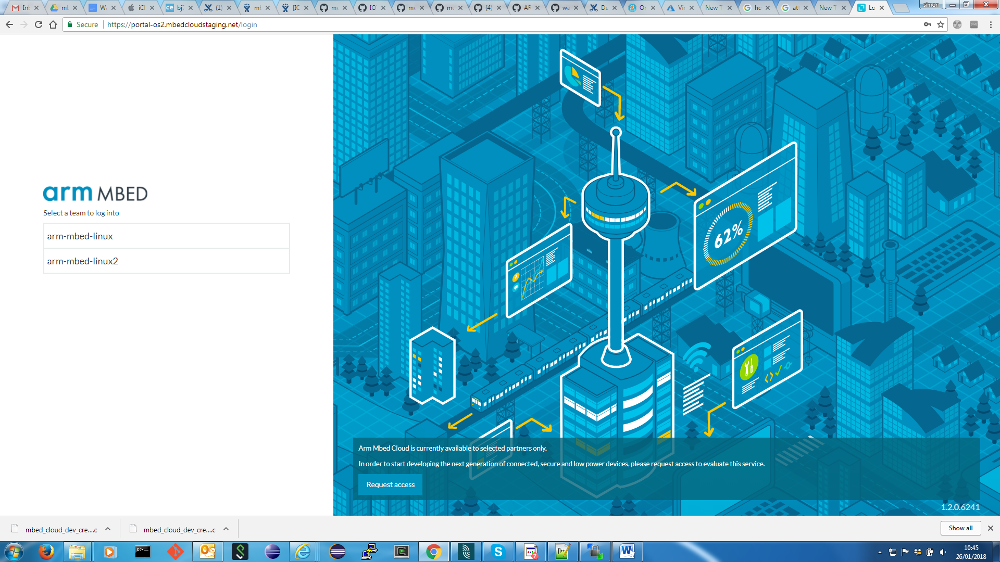
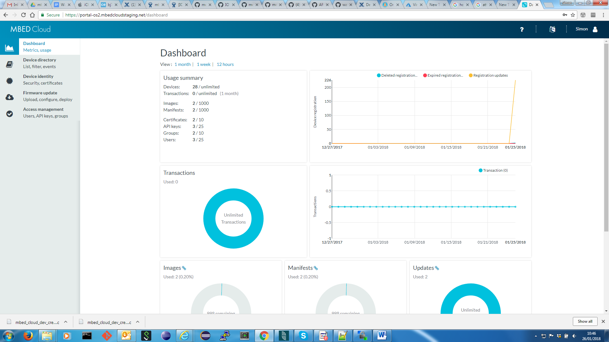
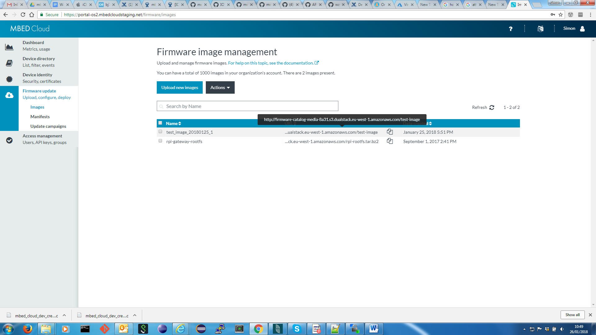
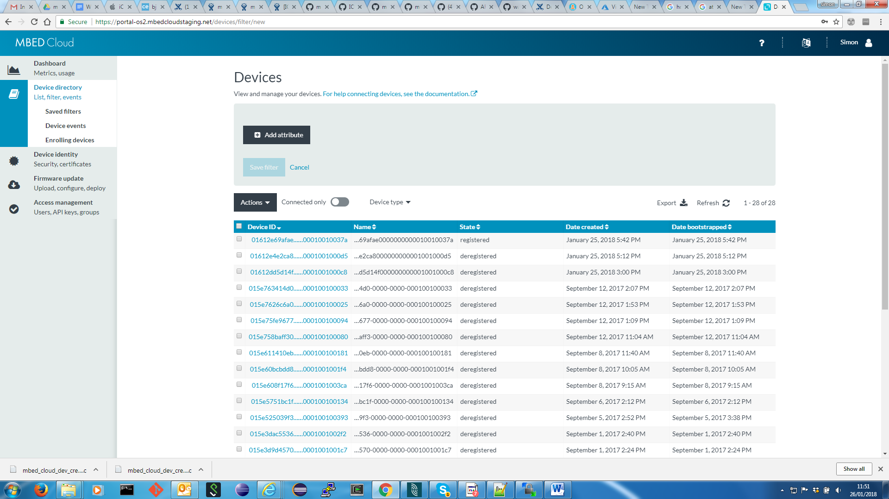
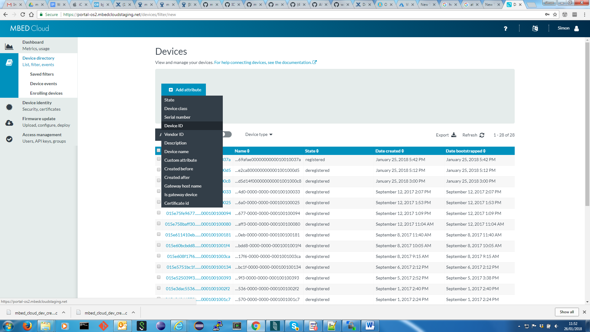
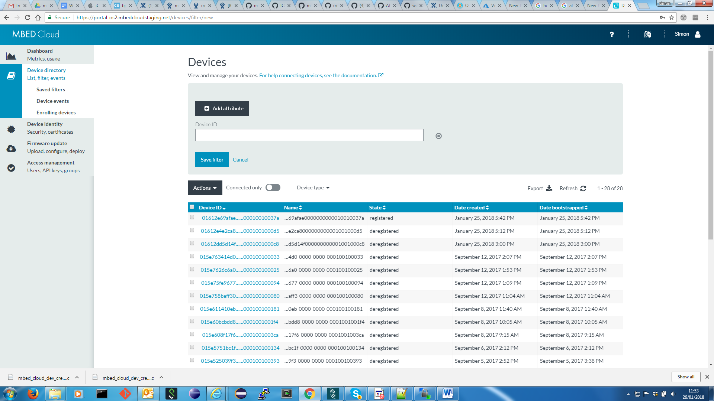
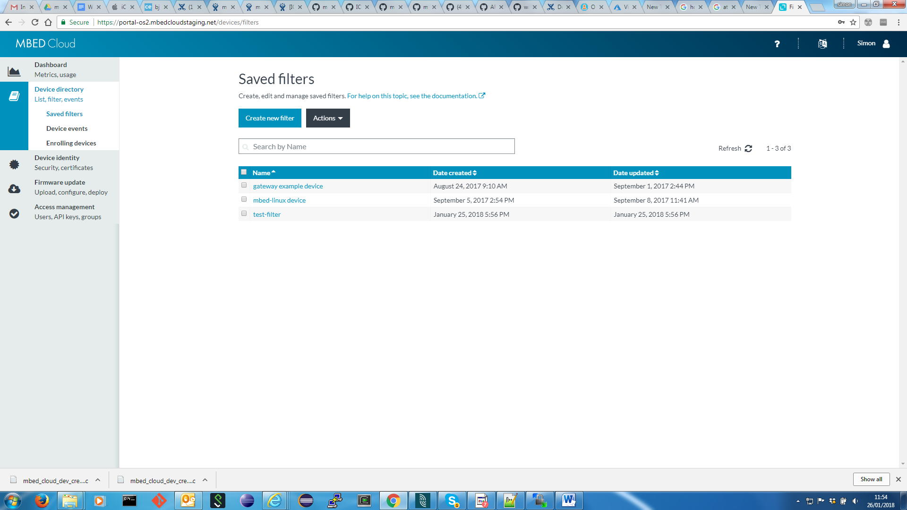
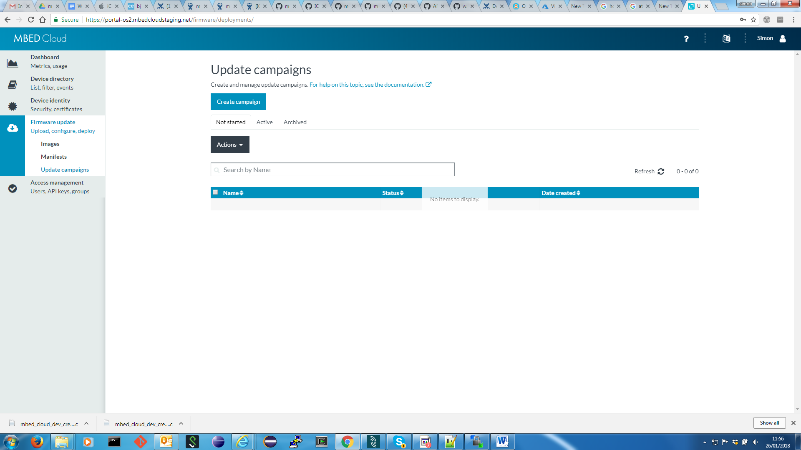
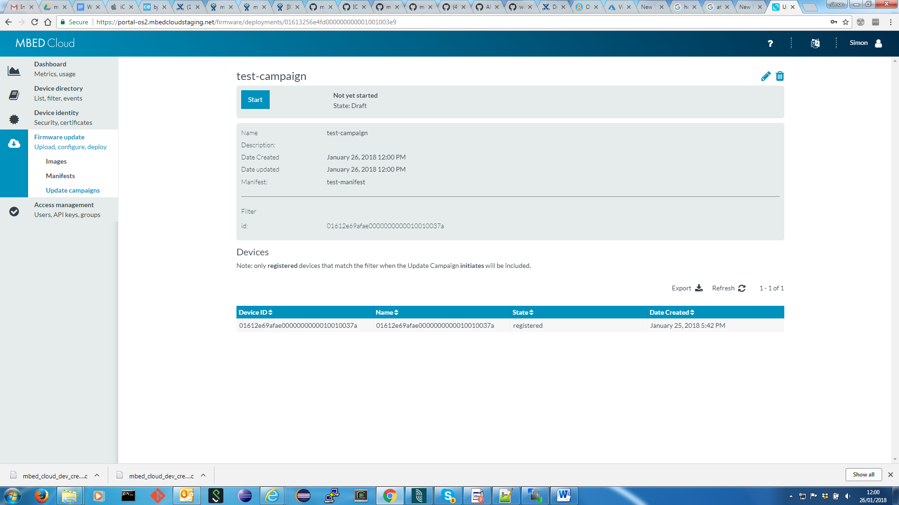
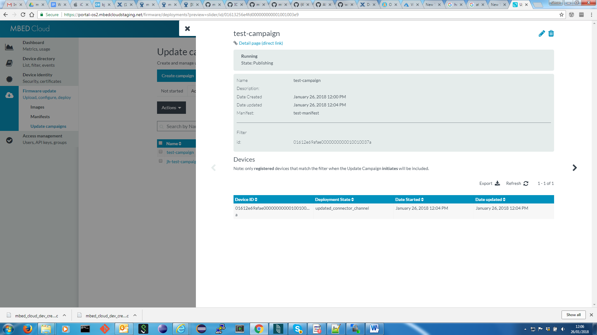

## Introduction

This document provides instructions for building Mbed Linux with the meta-mbl-private layer (which provides Mbed Cloud Client) and for performing an over-the-air firmware update.

Warp7 and Raspberry Pi 3 boards are currently supported.

## Disclaimer

The Mbed Linux project is in its early stages and information found in this document may become stale very quickly. The `jh-unstable` branches of repositories used in these instructions contain hacks and unreviewed code.

## Overview

The process of building Mbed Linux and performing a firmware update has been split into the following steps.
1. [Review prerequisites](#prerequisites).
2. [Create a working directory](#create-working-directory).
3. [Download an Mbed Cloud dev credentials file](#get-cloud-credentials). This file contains credentials that the device can use to access your Mbed Cloud account.
4. [Create an Update resources file](#create-update-resources). This file contains a certificate that is used by the device to authenticate new firmware packages.
5. [Download the required Yocto/OpenEmbedded "meta" layers](#get-meta-layers). This is data that contains rules for downloading and building the code for Mbed Linux.
6. [Set up the build environment](#set-up-build-env). This configures the build for the correct device and injects any user-specific data into the build.
7. [Build Mbed Linux](#build-mbl). This builds Mbed Linux and generates (a) an image that can be written directly to the device and (b) an image that can be used as a firmware update payload.
8. [Write the disk image to your device and boot Mbed Linux](#write-image-and-boot).
9. [Log in to Mbed Linux](#log-in).
10. [Set up a network connection](#set-up-network)
11. [Check `mbl-cloud-client`'s state](#check-mbl-cc)
12. [Perform a firmware update](#do-update).

## <a name="prerequisites"></a> 1. Prerequisites
To build and run Mbed Linux using this guide you will need:
* a PC running a new-ish Linux distribution (e.g. Ubuntu 16.04);
* a Warp7 board;
* two micro USB cables - one to provide power to the Warp7 and one to connect the Warp7 to a PC;
* an Mbed Cloud account (see [Getting an Mbed Cloud account](#get-cloud-account));
* a Github account with access to private ARMmbed repositories;
* a running SSH agent (required for cloning repositories non-interactively during the build process);
* some software dependencies (see [Installing software dependencies](#install-software-dependencies));
* Google's `repo` tool (see [Installing Google's repo tool](#install-google-repo));
* Mbed's `manifest-tool` with the Mbed Cloud SDK library (see [Installing the manifest tool](#install-manifest-tool)).

### <a name="get-cloud-account"></a> 1.1. Getting an Mbed Cloud account

Contact Nadya.Sandler@arm.com or Jyri.Ryymin@arm.com to get an Mbed Cloud account.
- You should report which account to use e.g. arm-mbed-linux.
- You should say your environment is Linux.
- You should request an account with a high firmware storage limit - Mbed Linux firmware packages can be 40-50MiB.

### <a name="install-software-dependencies"></a> 1.2. Installing software dependencies

The following packages are required by `repo` and/or `bitbake`.
* chrpath
* curl
* git
* python-dev
* texinfo

Install them with something like
```
sudo apt-get install chrpath curl git python-dev texinfo
```

### <a name="install-google-repo"></a> 1.3. Installing Google's repo tool

Install google's [`repo` tool](https://gerrit.googlesource.com/git-repo) with
```
mkdir ~/bin
PATH=~/bin:$PATH

curl http://commondatastorage.googleapis.com/git-repo-downloads/repo > ~/bin/repo
chmod a+x ~/bin/repo
```

### <a name="install-manifest-tool"></a> 1.4. Installing the manifest tool

Install the Mbed Cloud manifest tool and cloud SDK with
```
pip install -U "git+https://github.com/ARMmbed/manifest-tool-restricted.git"
pip install mbed-cloud-sdk
```
See <https://github.com/ARMmbed/manifest-tool-restricted> for more information about the manifest tool.


## <a name="create-working-directory"></a> 2. Create a working directory for the Mbed Linux build
This document will assume that you have a directory `~/mbl` under which all work will be done.
```
mkdir ~/mbl
```

## <a name="get-cloud-credentials"></a> 3. Download Mbed Cloud dev credentials file
Follow instructions at https://cloud.mbed.com/docs/v1.2/provisioning-process/provisioning-development.html#creating-and-downloading-a-developer-certificate to create and download a "credentials C file" (`mbed_cloud_dev_credentials.c`) to a directory `~/mbl/cloud-credentials`. This contains credentials for your device to connect to with Mbed Cloud and will be required during the build process.

## <a name="create-update-resources"></a> 4. Create an Update resources file
Initialize `manifest-tool` settings and generate Update resources by running
```
mkdir ~/mbl/manifests && cd ~/mbl/manifests
manifest-tool init -q -d arm.com -m dev-device
```
This will generate a file `update_default_resources.c` that will be required during the build process.

## <a name="get-meta-layers"></a> 5. Download the required Yocto/OpenEmbedded "meta" layers
```
cd ~/mbl
mkdir mbl-unstable && cd mbl-unstable
repo init -u ssh://git@github.com/armmbed/mbl-manifest.git -b jh-unstable -m private.xml
repo sync
```

## <a name="set-up-build-env"></a> 6. Set up the build environment
To setup the building environment for Warp7, use the following command to source the environment setup script with the MACHINE and DISTRO variables defined.
```
MACHINE=imx7s-warp-mbl DISTRO=mbl . setup_environment
```

The following table lists the {MACHINE, DISTRO} values for the Mbed Linux supported devices. Use the appropriate values for the device of interest.


| Device         | MACHINE          | DISTRO     |
| :---           | ---              | ---        |
| Warp7          | `imx7s-warp-mbl` | `mbl` |
| Raspberry Pi 3 | `raspberrypi3`   | `mbl`      |

This command should change your working directory to the "build directory" `~/mbl/mbl-unstable/build-mbl`. It also sets some environment variables that will affect how `bitbake` behaves, so ensure that you are using this shell instance when running any `bitbake` commands later.


Copy the Mbed Cloud dev credentials file and the Update resources file to the build directory:
```
cp ~/mbl/cloud-credentials/mbed_cloud_dev_credentials.c .
cp ~/mbl/manifests/update_default_resources.c .
```

## <a name="build-mbl"></a> 7. Build Mbed Linux
```
bitbake mbl-console-image
```

This command will generate two files that we are interested in: a full disk
image and a root filesystem archive.

The full disk image contains a partition table and all partitions required by
Mbed Linux, including two root partitions. At any one time, one of the root
filesystem partitions is "active" and the other is available to receive a new
version of firmware during an update. To finalize an update, the root partition
with the new firmware becomes "active" and the other root partition becomes
available to receive the next firmware update.  The full disk image is an image
created using the Wic tool from OpenEmbedded and, once decompressed, can be
directly written to storage media. See [this
section](https://www.yoctoproject.org/docs/latest/mega-manual/mega-manual.html#creating-partitioned-images-using-wic)
of the Yocto Mega Manual for more information.

The full disk image is used to initialize the device's storage once with a full
set of disk partitions and an initial version of firmware. Once the device
storage has been initialized, however, firmware updates only involve updating a
single root partition, and this can be done using the contents of the root
filesystem archive, which is a compressed tar archive.

The paths of these files are given in the table below, where `<MACHINE>` should
be replaced with the MACHINE value for your device from the table in [section
6](#set-up-build-env).

| Image type               | Path |
|--------------------------|------|
| Full disk image          | `~/mbl/mbl-unstable/build-mbl/tmp-mbl-glibc/deploy/images/<MACHINE>/mbl-console-image-<MACHINE>.wic.gz` |
| Root file system archive | `~/mbl/mbl-unstable/build-mbl/tmp-mbl-glibc/deploy/images/<MACHINE>/mbl-console-image-<MACHINE>.tar.xz` |


## <a name="write-image-and-boot"></a> 8. Write the disk image to your device and boot Mbed Linux

### 8.1. Warp 7
To transfer your disk image to the Warp7's flash device, you must first access the Warp7's serial console. To do this, connect the Warp7's I/O USB socket (on the I/O board) to your PC and the Warp7's power USB socket (on the CPU board) to a USB power supply. From your PC you should then be able to see a USB TTY device at e.g. /dev/ttyUSB0.

Connect to the Warp7's console with something like
```
minicom -D /dev/ttyUSB0
```
Use a baud rate of 115200, [8N1](https://en.wikipedia.org/wiki/8-N-1) encoding, and no hardware flow control.

Depending on the previous contents of the device's storage, you may get a U-boot prompt or you may see an operating system (e.g. Android) boot. If an operating system boots, reboot the device and then press a key when U-Boot starts to prevent it booting the operating system.

When you get a U-Boot prompt, type
```
ums 0 mmc 0
```
to expose the Warp7's flash device to Linux as USB mass storage. You should now see the Warp7's flash device in `/dev`, probably as `/dev/sdX` for some letter `X`. The output of `lsblk` can be useful to identify the name of the device.

From a Linux prompt Write the disk image to the Warp7's flash device with
```
gunzip -c ~/mbl/mbl-unstable/build-mbl/tmp-mbl-glibc/deploy/images/imx7s-warp-mbl/mbl-console-image-imx7s-warp-mbl.wic.gz | sudo dd status=progress conv=fsync bs=4M of=/dev/sdX
```
replacing `/dev/sdX` with the correct device file for the Warp7's flash device. This may take some time.


When `dd` has finished eject the device:
```
sudo eject /dev/sdX
```

Back on the Warp7's U-Boot prompt, press Ctrl-C to exit USB mass storage mode, then type
```
reset
```
to reboot the Warp7. It should now boot into Mbed Linux.

### 8.2. Raspberry Pi 3

Connect a micro SD card to your PC. You should see the SD card device file in `/dev`, probably as `/dev/sdX` for some letter `X`. The output of `lsblk` can be useful to identify the name of the device.

Write the disk image to the SD card with
```
gunzip -c ~/mbl/mbl-unstable/build-mbl/tmp-mbl-glibc/deploy/images/raspberrypi3/mbl-console-image-raspberrypi3.wic.gz | sudo dd status=progress conv=fsync bs=4M of=/dev/sdX
```
replacing `/dev/sdX` with the correct device file for the SD card. This may take some time.

When `dd` has finished eject the device:
```
sudo eject /dev/sdX
```

Detach the micro SD card from your PC and plug it into the Raspberry Pi 3.

Before powering on the Raspberry Pi 3, you will need to connect it to your PC such that you can access its console. You can do this e.g. by connecting it via a [C232HD-DDHSP-0](http://www.ftdichip.com/Support/Documents/DataSheets/Cables/DS_C232HD_UART_CABLE.pdf) cable. See [here](https://github.com/ARMmbed/raas-daemon/blob/master/doc/resources/ftdi-d2xx/HARDWARE.md) for instructions on how to connect that cable to your device.

Connect to the Raspberry Pi 3's console with something like
```
minicom -D /dev/ttyUSB0
```
Use a baud rate of 115200, [8N1](https://en.wikipedia.org/wiki/8-N-1) encoding, and no hardware flow control.

Now connect the Raspberry Pi 3's micro USB socket to a USB power supply. It should now boot into Mbed Linux.

## <a name="log-in"></a> 9. Log in to Mbed Linux

To log in, use the username `root` with no password.

## <a name="set-up-network"></a> 10. Set up a network connection

If your device is connected to a network with a DHCP server via Ethernet then it will automatically connect to that network. Otherwise, see https://github.com/ARMmbed/meta-mbl/blob/master/docs/wifi.md for help on setting up wifi in Mbed Linux.

## <a name="check-mbl-cc"></a> 11. Check `mbl-cloud-client`'s state
During Mbed Linux boot, `mbl-cloud-client` should start automatically start and connect to the Mbed Cloud. If networking wasn't configured appropriately during boot, however, mbl-cloud-client may not have connected to the Mbed Cloud. It will periodically retry to connect, but it may connect more quickly if it is restarted:
```
/etc/init.d/mbl-cloud-client restart
```
You can check whether the device has connected to the Mbed Cloud by using the
Mbed Cloud web interface ([Figure 8](#fig8)) or by reviewing
`mbl-cloud-client`'s log file at `/var/log/mbl-cloud-client.log`.

## <a name="do-update"></a> 12. Perform a firmware update

The following sections describe 2 ways to perform an update:

- 12.1. [Update Method 1.](#update-method-1) Using the manifest-tool. The development machine runs the manifest-tool to request a firmware update via a web API.
- 12.2. [Update Method 2.](#update-method-2) Using the mbed-cloud web interface. A firmware update is initiated using the mbed cloud web interface.

Note:  at the current time developers are unable to use Method 1 due to a problem (a bug?) using API keys. Therefore, the following section should be skipped in preference for Method 2, which works fine.


### <a name="update-method-1"></a> 12.1. Update Method 1: Perform a Firmware Update Using the Manifest-Tool.

After a firmware update, the flash partition used for the root filesystem will change. Check which partition is mounted at `/` now so that you can check that it changes after the update. You can use `lsblk` to do this.

The easiest way to update firmware on a single device is to use manifest-tool. To use the manifest tool for firmware updates you may need to install an additional package, [the Python mbed-cloud-sdk](https://github.com/ARMmbed/mbed-cloud-sdk-python):
```
pip install mbed-cloud-sdk
```

You will also need an Mbed Cloud API key. Follow the instructions at https://cloud.mbed.com/docs/v1.2/connecting/api-keys.html#generating-an-api-key to generate an API key for the "Administrators" group, then create the file `~/mbl/manifests/.mbed_cloud_config.json` with the following content
```
{
    "api_key": "<api-key>"
}
```
replacing `<api-key>` with the key obtained earlier.

The firmware "payload" used for updates is the "root filesystem archive" generated during the Mbed Linux build process. I've noticed that `manifest-tool` sometimes barks if the path to the firmware image is too long, so link this file into the manifests directory with
```
ln -s ~/mbl/mbl-unstable/build-mbl/tmp-mbl-glibc/deploy/images/<MACHINE>/mbl-console-image-<MACHINE>.tar.xz test-image
```
where `<MACHINE>` is the MACHINE value for your device from the table in [section 6](#set-up-build-env).

Now perform the update with
```
cd ~/mbl/manifests
manifest-tool update device -p test-image --manifest-name test-manifest --payload-name test-image --device-id <device ID>
```
replacing `<device ID>` with the device's ID. The ID can be found by looking on the Mbed Cloud web interface or by looking in `mbl-cloud-client`'s log file on the device:
```
grep -i 'device id' /var/log/mbl-cloud-client.log
```
Note that the device ID may change if a new disk image is written to the flash.

Example `manifest-tool` output:
```
$ manifest-tool update device -p test-image --manifest-name test-manifest --payload-name test-image --device-id 0161292331c700000000000100100246
[INFO] 2018-01-25 10:10:03 - manifesttool.update_device - Created new firmware at http://firmware-catalog-media-ca57.s3.dualstack.us-east-1.amazonaws.com/test-image
[INFO] 2018-01-25 10:10:03 - manifesttool.update_device - Created temporary manifest file at /tmp/tmpOoloXY/manifest
[INFO] 2018-01-25 10:10:04 - manifesttool.update_device - Created new manifest at http://firmware-catalog-media-ca57.s3.dualstack.us-east-1.amazonaws.com/manifest_BytWSLL
[INFO] 2018-01-25 10:10:05 - manifesttool.update_device - Campaign successfully created. Current state: 'draft'
[INFO] 2018-01-25 10:10:05 - manifesttool.update_device - Campaign successfully created. Filter result: {'id': {u'$eq': '0161292331c700000000000100100246'}}
[INFO] 2018-01-25 10:10:05 - manifesttool.update_device - Starting the update campign...
[INFO] 2018-01-25 10:10:05 - manifesttool.update_device - Campaign successfully started. Current state: u'scheduled'. Checking updates..
[INFO] 2018-01-25 10:10:06 - manifesttool.update_device - Current state: 'publishing'
[INFO] 2018-01-25 10:16:03 - manifesttool.update_device - Current state: 'deployed'
```

Once the manifest-tool indicates that the current state has changed to "Publishing" you can follow the update progress in `mbl-cloud-client`'s log file:
```
tail -f /var/log/mbl-cloud-client.log
```
When the update has finished the device should reboot into the new firmware. You can check that this has happened by checking that the flash partition mounted at `/` is different to before the update.


A short time after the new firmware has booted, `manifest-tool` should report that the state has changed from 'Publishing' to 'Deployed'.


### <a name="update-method-2"></a> 12.2. Method 2: Perform a firmware update Using the Mbed Cloud Web Interface

This section describes how to preform a device firmware update using the mbed cloud web interface. The steps
are described in the following sections:

- 12.2.1. [Update Step 1](#update2-1): Prerequisites.
- 12.2.2. [Update Step 2](#update2-2): Upload a firmware image to the cloud.
- 12.2.3. [Update Step 3](#update2-3): Create a manifest.
- 12.2.4. [Update Step 4](#update2-4): Upload the manifest to the cloud.
- 12.2.5. [Update Step 5](#update2-5): Create a filter for your device.
- 12.2.6. [Update Step 6](#update2-6): Run an update campaign to update the device firmware.


#### <a name="update2-1"></a> 12.2.1. Update Step 1: Prerequisites

The following should have already been performed:
- A build generating a device image.
- You have a set of mbed Cloud account credentials so you can log in.
- You've checked which is the currently running bank. This will change after a firmware update
  and should be checked before and after the update to verify the new firmware is running.

The following provides information on how to check which is the running bank (partition).
The device has 2 banks of software:
- The running bank. A device partition storing the rootfs for the running system.
- The non-running bank. A device partition that will receive the firmware update.

The process of performing a firmware update includes the following steps:
- The update SW writes the non-running bank with the new software rootfs.
- The update SW sets the non-running bank to be the running bank next time the device boots.
- The update SW reboots the device.

Check which partition is mounted at `/` now so that you can check that it changes after the update.
You can use `lsblk` to do this.


#### <a name="update2-2"></a> 12.2.2. Update Step 2: Upload a Firmware Image to the Cloud

This requires the following steps:
- Log into the [Mbed Cloud portal](https://portal.mbedcloud.com/login) ([Figure 1](#fig1)).
- If more than one team is available, select a team/group e.g. arm-mbed-linux ([Figure 2](#fig2)).
- Navigate to the Firmware Update/Images screen ([Figure 4](#fig4)).
- Select Upload new images.
- Choose an image file from your local hard disk. This should be the mbl-console-image-imx7s-warp-mbl-<date>.rootfs.tar.xz, which contains the root file system image for upgrading. ([Figure 6](#fig6).)
- Provide a name for the firmware image e.g. test\_image\_20180125\_1.
- Optionally, provide a description.
- Press the "Upload firmware image" button.
- On the main Firmware Update/Images screen you'll see the image listed in the table ([Figure 4](#fig4)).
- Copy the firmware image URL (2nd column in table) to your clipboard URL by clicking the "2 page" icon in the third column of the table ([Figure 5](#fig5)). This URL will be needed for creating the manifest (described in the next section).


#### <a name="update2-3"></a> 12.2.3. Update Step 3: Create a Manifest

This step describes how to use the manifest-tool to create a manifest for the firmware image:
- In the section "Create an Update resources file" earlier in this document, you will have:
    - Installed the `manifest-tool`,
    - Created the ~mbl/manifest sub-directory, and
    - Performed the `manifest-tool init` command.
- Make the current working directory the place where the `manifest-tool init` was performed.
- Create a manifest called test-manifest by using the manifest-tool in the following way:
```
manifest-tool create -p test-image -u http://firmware-catalog-media-8a31.s3.dualstack.eu-west-1.amazonaws.com/test-image -o test-manifest
```
- The **test-image** is a symlink to the full name of the image file to be used e.g.
  mbl-console-image-imx7s-warp-mbl-20180124161247.rootfs.tar.xz. The tool sometimes doesn't cope
  very well with long filenames.
- The **-u URL** is the image URL copied to the clipboard in the previous section.
- The **test-manifest** is the name of the output manifest file.


#### <a name="update2-4"></a> 12.2.4. Update Step 4: Upload the Manifest to the Cloud.

This requires the following steps to upload the test-manifest to the cloud:
- Navigate to the Firmware Update/Manifests screen
- Push the "Upload new manifest" button
- Press the "Chose File" button to select the test-manifest from your local filesystem
- Give the manifest a name e.g. test-manifest
- Optionally provide a description of the manifest
- Push the "Upload firmware manifest" button.


#### <a name="update2-5"></a> 12.2.5. Update Step 5: Create a filter for your device

A device filter has to be created before an update campaign can be configure. This is done in the following way:
- Navigate to the Device Directory screen ([Figure 8](#fig8)).
- Copy the device id to the clipboard. This can be done as follows:
	- Search for the device id in the `mbl-cloud-client`'s log file `/var/log/mbl-cloud-client.log`.
```
grep -i 'device id' /var/log/mbl-cloud-client.log
```
	Note the device id changes each time you load a new image onto the device.
	- By finding the device in the table presented on the Device Directory screen, clicking on it to get the device specific
	information page and then copying the device ID to the clipboard.
- Push the "Create New Filter" button.
- Push the "Add attribute" button and select "Device ID" ([Figure 9](#fig9)).
- Paste the Device ID into the Device ID edit box and click "Save Filter".
- See that the newly created filter reported on the Device Directory/Saved Filters screen ([Figure 11](#fig11)).

#### <a name="update2-6"></a> 12.2.6. Update Step 6: Run an Update Campaign to Update the Device Firmware

The following steps are needed to run a test campaign to perform the firmware update:
- Navigate to the Firmware Update/Update Campaigns screen ([Figure 12](#fig12)).
- Push the "Create Campaign" button ([Figure 13](#fig13)).
- Provide a name for the campaign e.g. "test-campaign".
- Optionally provide a description.
- Select the previously created test-manifest from the first drop down list box.
- Select the previously created test-filter from the second drop down list box. The device filter should report the Device ID of your device.
- Push the "Save" button to save the test campaign.
- The saved test-campaign will be reported on the screen ([Figure 14](#fig14)). Press the "Start" button to run the test campaign.
	- You may see the "Something went wrong" screen indicating problems with the update service. Be patient! This kind of thing seems normal. However, sometimes things have gone wrong and the update will not happen.
- Monitor the device console tail -f /var/log/mbl-cloud-client.log to see the update occurring.
	- You can also monitor the progress of the update via the web interface. It should report the "Publishing" state.
- After considerable console output, the update will complete and the device reboots.
- When the device comes up again, login and verify that the running bank (partition) has changed from that noted in Update Step 1.


 #### 12.2.7. Figures

<a name="fig1"></a>

Figure 1: The mbed cloud portal login.

<a name="fig2"></a>

Figure 2: Select the team you want to use e.g. arm-mbed-linux.

<a name="fig3"></a>

Figure 3: Dashboard after you login.

<a name="fig4"></a>

Figure 4: Firmware update/Images screen.

<a name="fig5"></a>

Figure 5: Firmware update/Images screen showing how to copy URL.

<a name="fig6"></a>

Figure 6: Upload firmware image screen.

<a name="fig7"></a>

Figure 7: Device details screen.

<a name="fig8"></a>

Figure 8: Device directory screen for viewing device registration status and adding device filters.

<a name="fig9"></a>

Figure 9: Device directory for adding a filter device id attribute.

<a name="fig10"></a>

Figure 10: Device directory for adding a filter.

<a name="fig11"></a>

Figure 11: Saved filters screen.

<a name="fig12"></a>

Figure 12: Update campaigns screen.

<a name="fig13"></a>

Figure 13: New update campaign screen.

<a name="fig14"></a>

Figure 14: Firmware update/Campaign status screen.

<a name="fig15"></a>

Figure 15: Test campaign details screen.
